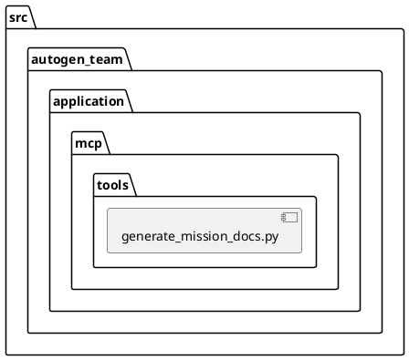
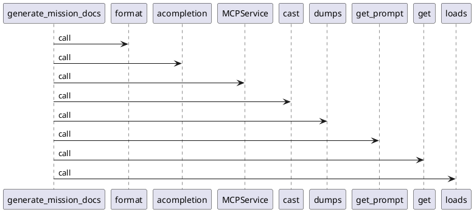
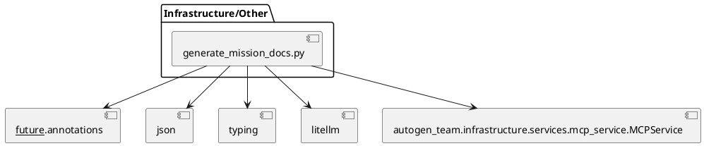
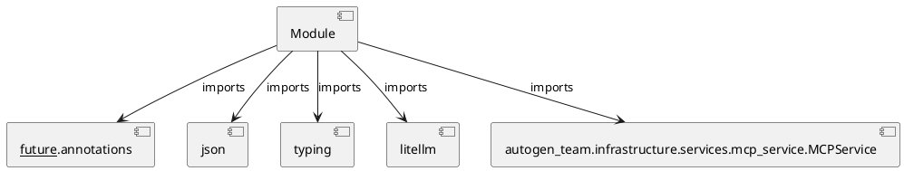
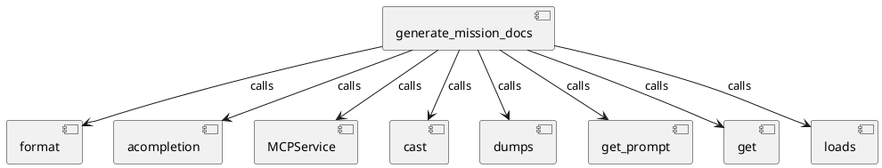

# Module Specification: generate_mission_docs

* **Source Reference:** `src/autogen_team/application/mcp/tools/generate_mission_docs.py`

## 1. Architectural Role & Responsibilities
**Purpose:**
Provides functionality related to generate mission docs.

**Architecture Layer:**
- Infrastructure/Other

**Responsibilities:**
- Not explicitly defined.

**Main Workflow:**
- Not explicitly defined.

## 2. Dependencies
**Imports:**
- `__future__.annotations`
- `json`
- `typing`
- `litellm`
- `autogen_team.infrastructure.services.mcp_service.MCPService`

**Exported Classes:**
- None

**Exported Functions:**
- `generate_mission_docs`

**Exported Interfaces:**
- Not explicitly defined.

**Public API:**
- Not explicitly defined.

## 3. Architecture & Execution
### Internal Architecture
Not explicitly defined.

### Execution Flow
Not explicitly defined.

### Sequence Explanation
Not explicitly defined.

### Examples
Not explicitly defined.

## 4. UML 2.0 Diagrams
### Class Diagram

```plantuml
@startuml
    ' No classes found in module
@enduml
```

### Package Diagram

```plantuml
@startuml
    package "src" {
        package "autogen_team" {
            package "application" {
                package "mcp" {
                    package "tools" {
                        [generate_mission_docs.py]
                    }
                }
            }
        }
    }
@enduml
```

### Sequence Diagram

```plantuml
@startuml
    generate_mission_docs -> format : call
    generate_mission_docs -> acompletion : call
    generate_mission_docs -> MCPService : call
    generate_mission_docs -> cast : call
    generate_mission_docs -> dumps : call
    generate_mission_docs -> get_prompt : call
    generate_mission_docs -> get : call
    generate_mission_docs -> loads : call
@enduml
```

### Component Diagram

```plantuml
@startuml
    package "Infrastructure/Other" {
        [generate_mission_docs.py]
    }
    [generate_mission_docs.py] --> [__future__.annotations]
    [generate_mission_docs.py] --> [json]
    [generate_mission_docs.py] --> [typing]
    [generate_mission_docs.py] --> [litellm]
    [generate_mission_docs.py] --> [autogen_team.infrastructure.services.mcp_service.MCPService]
@enduml
```

### Dependency Graph

```plantuml
@startuml
    [Module] --> [__future__.annotations] : imports
    [Module] --> [json] : imports
    [Module] --> [typing] : imports
    [Module] --> [litellm] : imports
    [Module] --> [autogen_team.infrastructure.services.mcp_service.MCPService] : imports
@enduml
```

## 5. Class & Method Specifications
## 6. Module Functions
### `generate_mission_docs(mission_id: str, mission_context: T.Dict[str, T.Any]) -> T.Dict[str, T.Any]` (Public)
**Description:** Generate Mermaid diagrams and documentation for a mission.

Args:
    mission_id: Unique identifier for the mission.
    mission_context: Context including goal, tasks, results, and file changes.

Returns:
    A dict containing generated Mermaid diagrams and documentation.

**Inputs:**
- `mission_id`
  - type: str
  - meaning: Not explicitly defined.
  - valid values: Not explicitly defined.
  - optional?: False
  - default value: None
- `mission_context`
  - type: T.Dict[str, T.Any]
  - meaning: Not explicitly defined.
  - valid values: Not explicitly defined.
  - optional?: False
  - default value: None

**Output:**
- return type: `T.Dict[str, T.Any]`
- semantic meaning: Not explicitly defined.
- possible null values: Not explicitly defined.
- exceptions: Not explicitly defined.

**Side Effects:**
- Database updates: Not explicitly defined.
- File operations: Not explicitly defined.
- Network calls: Not explicitly defined.
- Cache: Not explicitly defined.
- State changes: Not explicitly defined.

**Complexity:**
- Time Complexity: Not explicitly defined.
- Space Complexity: Not explicitly defined.

**Example:**
```python
result = generate_mission_docs(..., ...)
```

## 7. Call Graph

```plantuml
@startuml
[generate_mission_docs] --> [format] : calls
[generate_mission_docs] --> [acompletion] : calls
[generate_mission_docs] --> [MCPService] : calls
[generate_mission_docs] --> [cast] : calls
[generate_mission_docs] --> [dumps] : calls
[generate_mission_docs] --> [get_prompt] : calls
[generate_mission_docs] --> [get] : calls
[generate_mission_docs] --> [loads] : calls
@enduml
```

## 8. Cross References
- **Dependencies:** [Dependencies](../../../../../../dependencies/index.md)
- **Used by:** None
- **Calls:** format, acompletion, MCPService, cast, dumps, get_prompt, get, loads
- **Called from:** ../../../../../tests/application/mcp/tools/test_generate_mission_docs.md
- **Related classes:** [Classes](../../../../../../classes/index.md)
- **Related diagrams:** [Diagrams](../../../../../../diagrams/index.md)
