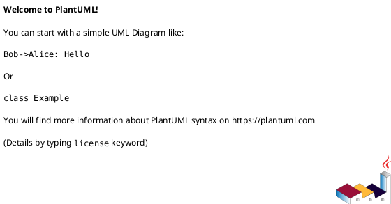
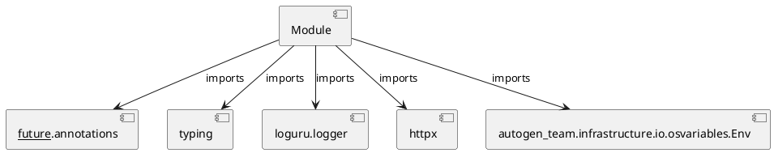

# Module Specification: index_code

* **Source Reference:** `src/autogen_team/application/mcp/tools/index_code.py`

## 1. Architectural Role & Responsibilities
**Purpose:**
Provides functionality related to index code.

**Architecture Layer:**
- Infrastructure/Other

**Responsibilities:**
- Not explicitly defined.

**Main Workflow:**
- Not explicitly defined.

## 2. Dependencies
**Imports:**
- `__future__.annotations`
- `typing`
- `loguru.logger`
- `httpx`
- `autogen_team.infrastructure.io.osvariables.Env`

**Exported Classes:**
- None

**Exported Functions:**
- `index_code`

## 3. Architecture & Execution
### Internal Architecture
Not explicitly defined.

### Execution Flow
Not explicitly defined.

### Sequence Explanation
Not explicitly defined.

## 4. UML 2.0 Diagrams
### Class Diagram

### Dependency Graph

## 5. Class & Method Specifications
## 6. Module Functions
### `index_code(file_path: str, content: str, metadata: T.Dict[str, T.Any] | None)`
Index a code file into R2R knowledge graph for future retrieval.

Args:
    file_path: Path of the file being indexed.
    content: Full content of the file.
    metadata: Optional metadata dict (language, author, etc).

Returns:
    Dict with document_id and status.

**Inputs:**
- `file_path`: str
- `content`: str
- `metadata`: T.Dict[str, T.Any] | None

**Output:**
- Return Type: `T.Dict[str, T.Any]`
