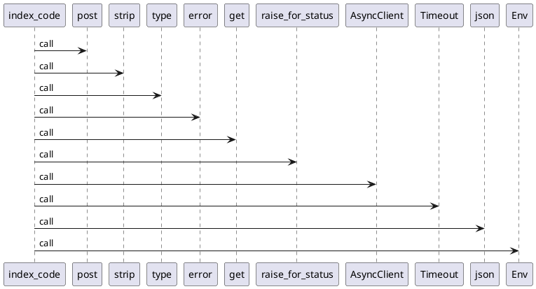
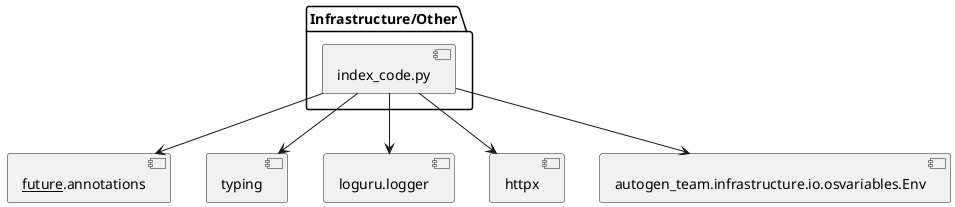
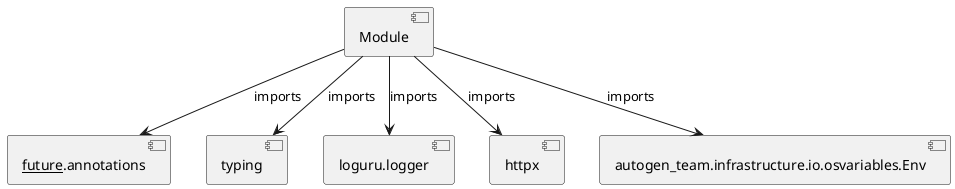
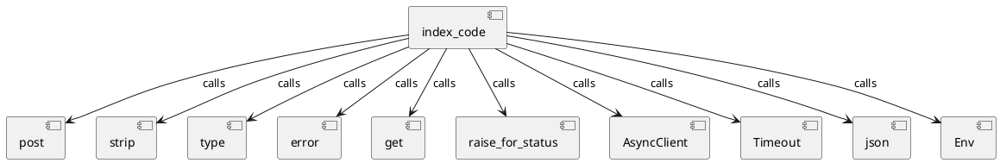

# Module Specification: index_code

* **Source Reference:** `src/autogen_team/application/mcp/tools/index_code.py`

## 1. Architectural Role & Responsibilities
**Purpose:**
Provides functionality related to index code.

**Architecture Layer:**
- Infrastructure/Other

**Responsibilities:**
- Manages operations and logic for index code.

**Main Workflow:**
- Executes the primary flow defined by index code functions and classes.

## 2. Dependencies
**Imports:**
- `__future__.annotations`
- `typing`
- `loguru.logger`
- `httpx`
- `autogen_team.infrastructure.io.osvariables.Env`

**Exported Classes:**
- None

**Exported Functions:**
- `index_code`

**Exported Interfaces:**
- Not explicitly defined.

**Public API:**
- Not explicitly defined.

## 3. Architecture & Execution
### Internal Architecture
Not explicitly defined.

### Execution Flow
Not explicitly defined.

### Sequence Explanation
Not explicitly defined.

### Examples
Not explicitly defined.

## 4. UML 2.0 Diagrams
### Class Diagram

```plantuml
@startuml
    ' No classes found in module
@enduml
```

### Sequence Diagram

```plantuml
@startuml
    index_code -> post : call
    index_code -> strip : call
    index_code -> type : call
    index_code -> error : call
    index_code -> get : call
    index_code -> raise_for_status : call
    index_code -> AsyncClient : call
    index_code -> Timeout : call
    index_code -> json : call
    index_code -> Env : call
@enduml
```

### Component Diagram

```plantuml
@startuml
    package "Infrastructure/Other" {
        [index_code.py]
    }
    [index_code.py] --> [__future__.annotations]
    [index_code.py] --> [typing]
    [index_code.py] --> [loguru.logger]
    [index_code.py] --> [httpx]
    [index_code.py] --> [autogen_team.infrastructure.io.osvariables.Env]
@enduml
```

### Dependency Graph

```plantuml
@startuml
    [Module] --> [__future__.annotations] : imports
    [Module] --> [typing] : imports
    [Module] --> [loguru.logger] : imports
    [Module] --> [httpx] : imports
    [Module] --> [autogen_team.infrastructure.io.osvariables.Env] : imports
@enduml
```

## 5. Class & Method Specifications
## 6. Module Functions
### `index_code(file_path: str, content: str, metadata: T.Dict[str, T.Any] | None)`
Index a code file into R2R knowledge graph for future retrieval.

Args:
    file_path: Path of the file being indexed.
    content: Full content of the file.
    metadata: Optional metadata dict (language, author, etc).

Returns:
    Dict with document_id and status.

**Inputs:**
- `file_path`
  - type: str
  - meaning: Represents the file path parameter.
  - valid values: Any valid str.
  - optional?: False
  - default value: None
- `content`
  - type: str
  - meaning: Represents the content parameter.
  - valid values: Any valid str.
  - optional?: False
  - default value: None
- `metadata`
  - type: T.Dict[str, T.Any] | None
  - meaning: Represents the metadata parameter.
  - valid values: Any valid T.Dict[str, T.Any] | None.
  - optional?: True
  - default value: None

**Output:**
- return type: `T.Dict[str, T.Any]`
- semantic meaning: Returns the result of index code.
- possible null values: Yes, if T.Dict[str, T.Any] allows it.
- exceptions: Standard execution exceptions.

**Side Effects:**
- Database updates: Not explicitly defined.
- File operations: Not explicitly defined.
- Network calls: Not explicitly defined.
- Cache: Not explicitly defined.
- State changes: Not explicitly defined.

## 7. Call Graph

```plantuml
@startuml
[index_code] --> [post] : calls
[index_code] --> [strip] : calls
[index_code] --> [type] : calls
[index_code] --> [error] : calls
[index_code] --> [get] : calls
[index_code] --> [raise_for_status] : calls
[index_code] --> [AsyncClient] : calls
[index_code] --> [Timeout] : calls
[index_code] --> [json] : calls
[index_code] --> [Env] : calls
@enduml
```

## 8. Cross References
- **Parent module:** __init__.md
- **Child modules:** None
- **Dependencies:** `autogen_team.infrastructure.io.osvariables.Env`, `__future__.annotations`, `typing`, `loguru.logger`, `httpx`
- **Used by:** None
- **Calls:** post, strip, type, error, get, raise_for_status, AsyncClient, Timeout, json, Env
- **Called from:** ../../../../../tests/application/mcp/tools/test_index_code.md
- **Related classes:** [Classes](../../../../../../classes/index.md)
- **Related interfaces:** Not explicitly defined.
- **Related diagrams:** [Diagrams](../../../../../../diagrams/index.md)
