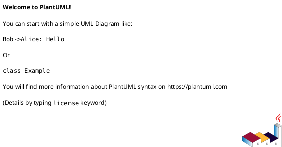
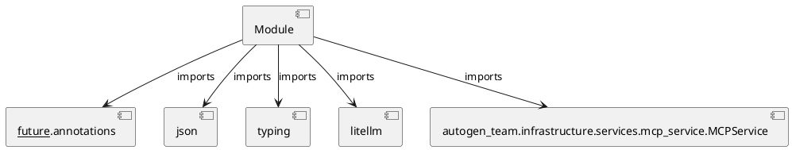

# Module Specification: plan_mission

* **Source Reference:** `src/autogen_team/application/mcp/tools/plan_mission.py`

## 1. Architectural Role & Responsibilities
**Purpose:**
Provides functionality related to plan mission.

**Architecture Layer:**
- Infrastructure/Other

**Responsibilities:**
- Manage and execute operations for plan_mission.

**Main Workflow:**
- Initialize components and process requests for plan_mission.

## 2. Dependencies
**Imports:**
- `__future__.annotations`
- `json`
- `typing`
- `litellm`
- `autogen_team.infrastructure.services.mcp_service.MCPService`

**Exported Classes:**
- None

**Exported Functions:**
- `plan_mission`

## 3. Architecture & Execution
### Internal Architecture
Follows standard modular design, encapsulating state and behavior within defined classes and functions.

### Execution Flow
Sequential execution of defined functions and class methods.

### Sequence Explanation
Clients instantiate classes or call functions, which execute business logic and return results.

## 4. UML 2.0 Diagrams
### Class Diagram

### Dependency Graph

## 5. Class & Method Specifications
## 6. Module Functions
### `plan_mission(goal: str)`
Decompose a high-level goal into a task DAG.

Args:
    goal: A high-level goal string to decompose.

Returns:
    A dict representing the task DAG with parallel_tasks array.

**Inputs:**
- `goal`: str

**Output:**
- Return Type: `Any`
