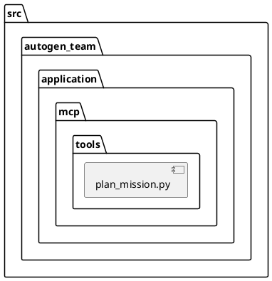
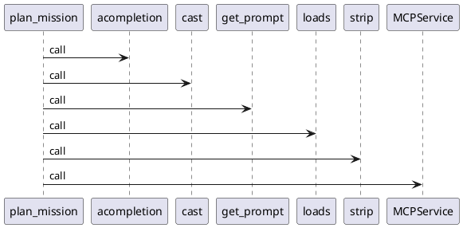
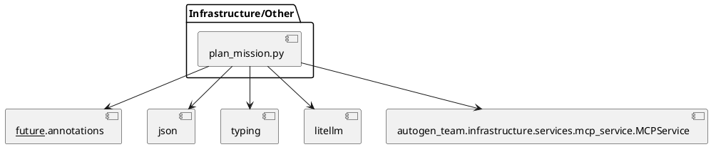
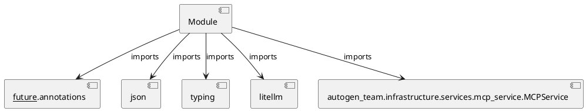
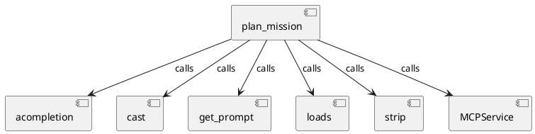

# Module Specification: plan_mission

* **Source Reference:** `src/autogen_team/application/mcp/tools/plan_mission.py`

## 1. Architectural Role & Responsibilities
**Purpose:**
Provides functionality related to plan mission.

**Architecture Layer:**
- Infrastructure/Other

**Responsibilities:**
- Not explicitly defined.

**Main Workflow:**
- Not explicitly defined.

## 2. Dependencies
**Imports:**
- `__future__.annotations`
- `json`
- `typing`
- `litellm`
- `autogen_team.infrastructure.services.mcp_service.MCPService`

**Exported Classes:**
- None

**Exported Functions:**
- `plan_mission`

**Exported Interfaces:**
- Not explicitly defined.

**Public API:**
- Not explicitly defined.

## 3. Architecture & Execution
### Internal Architecture
Not explicitly defined.

### Execution Flow
Not explicitly defined.

### Sequence Explanation
Not explicitly defined.

### Examples
Not explicitly defined.

## 4. UML 2.0 Diagrams
### Class Diagram

```plantuml
@startuml
    ' No classes found in module
@enduml
```

### Package Diagram

```plantuml
@startuml
    package "src" {
        package "autogen_team" {
            package "application" {
                package "mcp" {
                    package "tools" {
                        [plan_mission.py]
                    }
                }
            }
        }
    }
@enduml
```

### Sequence Diagram

```plantuml
@startuml
    plan_mission -> acompletion : call
    plan_mission -> cast : call
    plan_mission -> get_prompt : call
    plan_mission -> loads : call
    plan_mission -> strip : call
    plan_mission -> MCPService : call
@enduml
```

### Component Diagram

```plantuml
@startuml
    package "Infrastructure/Other" {
        [plan_mission.py]
    }
    [plan_mission.py] --> [__future__.annotations]
    [plan_mission.py] --> [json]
    [plan_mission.py] --> [typing]
    [plan_mission.py] --> [litellm]
    [plan_mission.py] --> [autogen_team.infrastructure.services.mcp_service.MCPService]
@enduml
```

### Dependency Graph

```plantuml
@startuml
    [Module] --> [__future__.annotations] : imports
    [Module] --> [json] : imports
    [Module] --> [typing] : imports
    [Module] --> [litellm] : imports
    [Module] --> [autogen_team.infrastructure.services.mcp_service.MCPService] : imports
@enduml
```

## 5. Class & Method Specifications
## 6. Module Functions
### `plan_mission(goal: str) -> T.Dict[str, T.Any]` (Public)
**Description:** Decompose a high-level goal into a task DAG.

Args:
    goal: A high-level goal string to decompose.

Returns:
    A dict representing the task DAG with parallel_tasks array.

**Inputs:**
- `goal`
  - type: str
  - meaning: Not explicitly defined.
  - valid values: Not explicitly defined.
  - optional?: False
  - default value: None

**Output:**
- return type: `T.Dict[str, T.Any]`
- semantic meaning: Not explicitly defined.
- possible null values: Not explicitly defined.
- exceptions: Not explicitly defined.

**Side Effects:**
- Database updates: Not explicitly defined.
- File operations: Not explicitly defined.
- Network calls: Not explicitly defined.
- Cache: Not explicitly defined.
- State changes: Not explicitly defined.

**Complexity:**
- Time Complexity: Not explicitly defined.
- Space Complexity: Not explicitly defined.

**Example:**
```python
result = plan_mission(...)
```

## 7. Call Graph

```plantuml
@startuml
[plan_mission] --> [acompletion] : calls
[plan_mission] --> [cast] : calls
[plan_mission] --> [get_prompt] : calls
[plan_mission] --> [loads] : calls
[plan_mission] --> [strip] : calls
[plan_mission] --> [MCPService] : calls
@enduml
```

## 8. Cross References
- **Dependencies:** [Dependencies](../../../../../../dependencies/index.md)
- **Used by:** None
- **Calls:** acompletion, cast, get_prompt, loads, strip, MCPService
- **Called from:** ../../../../../tests/test_coverage_gap_fillers.md, ../../../../../tests/application/mcp/tools/test_plan_mission.md
- **Related classes:** [Classes](../../../../../../classes/index.md)
- **Related diagrams:** [Diagrams](../../../../../../diagrams/index.md)
