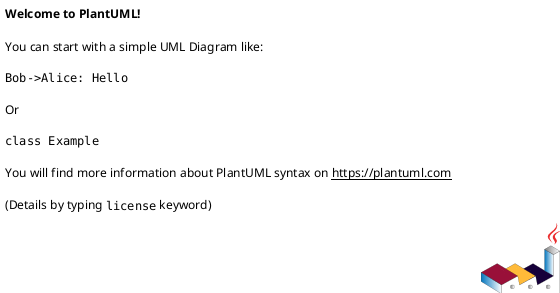
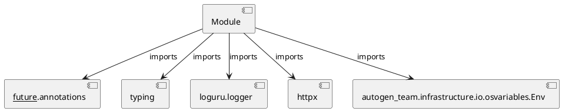

# Module Specification: retrieve_context

* **Source Reference:** `src/autogen_team/application/mcp/tools/retrieve_context.py`

## 1. Architectural Role & Responsibilities
**Purpose:**
Provides functionality related to retrieve context.

**Architecture Layer:**
- Infrastructure/Other

**Responsibilities:**
- Not explicitly defined.

**Main Workflow:**
- Not explicitly defined.

## 2. Dependencies
**Imports:**
- `__future__.annotations`
- `typing`
- `loguru.logger`
- `httpx`
- `autogen_team.infrastructure.io.osvariables.Env`

**Exported Classes:**
- None

**Exported Functions:**
- `retrieve_context`

## 3. Architecture & Execution
### Internal Architecture
Not explicitly defined.

### Execution Flow
Not explicitly defined.

### Sequence Explanation
Not explicitly defined.

## 4. UML 2.0 Diagrams
### Class Diagram

### Dependency Graph

## 5. Class & Method Specifications
## 6. Module Functions
### `retrieve_context(query: str, collection_name: str)`
Query R2R RAG system for relevant codebase patterns via semantic search.

Args:
    query: Search query string.
    collection_name: Name of the R2R collection to search.

Returns:
    Dict with matching documents and graph context.

**Inputs:**
- `query`: str
- `collection_name`: str

**Output:**
- Return Type: `T.Dict[str, T.Any]`
