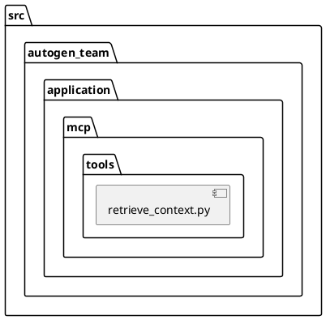
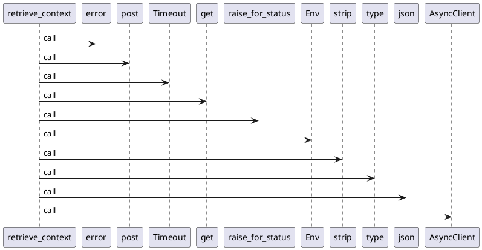
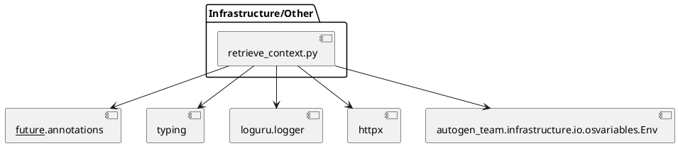
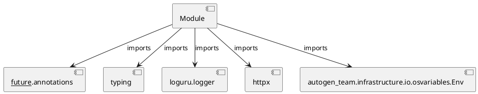
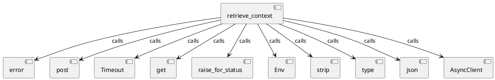

# Module Specification: retrieve_context

* **Source Reference:** `src/autogen_team/application/mcp/tools/retrieve_context.py`

## 1. Architectural Role & Responsibilities
**Purpose:**
Provides functionality related to retrieve context.

**Architecture Layer:**
- Infrastructure/Other

**Responsibilities:**
- Not explicitly defined.

**Main Workflow:**
- Not explicitly defined.

## 2. Dependencies
**Imports:**
- `__future__.annotations`
- `typing`
- `loguru.logger`
- `httpx`
- `autogen_team.infrastructure.io.osvariables.Env`

**Exported Classes:**
- None

**Exported Functions:**
- `retrieve_context`

**Exported Interfaces:**
- Not explicitly defined.

**Public API:**
- Not explicitly defined.

## 3. Architecture & Execution
### Internal Architecture
Not explicitly defined.

### Execution Flow
Not explicitly defined.

### Sequence Explanation
Not explicitly defined.

### Examples
Not explicitly defined.

## 4. UML 2.0 Diagrams
### Class Diagram

```plantuml
@startuml
    ' No classes found in module
@enduml
```

### Package Diagram

```plantuml
@startuml
    package "src" {
        package "autogen_team" {
            package "application" {
                package "mcp" {
                    package "tools" {
                        [retrieve_context.py]
                    }
                }
            }
        }
    }
@enduml
```

### Sequence Diagram

```plantuml
@startuml
    retrieve_context -> error : call
    retrieve_context -> post : call
    retrieve_context -> Timeout : call
    retrieve_context -> get : call
    retrieve_context -> raise_for_status : call
    retrieve_context -> Env : call
    retrieve_context -> strip : call
    retrieve_context -> type : call
    retrieve_context -> json : call
    retrieve_context -> AsyncClient : call
@enduml
```

### Component Diagram

```plantuml
@startuml
    package "Infrastructure/Other" {
        [retrieve_context.py]
    }
    [retrieve_context.py] --> [__future__.annotations]
    [retrieve_context.py] --> [typing]
    [retrieve_context.py] --> [loguru.logger]
    [retrieve_context.py] --> [httpx]
    [retrieve_context.py] --> [autogen_team.infrastructure.io.osvariables.Env]
@enduml
```

### Dependency Graph

```plantuml
@startuml
    [Module] --> [__future__.annotations] : imports
    [Module] --> [typing] : imports
    [Module] --> [loguru.logger] : imports
    [Module] --> [httpx] : imports
    [Module] --> [autogen_team.infrastructure.io.osvariables.Env] : imports
@enduml
```

## 5. Class & Method Specifications
## 6. Module Functions
### `retrieve_context(query: str, collection_name: str) -> T.Dict[str, T.Any]` (Public)
**Description:** Query R2R RAG system for relevant codebase patterns via semantic search.

Args:
    query: Search query string.
    collection_name: Name of the R2R collection to search.

Returns:
    Dict with matching documents and graph context.

**Inputs:**
- `query`
  - type: str
  - meaning: Not explicitly defined.
  - valid values: Not explicitly defined.
  - optional?: False
  - default value: None
- `collection_name`
  - type: str
  - meaning: Not explicitly defined.
  - valid values: Not explicitly defined.
  - optional?: True
  - default value: 'default'

**Output:**
- return type: `T.Dict[str, T.Any]`
- semantic meaning: Not explicitly defined.
- possible null values: Not explicitly defined.
- exceptions: Not explicitly defined.

**Side Effects:**
- Database updates: Not explicitly defined.
- File operations: Not explicitly defined.
- Network calls: Not explicitly defined.
- Cache: Not explicitly defined.
- State changes: Not explicitly defined.

**Complexity:**
- Time Complexity: Not explicitly defined.
- Space Complexity: Not explicitly defined.

**Example:**
```python
result = retrieve_context(..., ...)
```

## 7. Call Graph

```plantuml
@startuml
[retrieve_context] --> [error] : calls
[retrieve_context] --> [post] : calls
[retrieve_context] --> [Timeout] : calls
[retrieve_context] --> [get] : calls
[retrieve_context] --> [raise_for_status] : calls
[retrieve_context] --> [Env] : calls
[retrieve_context] --> [strip] : calls
[retrieve_context] --> [type] : calls
[retrieve_context] --> [json] : calls
[retrieve_context] --> [AsyncClient] : calls
@enduml
```

## 8. Cross References
- **Dependencies:** [Dependencies](../../../../../../dependencies/index.md)
- **Used by:** None
- **Calls:** error, post, Timeout, get, raise_for_status, Env, strip, type, json, AsyncClient
- **Called from:** ../../../../../tests/application/mcp/tools/test_retrieve_context.md
- **Related classes:** [Classes](../../../../../../classes/index.md)
- **Related diagrams:** [Diagrams](../../../../../../diagrams/index.md)
