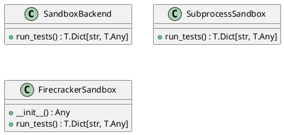
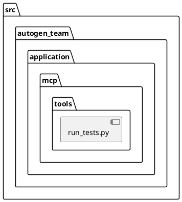
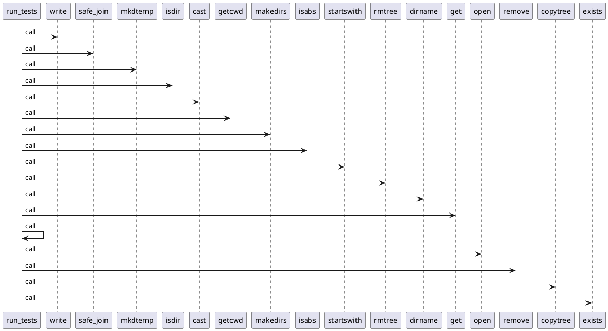
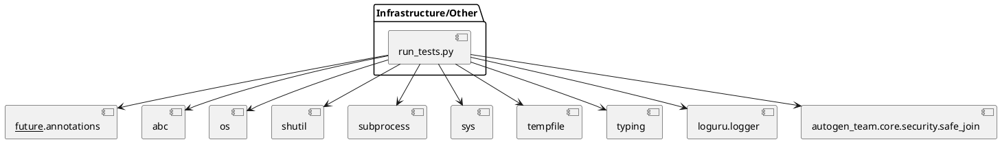
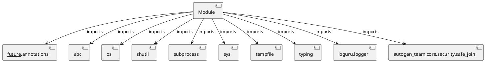

# Module Specification: run_tests

* **Source Reference:** `src/autogen_team/application/mcp/tools/run_tests.py`

## 1. Architectural Role & Responsibilities
**Purpose:**
Provides functionality related to run tests.

**Architecture Layer:**
- Infrastructure/Other

**Responsibilities:**
- Not explicitly defined.

**Main Workflow:**
- Not explicitly defined.

## 2. Dependencies
**Imports:**
- `__future__.annotations`
- `abc`
- `os`
- `shutil`
- `subprocess`
- `sys`
- `tempfile`
- `typing`
- `loguru.logger`
- `autogen_team.core.security.safe_join`

**Exported Classes:**
- `SandboxBackend`
- `SubprocessSandbox`
- `FirecrackerSandbox`

**Exported Functions:**
- `run_tests`

**Exported Interfaces:**
- Not explicitly defined.

**Public API:**
- Not explicitly defined.

## 3. Architecture & Execution
### Internal Architecture
Not explicitly defined.

### Execution Flow
Not explicitly defined.

### Sequence Explanation
Not explicitly defined.

### Examples
Not explicitly defined.

## 4. UML 2.0 Diagrams
### Class Diagram

```plantuml
@startuml
    class SandboxBackend {
        +run_tests() : T.Dict[str, T.Any]
    }
    class SubprocessSandbox {
        +run_tests() : T.Dict[str, T.Any]
    }
    class FirecrackerSandbox {
        +__init__() : Any
        +run_tests() : T.Dict[str, T.Any]
    }
@enduml
```

### Package Diagram

```plantuml
@startuml
    package "src" {
        package "autogen_team" {
            package "application" {
                package "mcp" {
                    package "tools" {
                        [run_tests.py]
                    }
                }
            }
        }
    }
@enduml
```

### Sequence Diagram

```plantuml
@startuml
    run_tests -> write : call
    run_tests -> safe_join : call
    run_tests -> mkdtemp : call
    run_tests -> isdir : call
    run_tests -> cast : call
    run_tests -> getcwd : call
    run_tests -> makedirs : call
    run_tests -> isabs : call
    run_tests -> startswith : call
    run_tests -> rmtree : call
    run_tests -> dirname : call
    run_tests -> get : call
    run_tests -> run_tests : call
    run_tests -> open : call
    run_tests -> remove : call
    run_tests -> copytree : call
    run_tests -> exists : call
@enduml
```

### Component Diagram

```plantuml
@startuml
    package "Infrastructure/Other" {
        [run_tests.py]
    }
    [run_tests.py] --> [__future__.annotations]
    [run_tests.py] --> [abc]
    [run_tests.py] --> [os]
    [run_tests.py] --> [shutil]
    [run_tests.py] --> [subprocess]
    [run_tests.py] --> [sys]
    [run_tests.py] --> [tempfile]
    [run_tests.py] --> [typing]
    [run_tests.py] --> [loguru.logger]
    [run_tests.py] --> [autogen_team.core.security.safe_join]
@enduml
```

### Dependency Graph

```plantuml
@startuml
    [Module] --> [__future__.annotations] : imports
    [Module] --> [abc] : imports
    [Module] --> [os] : imports
    [Module] --> [shutil] : imports
    [Module] --> [subprocess] : imports
    [Module] --> [sys] : imports
    [Module] --> [tempfile] : imports
    [Module] --> [typing] : imports
    [Module] --> [loguru.logger] : imports
    [Module] --> [autogen_team.core.security.safe_join] : imports
@enduml
```

## 5. Class & Method Specifications
### `SandboxBackend` ([`src/autogen_team/application/mcp/tools/run_tests.py`](/src/autogen_team/application/mcp/tools/run_tests.py))
#### Overview
Abstract sandbox backend for running tests.

Provides an interface for future Firecracker MicroVM integration.

#### Attributes
- None found.

#### Methods
##### `run_tests(self, workspace_dir: str, timeout: int) -> T.Dict[str, T.Any]` (Public)
**Description:** Run tests in the sandbox.

Args:
    workspace_dir: Path to the workspace with changes applied.
    timeout: Maximum execution time in seconds.

Returns:
    Dict with passed, summary, and details fields.

**Inputs:**
- `workspace_dir`
  - type: str
  - meaning: Not explicitly defined.
  - valid values: Not explicitly defined.
  - optional?: False
  - default value: None
- `timeout`
  - type: int
  - meaning: Not explicitly defined.
  - valid values: Not explicitly defined.
  - optional?: True
  - default value: 300

**Output:**
- return type: `T.Dict[str, T.Any]`
- semantic meaning: Not explicitly defined.
- possible null values: Not explicitly defined.
- exceptions: Not explicitly defined.

**Side Effects:**
- Database updates: Not explicitly defined.
- File operations: Not explicitly defined.
- Network calls: Not explicitly defined.
- Cache: Not explicitly defined.
- State changes: Not explicitly defined.

**Complexity:**
- Time Complexity: Not explicitly defined.
- Space Complexity: Not explicitly defined.

**Example:**
```python
result = SandboxBackend.run_tests(..., ...)
```

### `SubprocessSandbox` ([`src/autogen_team/application/mcp/tools/run_tests.py`](/src/autogen_team/application/mcp/tools/run_tests.py))
#### Overview
Subprocess-based sandbox for running pytest.

#### Attributes
- None found.

#### Methods
##### `run_tests(self, workspace_dir: str, timeout: int) -> T.Dict[str, T.Any]` (Public)
**Description:** Run pytest via subprocess in the given workspace.

Args:
    workspace_dir: Path to the workspace with changes applied.
    timeout: Maximum execution time in seconds.

Returns:
    Dict with passed, summary, and details fields.

**Inputs:**
- `workspace_dir`
  - type: str
  - meaning: Not explicitly defined.
  - valid values: Not explicitly defined.
  - optional?: False
  - default value: None
- `timeout`
  - type: int
  - meaning: Not explicitly defined.
  - valid values: Not explicitly defined.
  - optional?: True
  - default value: 300

**Output:**
- return type: `T.Dict[str, T.Any]`
- semantic meaning: Not explicitly defined.
- possible null values: Not explicitly defined.
- exceptions: Not explicitly defined.

**Side Effects:**
- Database updates: Not explicitly defined.
- File operations: Not explicitly defined.
- Network calls: Not explicitly defined.
- Cache: Not explicitly defined.
- State changes: Not explicitly defined.

**Complexity:**
- Time Complexity: Not explicitly defined.
- Space Complexity: Not explicitly defined.

**Example:**
```python
result = SubprocessSandbox.run_tests(..., ...)
```

### `FirecrackerSandbox` ([`src/autogen_team/application/mcp/tools/run_tests.py`](/src/autogen_team/application/mcp/tools/run_tests.py))
#### Overview
Firecracker-based sandbox using SandboxService.

#### Constructor
**Initialization:** Initializes `FirecrackerSandbox` with required dependencies and sets up initial internal state.

#### Attributes
- `service`
  - Type: Any
  - Purpose: Not explicitly defined.
  - Constraints: Not explicitly defined.

#### Methods
##### `__init__(self, sandbox_service: T.Any | None) -> Any` (Public)
**Description:** Executes the   init   operation.

**Inputs:**
- `sandbox_service`
  - type: T.Any | None
  - meaning: Not explicitly defined.
  - valid values: Not explicitly defined.
  - optional?: True
  - default value: None

**Output:**
- return type: `Any`
- semantic meaning: Not explicitly defined.
- possible null values: Not explicitly defined.
- exceptions: Not explicitly defined.

**Side Effects:**
- Database updates: Not explicitly defined.
- File operations: Not explicitly defined.
- Network calls: Not explicitly defined.
- Cache: Not explicitly defined.
- State changes: Not explicitly defined.

**Complexity:**
- Time Complexity: Not explicitly defined.
- Space Complexity: Not explicitly defined.

**Example:**
```python
instance = FirecrackerSandbox()
result = instance.__init__(...)
```

##### `run_tests(self, workspace_dir: str, timeout: int) -> T.Dict[str, T.Any]` (Public)
**Description:** Note: This is a synchronous wrapper for the async service.
In a real scenario, the tool should be async.

**Inputs:**
- `workspace_dir`
  - type: str
  - meaning: Not explicitly defined.
  - valid values: Not explicitly defined.
  - optional?: False
  - default value: None
- `timeout`
  - type: int
  - meaning: Not explicitly defined.
  - valid values: Not explicitly defined.
  - optional?: True
  - default value: 300

**Output:**
- return type: `T.Dict[str, T.Any]`
- semantic meaning: Not explicitly defined.
- possible null values: Not explicitly defined.
- exceptions: Not explicitly defined.

**Side Effects:**
- Database updates: Not explicitly defined.
- File operations: Not explicitly defined.
- Network calls: Not explicitly defined.
- Cache: Not explicitly defined.
- State changes: Not explicitly defined.

**Complexity:**
- Time Complexity: Not explicitly defined.
- Space Complexity: Not explicitly defined.

**Example:**
```python
instance = FirecrackerSandbox()
result = instance.run_tests(..., ...)
```

## 6. Module Functions
### `run_tests(changes: T.Dict[str, T.Any], workspace_path: str, timeout: int, sandbox: SandboxBackend | None) -> T.Dict[str, T.Any]` (Public)
**Description:** Run pytest against code changes in an isolated sandbox.

Args:
    changes: Dict with files_changed list (path, action, content).
    workspace_path: Original workspace path to copy from.
    timeout: Max execution time in seconds.
    sandbox: Optional sandbox backend (defaults to SubprocessSandbox).

Returns:
    Dict with passed bool, summary string, and details.

**Inputs:**
- `changes`
  - type: T.Dict[str, T.Any]
  - meaning: Not explicitly defined.
  - valid values: Not explicitly defined.
  - optional?: False
  - default value: None
- `workspace_path`
  - type: str
  - meaning: Not explicitly defined.
  - valid values: Not explicitly defined.
  - optional?: True
  - default value: ''
- `timeout`
  - type: int
  - meaning: Not explicitly defined.
  - valid values: Not explicitly defined.
  - optional?: True
  - default value: 300
- `sandbox`
  - type: SandboxBackend | None
  - meaning: Not explicitly defined.
  - valid values: Not explicitly defined.
  - optional?: True
  - default value: None

**Output:**
- return type: `T.Dict[str, T.Any]`
- semantic meaning: Not explicitly defined.
- possible null values: Not explicitly defined.
- exceptions: Not explicitly defined.

**Side Effects:**
- Database updates: Not explicitly defined.
- File operations: Not explicitly defined.
- Network calls: Not explicitly defined.
- Cache: Not explicitly defined.
- State changes: Not explicitly defined.

**Complexity:**
- Time Complexity: Not explicitly defined.
- Space Complexity: Not explicitly defined.

**Example:**
```python
result = run_tests(..., ..., ..., ...)
```

## 7. Call Graph

```plantuml
@startuml
[run_tests] --> [isdir] : calls
[run_tests] --> [run_until_complete] : calls
[run_tests] --> [cast] : calls
[run_tests] --> [run] : calls
[run_tests] --> [getcwd] : calls
[run_tests] --> [open] : calls
[run_tests] --> [get] : calls
[run_tests] --> [copytree] : calls
[run_tests] --> [safe_join] : calls
[run_tests] --> [SandboxService] : calls
[run_tests] --> [makedirs] : calls
[run_tests] --> [is_running] : calls
[run_tests] --> [run_tests] : calls
[run_tests] --> [get_event_loop] : calls
[run_tests] --> [SubprocessSandbox] : calls
[run_tests] --> [_run] : calls
[run_tests] --> [destroy] : calls
[run_tests] --> [create_sandbox] : calls
[run_tests] --> [len] : calls
[run_tests] --> [startswith] : calls
[run_tests] --> [remove] : calls
[run_tests] --> [exists] : calls
[run_tests] --> [write] : calls
[run_tests] --> [mkdtemp] : calls
[run_tests] --> [run_coroutine_threadsafe] : calls
[run_tests] --> [exception] : calls
[run_tests] --> [isabs] : calls
[run_tests] --> [run_python_tests] : calls
[run_tests] --> [rmtree] : calls
[run_tests] --> [result] : calls
[run_tests] --> [dirname] : calls
@enduml
```

## 8. Cross References
- **Dependencies:** [Dependencies](../../../../../../dependencies/index.md)
- **Used by:** ../../../../../tests/application/mcp/tools/test_run_tests.md
- **Calls:** isdir, run_until_complete, cast, run, getcwd, open, get, copytree, safe_join, SandboxService, makedirs, is_running, run_tests, get_event_loop, SubprocessSandbox, _run, destroy, create_sandbox, len, startswith, remove, exists, write, mkdtemp, run_coroutine_threadsafe, exception, isabs, run_python_tests, rmtree, result, dirname
- **Called from:** ../../../../../tests/security/test_mcp_path_traversal.md, ../../../../../tests/application/mcp/tools/test_run_tests.md, ../../workflows/autonomous_mission.md, ../../../../../tests/application/agents/test_agents.md, ../../../../../Scripts/verify_agent_mcp.md
- **Related classes:** [Classes](../../../../../../classes/index.md)
- **Related diagrams:** [Diagrams](../../../../../../diagrams/index.md)
