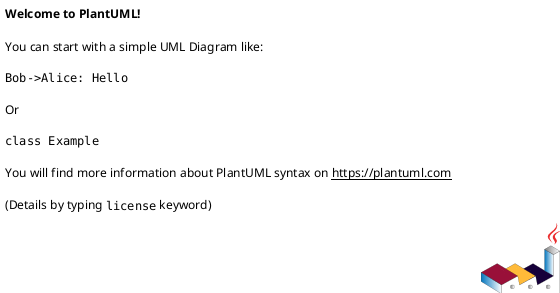
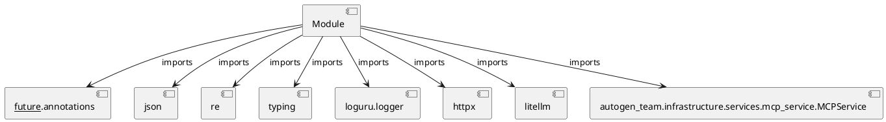

# Module Specification: security_review

* **Source Reference:** `src/autogen_team/application/mcp/tools/security_review.py`

## 1. Architectural Role & Responsibilities
**Purpose:**
Provides functionality related to security review.

**Architecture Layer:**
- Infrastructure/Other

**Responsibilities:**
- Not explicitly defined.

**Main Workflow:**
- Not explicitly defined.

## 2. Dependencies
**Imports:**
- `__future__.annotations`
- `json`
- `re`
- `typing`
- `loguru.logger`
- `httpx`
- `litellm`
- `autogen_team.infrastructure.services.mcp_service.MCPService`

**Exported Classes:**
- None

**Exported Functions:**
- `_scan_owasp_patterns`
- `_query_r2r_security`
- `security_review`

## 3. Architecture & Execution
### Internal Architecture
Not explicitly defined.

### Execution Flow
Not explicitly defined.

### Sequence Explanation
Not explicitly defined.

## 4. UML 2.0 Diagrams
### Class Diagram

### Dependency Graph

## 5. Class & Method Specifications
## 6. Module Functions
### `_scan_owasp_patterns(diff: str)`
Scan diff against OWASP patterns.

Args:
    diff: The code diff string to analyze.

Returns:
    List of findings dicts with rule, severity, location, description.

**Inputs:**
- `diff`: str

**Output:**
- Return Type: `T.List[T.Dict[str, str]]`

### `_query_r2r_security(diff: str, r2r_base_url: str)`
Query R2R RAG for security best practices relevant to the diff.

Args:
    diff: Code diff to find context for.
    r2r_base_url: R2R API base URL.

Returns:
    List of relevant security documents.

**Inputs:**
- `diff`: str
- `r2r_base_url`: str

**Output:**
- Return Type: `T.List[T.Dict[str, T.Any]]`

### `security_review(diff: str)`
Analyze code diffs against OWASP patterns and R2R RAG security knowledge.

Args:
    diff: The code diff string to review.

Returns:
    Dict with status (approved/rejected) and findings list.

**Inputs:**
- `diff`: str

**Output:**
- Return Type: `T.Dict[str, T.Any]`
