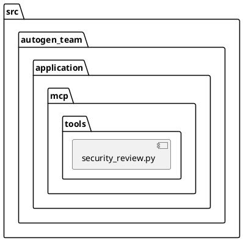
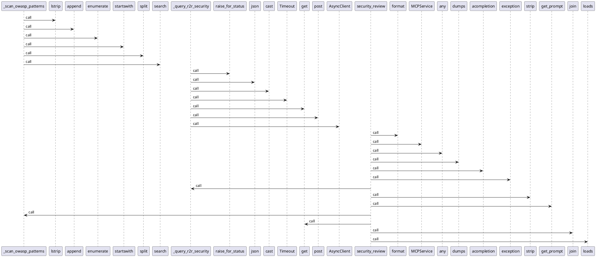
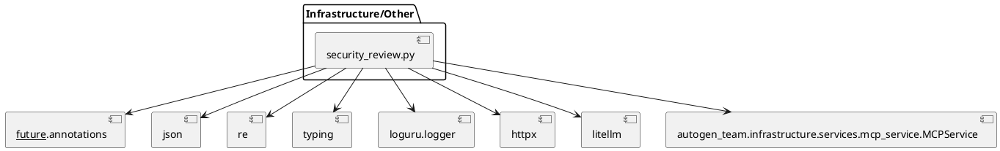
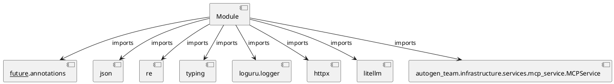

# Module Specification: security_review

* **Source Reference:** `src/autogen_team/application/mcp/tools/security_review.py`

## 1. Architectural Role & Responsibilities
**Purpose:**
Provides functionality related to security review.

**Architecture Layer:**
- Infrastructure/Other

**Responsibilities:**
- Not explicitly defined.

**Main Workflow:**
- Not explicitly defined.

## 2. Dependencies
**Imports:**
- `__future__.annotations`
- `json`
- `re`
- `typing`
- `loguru.logger`
- `httpx`
- `litellm`
- `autogen_team.infrastructure.services.mcp_service.MCPService`

**Exported Classes:**
- None

**Exported Functions:**
- `_scan_owasp_patterns`
- `_query_r2r_security`
- `security_review`

**Exported Interfaces:**
- Not explicitly defined.

**Public API:**
- Not explicitly defined.

## 3. Architecture & Execution
### Internal Architecture
Not explicitly defined.

### Execution Flow
Not explicitly defined.

### Sequence Explanation
Not explicitly defined.

### Examples
Not explicitly defined.

## 4. UML 2.0 Diagrams
### Class Diagram

```plantuml
@startuml
    ' No classes found in module
@enduml
```

### Package Diagram

```plantuml
@startuml
    package "src" {
        package "autogen_team" {
            package "application" {
                package "mcp" {
                    package "tools" {
                        [security_review.py]
                    }
                }
            }
        }
    }
@enduml
```

### Sequence Diagram

```plantuml
@startuml
    _scan_owasp_patterns -> lstrip : call
    _scan_owasp_patterns -> append : call
    _scan_owasp_patterns -> enumerate : call
    _scan_owasp_patterns -> startswith : call
    _scan_owasp_patterns -> split : call
    _scan_owasp_patterns -> search : call
    _query_r2r_security -> raise_for_status : call
    _query_r2r_security -> json : call
    _query_r2r_security -> cast : call
    _query_r2r_security -> Timeout : call
    _query_r2r_security -> get : call
    _query_r2r_security -> post : call
    _query_r2r_security -> AsyncClient : call
    security_review -> format : call
    security_review -> MCPService : call
    security_review -> any : call
    security_review -> dumps : call
    security_review -> acompletion : call
    security_review -> exception : call
    security_review -> _query_r2r_security : call
    security_review -> strip : call
    security_review -> get_prompt : call
    security_review -> _scan_owasp_patterns : call
    security_review -> get : call
    security_review -> join : call
    security_review -> loads : call
@enduml
```

### Component Diagram

```plantuml
@startuml
    package "Infrastructure/Other" {
        [security_review.py]
    }
    [security_review.py] --> [__future__.annotations]
    [security_review.py] --> [json]
    [security_review.py] --> [re]
    [security_review.py] --> [typing]
    [security_review.py] --> [loguru.logger]
    [security_review.py] --> [httpx]
    [security_review.py] --> [litellm]
    [security_review.py] --> [autogen_team.infrastructure.services.mcp_service.MCPService]
@enduml
```

### Dependency Graph

```plantuml
@startuml
    [Module] --> [__future__.annotations] : imports
    [Module] --> [json] : imports
    [Module] --> [re] : imports
    [Module] --> [typing] : imports
    [Module] --> [loguru.logger] : imports
    [Module] --> [httpx] : imports
    [Module] --> [litellm] : imports
    [Module] --> [autogen_team.infrastructure.services.mcp_service.MCPService] : imports
@enduml
```

## 5. Class & Method Specifications
## 6. Module Functions
### `_scan_owasp_patterns(diff: str) -> T.List[T.Dict[str, str]]` (Private)
**Purpose:** Scan diff against OWASP patterns.

Args:
    diff: The code diff string to analyze.

Returns:
    List of findings dicts with rule, severity, location, description.

**Parameters:**
- `diff`: str

**Return value:**
- `T.List[T.Dict[str, str]]`

### `_query_r2r_security(diff: str, r2r_base_url: str) -> T.List[T.Dict[str, T.Any]]` (Private)
**Purpose:** Query R2R RAG for security best practices relevant to the diff.

Args:
    diff: Code diff to find context for.
    r2r_base_url: R2R API base URL.

Returns:
    List of relevant security documents.

**Parameters:**
- `diff`: str
- `r2r_base_url`: str

**Return value:**
- `T.List[T.Dict[str, T.Any]]`

### `security_review(diff: str) -> T.Dict[str, T.Any]` (Public)
**Description:** Analyze code diffs against OWASP patterns and R2R RAG security knowledge.

Args:
    diff: The code diff string to review.

Returns:
    Dict with status (approved/rejected) and findings list.

**Inputs:**
- `diff`
  - type: str
  - meaning: Not explicitly defined.
  - valid values: Not explicitly defined.
  - optional?: False
  - default value: None

**Output:**
- return type: `T.Dict[str, T.Any]`
- semantic meaning: Not explicitly defined.
- possible null values: Not explicitly defined.
- exceptions: Not explicitly defined.

**Side Effects:**
- Database updates: Not explicitly defined.
- File operations: Not explicitly defined.
- Network calls: Not explicitly defined.
- Cache: Not explicitly defined.
- State changes: Not explicitly defined.

**Complexity:**
- Time Complexity: Not explicitly defined.
- Space Complexity: Not explicitly defined.

**Example:**
```python
result = security_review(...)
```

## 7. Call Graph

```plantuml
@startuml
[security_review] --> [cast] : calls
[security_review] --> [append] : calls
[security_review] --> [get] : calls
[security_review] --> [join] : calls
[security_review] --> [loads] : calls
[security_review] --> [lstrip] : calls
[security_review] --> [raise_for_status] : calls
[security_review] --> [format] : calls
[security_review] --> [dumps] : calls
[security_review] --> [_scan_owasp_patterns] : calls
[security_review] --> [split] : calls
[security_review] --> [AsyncClient] : calls
[security_review] --> [search] : calls
[security_review] --> [MCPService] : calls
[security_review] --> [Timeout] : calls
[security_review] --> [strip] : calls
[security_review] --> [get_prompt] : calls
[security_review] --> [startswith] : calls
[security_review] --> [any] : calls
[security_review] --> [json] : calls
[security_review] --> [acompletion] : calls
[security_review] --> [exception] : calls
[security_review] --> [enumerate] : calls
[security_review] --> [_query_r2r_security] : calls
[security_review] --> [post] : calls
@enduml
```

## 8. Cross References
- **Dependencies:** [Dependencies](../../../../../../dependencies/index.md)
- **Used by:** None
- **Calls:** cast, append, get, join, loads, lstrip, raise_for_status, format, dumps, _scan_owasp_patterns, split, AsyncClient, search, MCPService, Timeout, strip, get_prompt, startswith, any, json, acompletion, exception, enumerate, _query_r2r_security, post
- **Called from:** ../../../../../tests/application/mcp/tools/test_security_review.md
- **Related classes:** [Classes](../../../../../../classes/index.md)
- **Related diagrams:** [Diagrams](../../../../../../diagrams/index.md)
