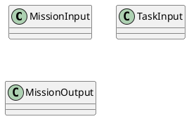

# Module Specification: autonomous_mission

* **Source Reference:** `src/autogen_team/application/workflows/autonomous_mission.py`

## 1. Architectural Role & Responsibilities
**Purpose:**
Provides functionality related to autonomous mission.

**Architecture Layer:**
- Infrastructure/Other

**Responsibilities:**
- Manage and execute operations for autonomous_mission.

**Main Workflow:**
- Initialize components and process requests for autonomous_mission.

## 2. Dependencies
**Imports:**
- `typing.Any`
- `typing.Dict`
- `typing.List`
- `autogen_team.application.agents.coder_agent.CoderAgent`
- `autogen_team.application.agents.documentation_agent.DocumentationAgent`
- `autogen_team.application.agents.planner_agent.PlannerAgent`
- `autogen_team.application.agents.reviewer_agent.ReviewerAgent`
- `autogen_team.application.agents.tester_agent.TesterAgent`
- `autogen_team.infrastructure.services.hatchet_service.HatchetService`
- `hatchet_sdk.Context`
- `pydantic.BaseModel`

**Exported Classes:**
- `MissionInput`
- `TaskInput`
- `MissionOutput`

**Exported Functions:**
- `execute_coding_task`
- `plan`
- `fan_out_tasks`
- `aggregate_and_review`
- `document_mission`

## 3. Architecture & Execution
### Internal Architecture
Follows standard modular design, encapsulating state and behavior within defined classes and functions.

### Execution Flow
Sequential execution of defined functions and class methods.

### Sequence Explanation
Clients instantiate classes or call functions, which execute business logic and return results.

## 4. UML 2.0 Diagrams
### Class Diagram

### Dependency Graph

```plantuml
@startuml
    [Module] --> [typing.Any] : imports
    [Module] --> [typing.Dict] : imports
    [Module] --> [typing.List] : imports
    [Module] --> [autogen_team.application.agents.coder_agent.CoderAgent] : imports
    [Module] --> [autogen_team.application.agents.documentation_agent.DocumentationAgent] : imports
    [Module] --> [autogen_team.application.agents.planner_agent.PlannerAgent] : imports
    [Module] --> [autogen_team.application.agents.reviewer_agent.ReviewerAgent] : imports
    [Module] --> [autogen_team.application.agents.tester_agent.TesterAgent] : imports
    [Module] --> [autogen_team.infrastructure.services.hatchet_service.HatchetService] : imports
    [Module] --> [hatchet_sdk.Context] : imports
    [Module] --> [pydantic.BaseModel] : imports
@enduml
```

## 5. Class & Method Specifications
### `MissionInput` ([`src/autogen_team/application/workflows/autonomous_mission.py`](/src/autogen_team/application/workflows/autonomous_mission.py))
#### Overview
Input for the top-level autonomous-mission workflow.

#### Attributes
- None found.

#### Methods
### `TaskInput` ([`src/autogen_team/application/workflows/autonomous_mission.py`](/src/autogen_team/application/workflows/autonomous_mission.py))
#### Overview
Input for a single child coding-task workflow.

#### Attributes
- None found.

#### Methods
### `MissionOutput` ([`src/autogen_team/application/workflows/autonomous_mission.py`](/src/autogen_team/application/workflows/autonomous_mission.py))
#### Overview
Final output of the autonomous-mission workflow.

#### Attributes
- None found.

#### Methods
## 6. Module Functions
### `execute_coding_task(task_input: TaskInput, context: Context)`
Run the Coder Agent on a single task inside a child workflow.

**Inputs:**
- `task_input`: TaskInput
- `context`: Context

**Output:**
- Return Type: `Any`

### `plan(mission_input: MissionInput, context: Context)`
Step 1: Planner Agent analyses the goal and creates a task DAG.

**Inputs:**
- `mission_input`: MissionInput
- `context`: Context

**Output:**
- Return Type: `Any`

### `fan_out_tasks(mission_input: MissionInput, context: Context)`
Step 2: Spawn parallel child workflows for each coding task.

Uses ``develop_task_workflow.aio_run_many`` for true parallel
fan-out execution across the Hatchet worker pool.

**Inputs:**
- `mission_input`: MissionInput
- `context`: Context

**Output:**
- Return Type: `Any`

### `aggregate_and_review(mission_input: MissionInput, context: Context)`
Step 3: Aggregate child results, run tests, and perform security review.

**Inputs:**
- `mission_input`: MissionInput
- `context`: Context

**Output:**
- Return Type: `MissionOutput`

### `document_mission(mission_input: MissionInput, context: Context)`
Step 4: Generate documentation and diagrams for the mission.

**Inputs:**
- `mission_input`: MissionInput
- `context`: Context

**Output:**
- Return Type: `MissionOutput`
