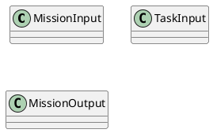
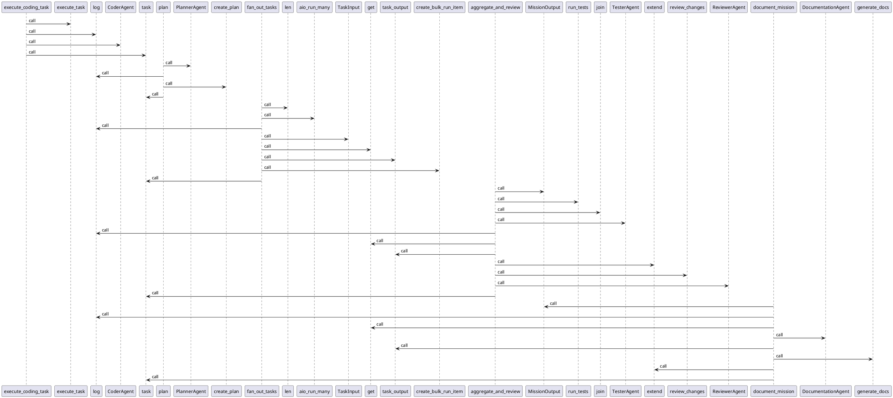

# Module Specification: autonomous_mission

* **Source Reference:** `src/autogen_team/application/workflows/autonomous_mission.py`

## 1. Architectural Role & Responsibilities
**Purpose:**
Provides functionality related to autonomous mission.

**Architecture Layer:**
- Infrastructure/Other

**Responsibilities:**
- Manages operations and logic for autonomous mission.

**Main Workflow:**
- Executes the primary flow defined by autonomous mission functions and classes.

## 2. Dependencies
**Imports:**
- `typing.Any`
- `typing.Dict`
- `typing.List`
- `autogen_team.application.agents.coder_agent.CoderAgent`
- `autogen_team.application.agents.documentation_agent.DocumentationAgent`
- `autogen_team.application.agents.planner_agent.PlannerAgent`
- `autogen_team.application.agents.reviewer_agent.ReviewerAgent`
- `autogen_team.application.agents.tester_agent.TesterAgent`
- `autogen_team.infrastructure.services.hatchet_service.HatchetService`
- `hatchet_sdk.Context`
- `pydantic.BaseModel`

**Exported Classes:**
- `MissionInput`
- `TaskInput`
- `MissionOutput`

**Exported Functions:**
- `execute_coding_task`
- `plan`
- `fan_out_tasks`
- `aggregate_and_review`
- `document_mission`

**Exported Interfaces:**
- Not explicitly defined.

**Public API:**
- Not explicitly defined.

## 3. Architecture & Execution
### Internal Architecture
Not explicitly defined.

### Execution Flow
Not explicitly defined.

### Sequence Explanation
Not explicitly defined.

### Examples
Not explicitly defined.

## 4. UML 2.0 Diagrams
### Class Diagram

```plantuml
@startuml
    class MissionInput {
    }
    class TaskInput {
    }
    class MissionOutput {
    }
@enduml
```

### Sequence Diagram

```plantuml
@startuml
    execute_coding_task -> execute_task : call
    execute_coding_task -> log : call
    execute_coding_task -> CoderAgent : call
    execute_coding_task -> task : call
    plan -> PlannerAgent : call
    plan -> log : call
    plan -> create_plan : call
    plan -> task : call
    fan_out_tasks -> len : call
    fan_out_tasks -> aio_run_many : call
    fan_out_tasks -> log : call
    fan_out_tasks -> TaskInput : call
    fan_out_tasks -> get : call
    fan_out_tasks -> task_output : call
    fan_out_tasks -> create_bulk_run_item : call
    fan_out_tasks -> task : call
    aggregate_and_review -> MissionOutput : call
    aggregate_and_review -> run_tests : call
    aggregate_and_review -> join : call
    aggregate_and_review -> TesterAgent : call
    aggregate_and_review -> log : call
    aggregate_and_review -> get : call
    aggregate_and_review -> task_output : call
    aggregate_and_review -> extend : call
    aggregate_and_review -> review_changes : call
    aggregate_and_review -> ReviewerAgent : call
    aggregate_and_review -> task : call
    document_mission -> MissionOutput : call
    document_mission -> log : call
    document_mission -> get : call
    document_mission -> DocumentationAgent : call
    document_mission -> task_output : call
    document_mission -> generate_docs : call
    document_mission -> extend : call
    document_mission -> task : call
@enduml
```

### Component Diagram

```plantuml
@startuml
    package "Infrastructure/Other" {
        [autonomous_mission.py]
    }
    [autonomous_mission.py] --> [typing.Any]
    [autonomous_mission.py] --> [typing.Dict]
    [autonomous_mission.py] --> [typing.List]
    [autonomous_mission.py] --> [autogen_team.application.agents.coder_agent.CoderAgent]
    [autonomous_mission.py] --> [autogen_team.application.agents.documentation_agent.DocumentationAgent]
    [autonomous_mission.py] --> [autogen_team.application.agents.planner_agent.PlannerAgent]
    [autonomous_mission.py] --> [autogen_team.application.agents.reviewer_agent.ReviewerAgent]
    [autonomous_mission.py] --> [autogen_team.application.agents.tester_agent.TesterAgent]
    [autonomous_mission.py] --> [autogen_team.infrastructure.services.hatchet_service.HatchetService]
    [autonomous_mission.py] --> [hatchet_sdk.Context]
    [autonomous_mission.py] --> [pydantic.BaseModel]
@enduml
```

### Dependency Graph

```plantuml
@startuml
    [Module] --> [typing.Any] : imports
    [Module] --> [typing.Dict] : imports
    [Module] --> [typing.List] : imports
    [Module] --> [autogen_team.application.agents.coder_agent.CoderAgent] : imports
    [Module] --> [autogen_team.application.agents.documentation_agent.DocumentationAgent] : imports
    [Module] --> [autogen_team.application.agents.planner_agent.PlannerAgent] : imports
    [Module] --> [autogen_team.application.agents.reviewer_agent.ReviewerAgent] : imports
    [Module] --> [autogen_team.application.agents.tester_agent.TesterAgent] : imports
    [Module] --> [autogen_team.infrastructure.services.hatchet_service.HatchetService] : imports
    [Module] --> [hatchet_sdk.Context] : imports
    [Module] --> [pydantic.BaseModel] : imports
@enduml
```

## 5. Class & Method Specifications
### `MissionInput` ([`src/autogen_team/application/workflows/autonomous_mission.py`](/src/autogen_team/application/workflows/autonomous_mission.py))
#### Overview
Input for the top-level autonomous-mission workflow.

#### Attributes
- None found.

#### Methods
### `TaskInput` ([`src/autogen_team/application/workflows/autonomous_mission.py`](/src/autogen_team/application/workflows/autonomous_mission.py))
#### Overview
Input for a single child coding-task workflow.

#### Attributes
- None found.

#### Methods
### `MissionOutput` ([`src/autogen_team/application/workflows/autonomous_mission.py`](/src/autogen_team/application/workflows/autonomous_mission.py))
#### Overview
Final output of the autonomous-mission workflow.

#### Attributes
- None found.

#### Methods
## 6. Module Functions
### `execute_coding_task(task_input: TaskInput, context: Context)`
Run the Coder Agent on a single task inside a child workflow.

**Inputs:**
- `task_input`
  - type: TaskInput
  - meaning: Represents the task input parameter.
  - valid values: Any valid TaskInput.
  - optional?: False
  - default value: None
- `context`
  - type: Context
  - meaning: Represents the context parameter.
  - valid values: Any valid Context.
  - optional?: False
  - default value: None

**Output:**
- return type: `Dict[str, Any]`
- semantic meaning: Returns the result of execute coding task.
- possible null values: Yes, if Dict[str, Any] allows it.
- exceptions: Standard execution exceptions.

**Side Effects:**
- Database updates: Not explicitly defined.
- File operations: Not explicitly defined.
- Network calls: Not explicitly defined.
- Cache: Not explicitly defined.
- State changes: Not explicitly defined.

### `plan(mission_input: MissionInput, context: Context)`
Step 1: Planner Agent analyses the goal and creates a task DAG.

**Inputs:**
- `mission_input`
  - type: MissionInput
  - meaning: Represents the mission input parameter.
  - valid values: Any valid MissionInput.
  - optional?: False
  - default value: None
- `context`
  - type: Context
  - meaning: Represents the context parameter.
  - valid values: Any valid Context.
  - optional?: False
  - default value: None

**Output:**
- return type: `Dict[str, Any]`
- semantic meaning: Returns the result of plan.
- possible null values: Yes, if Dict[str, Any] allows it.
- exceptions: Standard execution exceptions.

**Side Effects:**
- Database updates: Not explicitly defined.
- File operations: Not explicitly defined.
- Network calls: Not explicitly defined.
- Cache: Not explicitly defined.
- State changes: Not explicitly defined.

### `fan_out_tasks(mission_input: MissionInput, context: Context)`
Step 2: Spawn parallel child workflows for each coding task.

Uses ``develop_task_workflow.aio_run_many`` for true parallel
fan-out execution across the Hatchet worker pool.

**Inputs:**
- `mission_input`
  - type: MissionInput
  - meaning: Represents the mission input parameter.
  - valid values: Any valid MissionInput.
  - optional?: False
  - default value: None
- `context`
  - type: Context
  - meaning: Represents the context parameter.
  - valid values: Any valid Context.
  - optional?: False
  - default value: None

**Output:**
- return type: `Dict[str, Any]`
- semantic meaning: Returns the result of fan out tasks.
- possible null values: Yes, if Dict[str, Any] allows it.
- exceptions: Standard execution exceptions.

**Side Effects:**
- Database updates: Not explicitly defined.
- File operations: Not explicitly defined.
- Network calls: Not explicitly defined.
- Cache: Not explicitly defined.
- State changes: Not explicitly defined.

### `aggregate_and_review(mission_input: MissionInput, context: Context)`
Step 3: Aggregate child results, run tests, and perform security review.

**Inputs:**
- `mission_input`
  - type: MissionInput
  - meaning: Represents the mission input parameter.
  - valid values: Any valid MissionInput.
  - optional?: False
  - default value: None
- `context`
  - type: Context
  - meaning: Represents the context parameter.
  - valid values: Any valid Context.
  - optional?: False
  - default value: None

**Output:**
- return type: `MissionOutput`
- semantic meaning: Returns the result of aggregate and review.
- possible null values: Yes, if MissionOutput allows it.
- exceptions: Standard execution exceptions.

**Side Effects:**
- Database updates: Not explicitly defined.
- File operations: Not explicitly defined.
- Network calls: Not explicitly defined.
- Cache: Not explicitly defined.
- State changes: Not explicitly defined.

### `document_mission(mission_input: MissionInput, context: Context)`
Step 4: Generate documentation and diagrams for the mission.

**Inputs:**
- `mission_input`
  - type: MissionInput
  - meaning: Represents the mission input parameter.
  - valid values: Any valid MissionInput.
  - optional?: False
  - default value: None
- `context`
  - type: Context
  - meaning: Represents the context parameter.
  - valid values: Any valid Context.
  - optional?: False
  - default value: None

**Output:**
- return type: `MissionOutput`
- semantic meaning: Returns the result of document mission.
- possible null values: Yes, if MissionOutput allows it.
- exceptions: Standard execution exceptions.

**Side Effects:**
- Database updates: Not explicitly defined.
- File operations: Not explicitly defined.
- Network calls: Not explicitly defined.
- Cache: Not explicitly defined.
- State changes: Not explicitly defined.

## 7. Call Graph

```plantuml
@startuml
[autonomous_mission] --> [len] : calls
[autonomous_mission] --> [HatchetService] : calls
[autonomous_mission] --> [PlannerAgent] : calls
[autonomous_mission] --> [task] : calls
[autonomous_mission] --> [MissionOutput] : calls
[autonomous_mission] --> [aio_run_many] : calls
[autonomous_mission] --> [run_tests] : calls
[autonomous_mission] --> [join] : calls
[autonomous_mission] --> [log] : calls
[autonomous_mission] --> [task_output] : calls
[autonomous_mission] --> [create_bulk_run_item] : calls
[autonomous_mission] --> [review_changes] : calls
[autonomous_mission] --> [workflow] : calls
[autonomous_mission] --> [DocumentationAgent] : calls
[autonomous_mission] --> [create_plan] : calls
[autonomous_mission] --> [execute_task] : calls
[autonomous_mission] --> [generate_docs] : calls
[autonomous_mission] --> [extend] : calls
[autonomous_mission] --> [TesterAgent] : calls
[autonomous_mission] --> [ReviewerAgent] : calls
[autonomous_mission] --> [get] : calls
[autonomous_mission] --> [TaskInput] : calls
[autonomous_mission] --> [CoderAgent] : calls
@enduml
```

## 8. Cross References
- **Parent module:** None
- **Child modules:** None
- **Dependencies:** `typing.List`, `autogen_team.application.agents.documentation_agent.DocumentationAgent`, `pydantic.BaseModel`, `hatchet_sdk.Context`, `autogen_team.application.agents.coder_agent.CoderAgent`, `autogen_team.application.agents.reviewer_agent.ReviewerAgent`, `typing.Dict`, `autogen_team.infrastructure.services.hatchet_service.HatchetService`, `typing.Any`, `autogen_team.application.agents.tester_agent.TesterAgent`, `autogen_team.application.agents.planner_agent.PlannerAgent`
- **Used by:** ../../../../tests/application/workflows/test_autonomous_mission.md
- **Calls:** len, HatchetService, PlannerAgent, task, MissionOutput, aio_run_many, run_tests, join, log, task_output, create_bulk_run_item, review_changes, workflow, DocumentationAgent, create_plan, execute_task, generate_docs, extend, TesterAgent, ReviewerAgent, get, TaskInput, CoderAgent
- **Called from:** None
- **Related classes:** [Classes](../../../../../classes/index.md)
- **Related interfaces:** Not explicitly defined.
- **Related diagrams:** [Diagrams](../../../../../diagrams/index.md)
