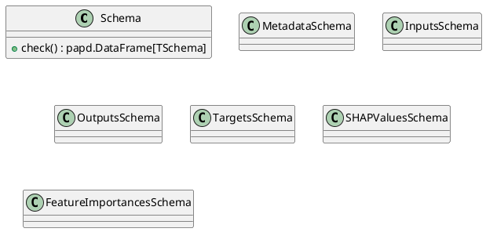
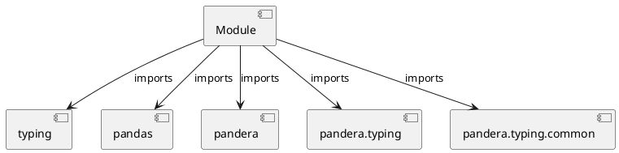

# Module Specification: schemas

* **Source Reference:** `src/autogen_team/core/schemas.py`

## 1. Architectural Role & Responsibilities
**Purpose:**
Provides functionality related to schemas.

**Architecture Layer:**
- Infrastructure/Other

**Responsibilities:**
- Not explicitly defined.

**Main Workflow:**
- Not explicitly defined.

## 2. Dependencies
**Imports:**
- `typing`
- `pandas`
- `pandera`
- `pandera.typing`
- `pandera.typing.common`

**Exported Classes:**
- `Schema`
- `MetadataSchema`
- `InputsSchema`
- `OutputsSchema`
- `TargetsSchema`
- `SHAPValuesSchema`
- `FeatureImportancesSchema`

**Exported Functions:**
- None

## 3. Architecture & Execution
### Internal Architecture
Not explicitly defined.

### Execution Flow
Not explicitly defined.

### Sequence Explanation
Not explicitly defined.

## 4. UML 2.0 Diagrams
### Class Diagram


### Dependency Graph


## 5. Class & Method Specifications
### `Schema` ([`src/autogen_team/core/schemas.py`](/src/autogen_team/core/schemas.py))
#### Overview
Base class for a dataframe schema.

Use a schema to type your dataframe object.
e.g., to communicate and validate its fields.

#### Attributes
- None found.

#### Methods
##### `check(cls: T.Type[TSchema], data: pd.DataFrame) -> papd.DataFrame[TSchema]` (Public)
**Description:** Check the dataframe with this schema.

Args:
    data (pd.DataFrame): dataframe to check.

Returns:
    papd.DataFrame[TSchema]: validated dataframe.

**Inputs:**
- `cls`: T.Type[TSchema]
- `data`: pd.DataFrame

**Output:**
- Return Type: `papd.DataFrame[TSchema]`
- Semantic Meaning: Not explicitly defined.

**Side Effects:**
- Not explicitly defined.

**Complexity:**
- Time Complexity: Not explicitly defined.
- Space Complexity: Not explicitly defined.

**Example:**
```python
result = Schema.check(..., ...)
```

### `MetadataSchema` ([`src/autogen_team/core/schemas.py`](/src/autogen_team/core/schemas.py))
#### Overview
Schema for metadata in outputs.

#### Attributes
- None found.

#### Methods
### `InputsSchema` ([`src/autogen_team/core/schemas.py`](/src/autogen_team/core/schemas.py))
#### Overview
Schema for validating large string inputs.

#### Attributes
- None found.

#### Methods
### `OutputsSchema` ([`src/autogen_team/core/schemas.py`](/src/autogen_team/core/schemas.py))
#### Overview
Schema for structured JSON outputs.

#### Attributes
- None found.

#### Methods
### `TargetsSchema` ([`src/autogen_team/core/schemas.py`](/src/autogen_team/core/schemas.py))
#### Overview
Schema for the project target.

#### Attributes
- None found.

#### Methods
### `SHAPValuesSchema` ([`src/autogen_team/core/schemas.py`](/src/autogen_team/core/schemas.py))
#### Overview
Schema for SHAP values.

#### Attributes
- None found.

#### Methods
### `FeatureImportancesSchema` ([`src/autogen_team/core/schemas.py`](/src/autogen_team/core/schemas.py))
#### Overview
Schema for feature importances.

#### Attributes
- None found.

#### Methods
## 6. Module Functions