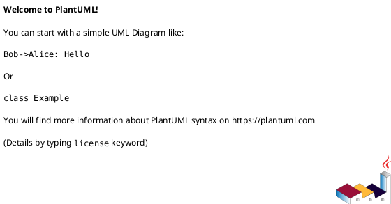
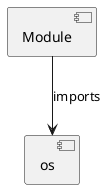

# Module Specification: security

* **Source Reference:** `src/autogen_team/core/security.py`

## 1. Architectural Role & Responsibilities
**Purpose:**
Provides functionality related to security.

**Architecture Layer:**
- Infrastructure/Other

**Responsibilities:**
- Not explicitly defined.

**Main Workflow:**
- Not explicitly defined.

## 2. Dependencies
**Imports:**
- `os`

**Exported Classes:**
- None

**Exported Functions:**
- `safe_join`

## 3. Architecture & Execution
### Internal Architecture
Not explicitly defined.

### Execution Flow
Not explicitly defined.

### Sequence Explanation
Not explicitly defined.

## 4. UML 2.0 Diagrams
### Class Diagram

### Dependency Graph

## 5. Class & Method Specifications
## 6. Module Functions
### `safe_join(base: str)`
Safely join paths, ensuring the result is within the base directory.

Args:
    base (str): The base directory.
    *paths (str): Paths to join.

Returns:
    str: The joined path.

Raises:
    ValueError: If the resolved path is outside the base directory.

**Inputs:**
- `base`: str

**Output:**
- Return Type: `str`
