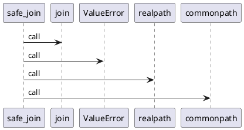
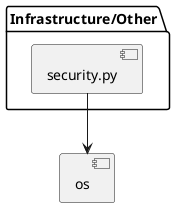
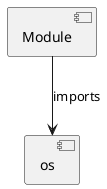
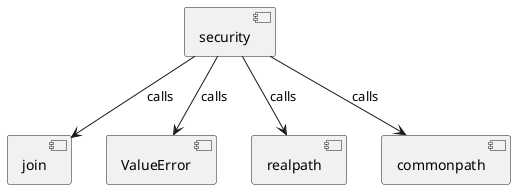

# Module Specification: security

* **Source Reference:** `src/autogen_team/core/security.py`

## 1. Architectural Role & Responsibilities
**Purpose:**
Provides functionality related to security.

**Architecture Layer:**
- Infrastructure/Other

**Responsibilities:**
- Manages operations and logic for security.

**Main Workflow:**
- Executes the primary flow defined by security functions and classes.

## 2. Dependencies
**Imports:**
- `os`

**Exported Classes:**
- None

**Exported Functions:**
- `safe_join`

**Exported Interfaces:**
- Not explicitly defined.

**Public API:**
- Not explicitly defined.

## 3. Architecture & Execution
### Internal Architecture
Not explicitly defined.

### Execution Flow
Not explicitly defined.

### Sequence Explanation
Not explicitly defined.

### Examples
Not explicitly defined.

## 4. UML 2.0 Diagrams
### Class Diagram

```plantuml
@startuml
    ' No classes found in module
@enduml
```

### Sequence Diagram

```plantuml
@startuml
    safe_join -> join : call
    safe_join -> ValueError : call
    safe_join -> realpath : call
    safe_join -> commonpath : call
@enduml
```

### Component Diagram

```plantuml
@startuml
    package "Infrastructure/Other" {
        [security.py]
    }
    [security.py] --> [os]
@enduml
```

### Dependency Graph

```plantuml
@startuml
    [Module] --> [os] : imports
@enduml
```

## 5. Class & Method Specifications
## 6. Module Functions
### `safe_join(base: str)`
Safely join paths, ensuring the result is within the base directory.

Args:
    base (str): The base directory.
    *paths (str): Paths to join.

Returns:
    str: The joined path.

Raises:
    ValueError: If the resolved path is outside the base directory.

**Inputs:**
- `base`
  - type: str
  - meaning: Represents the base parameter.
  - valid values: Any valid str.
  - optional?: False
  - default value: None

**Output:**
- return type: `str`
- semantic meaning: Returns the result of safe join.
- possible null values: Yes, if str allows it.
- exceptions: Standard execution exceptions.

**Side Effects:**
- Database updates: Not explicitly defined.
- File operations: Not explicitly defined.
- Network calls: Not explicitly defined.
- Cache: Not explicitly defined.
- State changes: Not explicitly defined.

## 7. Call Graph

```plantuml
@startuml
[security] --> [join] : calls
[security] --> [ValueError] : calls
[security] --> [realpath] : calls
[security] --> [commonpath] : calls
@enduml
```

## 8. Cross References
- **Parent module:** __init__.md
- **Child modules:** None
- **Dependencies:** `os`
- **Used by:** None
- **Calls:** join, ValueError, realpath, commonpath
- **Called from:** ../../../tests/core/test_security.md, ../application/mcp/tools/execute_code.md, ../application/mcp/tools/run_tests.md, ../infrastructure/services/sandbox_service.md
- **Related classes:** [Classes](../../../../classes/index.md)
- **Related interfaces:** Not explicitly defined.
- **Related diagrams:** [Diagrams](../../../../diagrams/index.md)
