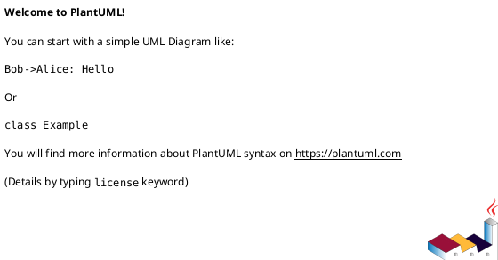
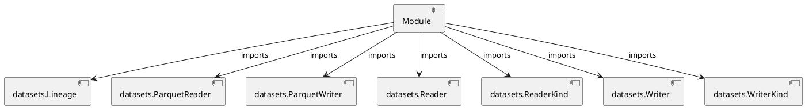

# Module Specification: __init__

* **Source Reference:** `src/autogen_team/data_access/adapters/__init__.py`

## 1. Architectural Role & Responsibilities
**Purpose:**
Provides functionality related to   init  .

**Architecture Layer:**
- Repositories

**Responsibilities:**
- Not explicitly defined.

**Main Workflow:**
- Not explicitly defined.

## 2. Dependencies
**Imports:**
- `datasets.Lineage`
- `datasets.ParquetReader`
- `datasets.ParquetWriter`
- `datasets.Reader`
- `datasets.ReaderKind`
- `datasets.Writer`
- `datasets.WriterKind`

**Exported Classes:**
- None

**Exported Functions:**
- None

## 3. Architecture & Execution
### Internal Architecture
Not explicitly defined.

### Execution Flow
Not explicitly defined.

### Sequence Explanation
Not explicitly defined.

## 4. UML 2.0 Diagrams
### Class Diagram

### Dependency Graph

## 5. Class & Method Specifications
## 6. Module Functions