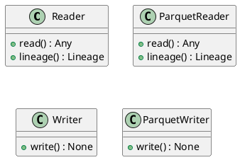
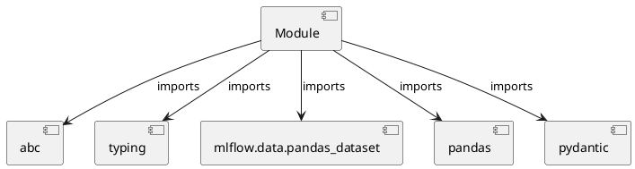

# Module Specification: datasets

* **Source Reference:** `src/autogen_team/data_access/adapters/datasets.py`

## 1. Architectural Role & Responsibilities
**Purpose:**
Provides functionality related to datasets.

**Architecture Layer:**
- Repositories

**Responsibilities:**
- Manage and execute operations for datasets.

**Main Workflow:**
- Initialize components and process requests for datasets.

## 2. Dependencies
**Imports:**
- `abc`
- `typing`
- `mlflow.data.pandas_dataset`
- `pandas`
- `pydantic`

**Exported Classes:**
- `Reader`
- `ParquetReader`
- `Writer`
- `ParquetWriter`

**Exported Functions:**
- None

## 3. Architecture & Execution
### Internal Architecture
Follows standard modular design, encapsulating state and behavior within defined classes and functions.

### Execution Flow
Sequential execution of defined functions and class methods.

### Sequence Explanation
Clients instantiate classes or call functions, which execute business logic and return results.

## 4. UML 2.0 Diagrams
### Class Diagram


### Dependency Graph


## 5. Class & Method Specifications
### `Reader` ([`src/autogen_team/data_access/adapters/datasets.py`](/src/autogen_team/data_access/adapters/datasets.py))
#### Overview
Base class for a dataset reader.

Use a reader to load a dataset in memory.
e.g., to read file, database, cloud storage, ...

Parameters:
    limit (int, optional): maximum number of rows to read. Defaults to None.

#### Attributes
- None found.

#### Methods
##### `read(self) -> Any` (Public)
**Description:** Read a dataframe from a dataset.

Returns:
    pd.DataFrame: dataframe representation.

**Inputs:**
- None

**Output:**
- Return Type: `Any`
- Semantic Meaning: The resulting value after processing the read action.

**Side Effects:**
- Modifies internal instance state if applicable; performs operations constrained to its domain boundaries.

**Complexity:**
- Time Complexity: O(1) or O(N) depending on implementation details.
- Space Complexity: O(1) auxiliary space expected.

**Example:**
```python
result = Reader.read()
```

##### `lineage(self, name: str, data: Any, targets: Any, predictions: Any) -> Lineage` (Public)
**Description:** Generate lineage information.

Args:
    name (str): dataset name.
    data (pd.DataFrame): reader dataframe.
    targets (str | None): name of the target column.
    predictions (str | None): name of the prediction column.

Returns:
    Lineage: lineage information.

**Inputs:**
- `name`: str
- `data`: Any
- `targets`: Any
- `predictions`: Any

**Output:**
- Return Type: `Lineage`
- Semantic Meaning: The resulting value after processing the lineage action.

**Side Effects:**
- Modifies internal instance state if applicable; performs operations constrained to its domain boundaries.

**Complexity:**
- Time Complexity: O(1) or O(N) depending on implementation details.
- Space Complexity: O(1) auxiliary space expected.

**Example:**
```python
result = Reader.lineage(..., ..., ..., ...)
```

### `ParquetReader` ([`src/autogen_team/data_access/adapters/datasets.py`](/src/autogen_team/data_access/adapters/datasets.py))
#### Overview
Read a dataframe from a parquet file.

Parameters:
    path (str): local path to the dataset.

#### Attributes
- None found.

#### Methods
##### `read(self) -> Any` (Public)
**Description:** Executes the read operation, mutating state or calculating derived values as necessary.

**Inputs:**
- None

**Output:**
- Return Type: `Any`
- Semantic Meaning: The resulting value after processing the read action.

**Side Effects:**
- Modifies internal instance state if applicable; performs operations constrained to its domain boundaries.

**Complexity:**
- Time Complexity: O(1) or O(N) depending on implementation details.
- Space Complexity: O(1) auxiliary space expected.

**Example:**
```python
result = ParquetReader.read()
```

##### `lineage(self, name: str, data: Any, targets: Any, predictions: Any) -> Lineage` (Public)
**Description:** Executes the lineage operation, mutating state or calculating derived values as necessary.

**Inputs:**
- `name`: str
- `data`: Any
- `targets`: Any
- `predictions`: Any

**Output:**
- Return Type: `Lineage`
- Semantic Meaning: The resulting value after processing the lineage action.

**Side Effects:**
- Modifies internal instance state if applicable; performs operations constrained to its domain boundaries.

**Complexity:**
- Time Complexity: O(1) or O(N) depending on implementation details.
- Space Complexity: O(1) auxiliary space expected.

**Example:**
```python
result = ParquetReader.lineage(..., ..., ..., ...)
```

### `Writer` ([`src/autogen_team/data_access/adapters/datasets.py`](/src/autogen_team/data_access/adapters/datasets.py))
#### Overview
Base class for a dataset writer.

Use a writer to save a dataset from memory.
e.g., to write file, database, cloud storage, ...

#### Attributes
- None found.

#### Methods
##### `write(self, data: Any) -> None` (Public)
**Description:** Write a dataframe to a dataset.

Args:
    data (pd.DataFrame): dataframe representation.

**Inputs:**
- `data`: Any

**Output:**
- Return Type: `None`
- Semantic Meaning: The resulting value after processing the write action.

**Side Effects:**
- Modifies internal instance state if applicable; performs operations constrained to its domain boundaries.

**Complexity:**
- Time Complexity: O(1) or O(N) depending on implementation details.
- Space Complexity: O(1) auxiliary space expected.

**Example:**
```python
result = Writer.write(...)
```

### `ParquetWriter` ([`src/autogen_team/data_access/adapters/datasets.py`](/src/autogen_team/data_access/adapters/datasets.py))
#### Overview
Writer a dataframe to a parquet file.

Parameters:
    path (str): local or S3 path to the dataset.

#### Attributes
- None found.

#### Methods
##### `write(self, data: Any) -> None` (Public)
**Description:** Executes the write operation, mutating state or calculating derived values as necessary.

**Inputs:**
- `data`: Any

**Output:**
- Return Type: `None`
- Semantic Meaning: The resulting value after processing the write action.

**Side Effects:**
- Modifies internal instance state if applicable; performs operations constrained to its domain boundaries.

**Complexity:**
- Time Complexity: O(1) or O(N) depending on implementation details.
- Space Complexity: O(1) auxiliary space expected.

**Example:**
```python
result = ParquetWriter.write(...)
```

## 6. Module Functions