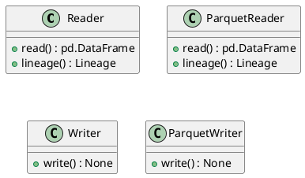
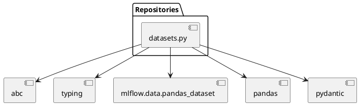
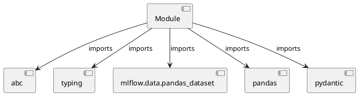
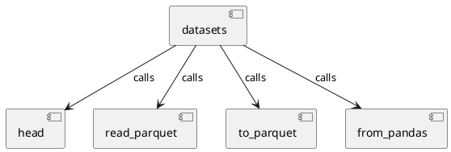

# Module Specification: datasets

* **Source Reference:** `src/autogen_team/data_access/adapters/datasets.py`

## 1. Architectural Role & Responsibilities
**Purpose:**
Provides functionality related to datasets.

**Architecture Layer:**
- Repositories

**Responsibilities:**
- Manages operations and logic for datasets.

**Main Workflow:**
- Executes the primary flow defined by datasets functions and classes.

## 2. Dependencies
**Imports:**
- `abc`
- `typing`
- `mlflow.data.pandas_dataset`
- `pandas`
- `pydantic`

**Exported Classes:**
- `Reader`
- `ParquetReader`
- `Writer`
- `ParquetWriter`

**Exported Functions:**
- None

**Exported Interfaces:**
- Not explicitly defined.

**Public API:**
- Not explicitly defined.

## 3. Architecture & Execution
### Internal Architecture
Not explicitly defined.

### Execution Flow
Not explicitly defined.

### Sequence Explanation
Not explicitly defined.

### Examples
Not explicitly defined.

## 4. UML 2.0 Diagrams
### Class Diagram

```plantuml
@startuml
    class Reader {
        +read() : pd.DataFrame
        +lineage() : Lineage
    }
    class ParquetReader {
        +read() : pd.DataFrame
        +lineage() : Lineage
    }
    class Writer {
        +write() : None
    }
    class ParquetWriter {
        +write() : None
    }
@enduml
```

### Sequence Diagram

```plantuml
@startuml
    ' No functions for sequence
@enduml
```

### Component Diagram

```plantuml
@startuml
    package "Repositories" {
        [datasets.py]
    }
    [datasets.py] --> [abc]
    [datasets.py] --> [typing]
    [datasets.py] --> [mlflow.data.pandas_dataset]
    [datasets.py] --> [pandas]
    [datasets.py] --> [pydantic]
@enduml
```

### Dependency Graph

```plantuml
@startuml
    [Module] --> [abc] : imports
    [Module] --> [typing] : imports
    [Module] --> [mlflow.data.pandas_dataset] : imports
    [Module] --> [pandas] : imports
    [Module] --> [pydantic] : imports
@enduml
```

## 5. Class & Method Specifications
### `Reader` ([`src/autogen_team/data_access/adapters/datasets.py`](/src/autogen_team/data_access/adapters/datasets.py))
#### Overview
Base class for a dataset reader.

Use a reader to load a dataset in memory.
e.g., to read file, database, cloud storage, ...

Parameters:
    limit (int, optional): maximum number of rows to read. Defaults to None.

#### Attributes
- None found.

#### Methods
##### `read(self) -> pd.DataFrame` (Public)
**Description:** Read a dataframe from a dataset.

Returns:
    pd.DataFrame: dataframe representation.

**Inputs:**
- None

**Output:**
- return type: `pd.DataFrame`
- semantic meaning: Returns the result of read.
- possible null values: Yes, if pd.DataFrame allows it.
- exceptions: Standard execution exceptions.

**Side Effects:**
- Database updates: Not explicitly defined.
- File operations: Not explicitly defined.
- Network calls: Not explicitly defined.
- Cache: Not explicitly defined.
- State changes: Not explicitly defined.

**Complexity:**
- Time Complexity: Not explicitly defined.
- Space Complexity: Not explicitly defined.

**Example:**
```python
result = Reader.read()
```

##### `lineage(self, name: str, data: pd.DataFrame, targets: str | None, predictions: str | None) -> Lineage` (Public)
**Description:** Generate lineage information.

Args:
    name (str): dataset name.
    data (pd.DataFrame): reader dataframe.
    targets (str | None): name of the target column.
    predictions (str | None): name of the prediction column.

Returns:
    Lineage: lineage information.

**Inputs:**
- `name`
  - type: str
  - meaning: Represents the name parameter.
  - valid values: Any valid str.
  - optional?: False
  - default value: None
- `data`
  - type: pd.DataFrame
  - meaning: Represents the data parameter.
  - valid values: Any valid pd.DataFrame.
  - optional?: False
  - default value: None
- `targets`
  - type: str | None
  - meaning: Represents the targets parameter.
  - valid values: Any valid str | None.
  - optional?: True
  - default value: None
- `predictions`
  - type: str | None
  - meaning: Represents the predictions parameter.
  - valid values: Any valid str | None.
  - optional?: True
  - default value: None

**Output:**
- return type: `Lineage`
- semantic meaning: Returns the result of lineage.
- possible null values: Yes, if Lineage allows it.
- exceptions: Standard execution exceptions.

**Side Effects:**
- Database updates: Not explicitly defined.
- File operations: Not explicitly defined.
- Network calls: Not explicitly defined.
- Cache: Not explicitly defined.
- State changes: Not explicitly defined.

**Complexity:**
- Time Complexity: Not explicitly defined.
- Space Complexity: Not explicitly defined.

**Example:**
```python
result = Reader.lineage(..., ..., ..., ...)
```

### `ParquetReader` ([`src/autogen_team/data_access/adapters/datasets.py`](/src/autogen_team/data_access/adapters/datasets.py))
#### Overview
Read a dataframe from a parquet file.

Parameters:
    path (str): local path to the dataset.

#### Attributes
- None found.

#### Methods
##### `read(self) -> pd.DataFrame` (Public)
**Description:** Executes the read operation.

**Inputs:**
- None

**Output:**
- return type: `pd.DataFrame`
- semantic meaning: Returns the result of read.
- possible null values: Yes, if pd.DataFrame allows it.
- exceptions: Standard execution exceptions.

**Side Effects:**
- Database updates: Not explicitly defined.
- File operations: Not explicitly defined.
- Network calls: Not explicitly defined.
- Cache: Not explicitly defined.
- State changes: Not explicitly defined.

**Complexity:**
- Time Complexity: Not explicitly defined.
- Space Complexity: Not explicitly defined.

**Example:**
```python
result = ParquetReader.read()
```

##### `lineage(self, name: str, data: pd.DataFrame, targets: str | None, predictions: str | None) -> Lineage` (Public)
**Description:** Executes the lineage operation.

**Inputs:**
- `name`
  - type: str
  - meaning: Represents the name parameter.
  - valid values: Any valid str.
  - optional?: False
  - default value: None
- `data`
  - type: pd.DataFrame
  - meaning: Represents the data parameter.
  - valid values: Any valid pd.DataFrame.
  - optional?: False
  - default value: None
- `targets`
  - type: str | None
  - meaning: Represents the targets parameter.
  - valid values: Any valid str | None.
  - optional?: True
  - default value: None
- `predictions`
  - type: str | None
  - meaning: Represents the predictions parameter.
  - valid values: Any valid str | None.
  - optional?: True
  - default value: None

**Output:**
- return type: `Lineage`
- semantic meaning: Returns the result of lineage.
- possible null values: Yes, if Lineage allows it.
- exceptions: Standard execution exceptions.

**Side Effects:**
- Database updates: Not explicitly defined.
- File operations: Not explicitly defined.
- Network calls: Not explicitly defined.
- Cache: Not explicitly defined.
- State changes: Not explicitly defined.

**Complexity:**
- Time Complexity: Not explicitly defined.
- Space Complexity: Not explicitly defined.

**Example:**
```python
result = ParquetReader.lineage(..., ..., ..., ...)
```

### `Writer` ([`src/autogen_team/data_access/adapters/datasets.py`](/src/autogen_team/data_access/adapters/datasets.py))
#### Overview
Base class for a dataset writer.

Use a writer to save a dataset from memory.
e.g., to write file, database, cloud storage, ...

#### Attributes
- None found.

#### Methods
##### `write(self, data: pd.DataFrame) -> None` (Public)
**Description:** Write a dataframe to a dataset.

Args:
    data (pd.DataFrame): dataframe representation.

**Inputs:**
- `data`
  - type: pd.DataFrame
  - meaning: Represents the data parameter.
  - valid values: Any valid pd.DataFrame.
  - optional?: False
  - default value: None

**Output:**
- return type: `None`
- semantic meaning: Returns the result of write.
- possible null values: Yes, if None allows it.
- exceptions: Standard execution exceptions.

**Side Effects:**
- Database updates: Not explicitly defined.
- File operations: Not explicitly defined.
- Network calls: Not explicitly defined.
- Cache: Not explicitly defined.
- State changes: Not explicitly defined.

**Complexity:**
- Time Complexity: Not explicitly defined.
- Space Complexity: Not explicitly defined.

**Example:**
```python
result = Writer.write(...)
```

### `ParquetWriter` ([`src/autogen_team/data_access/adapters/datasets.py`](/src/autogen_team/data_access/adapters/datasets.py))
#### Overview
Writer a dataframe to a parquet file.

Parameters:
    path (str): local or S3 path to the dataset.

#### Attributes
- None found.

#### Methods
##### `write(self, data: pd.DataFrame) -> None` (Public)
**Description:** Executes the write operation.

**Inputs:**
- `data`
  - type: pd.DataFrame
  - meaning: Represents the data parameter.
  - valid values: Any valid pd.DataFrame.
  - optional?: False
  - default value: None

**Output:**
- return type: `None`
- semantic meaning: Returns the result of write.
- possible null values: Yes, if None allows it.
- exceptions: Standard execution exceptions.

**Side Effects:**
- Database updates: Not explicitly defined.
- File operations: Not explicitly defined.
- Network calls: Not explicitly defined.
- Cache: Not explicitly defined.
- State changes: Not explicitly defined.

**Complexity:**
- Time Complexity: Not explicitly defined.
- Space Complexity: Not explicitly defined.

**Example:**
```python
result = ParquetWriter.write(...)
```

## 6. Module Functions
## 7. Call Graph

```plantuml
@startuml
[datasets] --> [head] : calls
[datasets] --> [read_parquet] : calls
[datasets] --> [to_parquet] : calls
[datasets] --> [from_pandas] : calls
@enduml
```

## 8. Cross References
- **Parent module:** __init__.md
- **Child modules:** None
- **Dependencies:** `pandas`, `mlflow.data.pandas_dataset`, `typing`, `abc`, `pydantic`
- **Used by:** ../../../../tests/conftest.md, ../../../../tests/data_access/adapters/test_datasets.md
- **Calls:** head, read_parquet, to_parquet, from_pandas
- **Called from:** None
- **Related classes:** [Classes](../../../../../classes/index.md)
- **Related interfaces:** Not explicitly defined.
- **Related diagrams:** [Diagrams](../../../../../diagrams/index.md)
