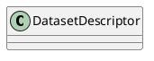
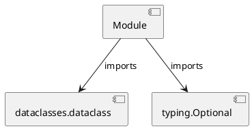

# Module Specification: entities

* **Source Reference:** `src/autogen_team/data_access/entities.py`

## 1. Architectural Role & Responsibilities
**Purpose:**
Provides functionality related to entities.

**Architecture Layer:**
- Repositories

**Responsibilities:**
- Not explicitly defined.

**Main Workflow:**
- Not explicitly defined.

## 2. Dependencies
**Imports:**
- `dataclasses.dataclass`
- `typing.Optional`

**Exported Classes:**
- `DatasetDescriptor`

**Exported Functions:**
- None

## 3. Architecture & Execution
### Internal Architecture
Not explicitly defined.

### Execution Flow
Not explicitly defined.

### Sequence Explanation
Not explicitly defined.

## 4. UML 2.0 Diagrams
### Class Diagram

### Dependency Graph

## 5. Class & Method Specifications
### `DatasetDescriptor` ([`src/autogen_team/data_access/entities.py`](/src/autogen_team/data_access/entities.py))
#### Overview
Describes a dataset source.

#### Attributes
- None found.

#### Methods
## 6. Module Functions