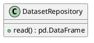
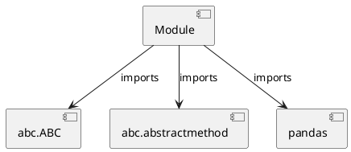

# Module Specification: repositories

* **Source Reference:** `src/autogen_team/data_access/repositories.py`

## 1. Architectural Role & Responsibilities
**Purpose:**
Provides functionality related to repositories.

**Architecture Layer:**
- Repositories

**Responsibilities:**
- Not explicitly defined.

**Main Workflow:**
- Not explicitly defined.

## 2. Dependencies
**Imports:**
- `abc.ABC`
- `abc.abstractmethod`
- `pandas`

**Exported Classes:**
- `DatasetRepository`

**Exported Functions:**
- None

## 3. Architecture & Execution
### Internal Architecture
Not explicitly defined.

### Execution Flow
Not explicitly defined.

### Sequence Explanation
Not explicitly defined.

## 4. UML 2.0 Diagrams
### Class Diagram


### Dependency Graph


## 5. Class & Method Specifications
### `DatasetRepository` ([`src/autogen_team/data_access/repositories.py`](/src/autogen_team/data_access/repositories.py))
#### Overview
Abstract repository for dataset access.

#### Attributes
- None found.

#### Methods
##### `read(self) -> pd.DataFrame` (Public)
**Description:** Read dataset into DataFrame.

**Inputs:**
- None

**Output:**
- Return Type: `pd.DataFrame`
- Semantic Meaning: Not explicitly defined.

**Side Effects:**
- Not explicitly defined.

**Complexity:**
- Time Complexity: Not explicitly defined.
- Space Complexity: Not explicitly defined.

**Example:**
```python
result = DatasetRepository.read()
```

## 6. Module Functions