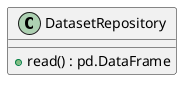
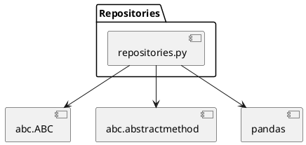
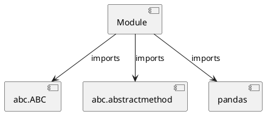

# Module Specification: repositories

* **Source Reference:** `src/autogen_team/data_access/repositories.py`

## 1. Architectural Role & Responsibilities
**Purpose:**
Provides functionality related to repositories.

**Architecture Layer:**
- Repositories

**Responsibilities:**
- Manages operations and logic for repositories.

**Main Workflow:**
- Executes the primary flow defined by repositories functions and classes.

## 2. Dependencies
**Imports:**
- `abc.ABC`
- `abc.abstractmethod`
- `pandas`

**Exported Classes:**
- `DatasetRepository`

**Exported Functions:**
- None

**Exported Interfaces:**
- Not explicitly defined.

**Public API:**
- Not explicitly defined.

## 3. Architecture & Execution
### Internal Architecture
Not explicitly defined.

### Execution Flow
Not explicitly defined.

### Sequence Explanation
Not explicitly defined.

### Examples
Not explicitly defined.

## 4. UML 2.0 Diagrams
### Class Diagram

```plantuml
@startuml
    class DatasetRepository {
        +read() : pd.DataFrame
    }
@enduml
```

### Sequence Diagram

```plantuml
@startuml
    ' No functions for sequence
@enduml
```

### Component Diagram

```plantuml
@startuml
    package "Repositories" {
        [repositories.py]
    }
    [repositories.py] --> [abc.ABC]
    [repositories.py] --> [abc.abstractmethod]
    [repositories.py] --> [pandas]
@enduml
```

### Dependency Graph

```plantuml
@startuml
    [Module] --> [abc.ABC] : imports
    [Module] --> [abc.abstractmethod] : imports
    [Module] --> [pandas] : imports
@enduml
```

## 5. Class & Method Specifications
### `DatasetRepository` ([`src/autogen_team/data_access/repositories.py`](/src/autogen_team/data_access/repositories.py))
#### Overview
Abstract repository for dataset access.

#### Attributes
- None found.

#### Methods
##### `read(self) -> pd.DataFrame` (Public)
**Description:** Read dataset into DataFrame.

**Inputs:**
- None

**Output:**
- return type: `pd.DataFrame`
- semantic meaning: Returns the result of read.
- possible null values: Yes, if pd.DataFrame allows it.
- exceptions: Standard execution exceptions.

**Side Effects:**
- Database updates: Not explicitly defined.
- File operations: Not explicitly defined.
- Network calls: Not explicitly defined.
- Cache: Not explicitly defined.
- State changes: Not explicitly defined.

**Complexity:**
- Time Complexity: Not explicitly defined.
- Space Complexity: Not explicitly defined.

**Example:**
```python
result = DatasetRepository.read()
```

## 6. Module Functions
## 7. Call Graph
- No public API calls detected.

## 8. Cross References
- **Parent module:** __init__.md
- **Child modules:** None
- **Dependencies:** `pandas`, `abc.abstractmethod`, `abc.ABC`
- **Used by:** None
- **Calls:** None
- **Called from:** None
- **Related classes:** [Classes](../../../../classes/index.md)
- **Related interfaces:** Not explicitly defined.
- **Related diagrams:** [Diagrams](../../../../diagrams/index.md)
