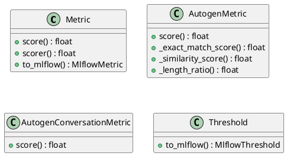
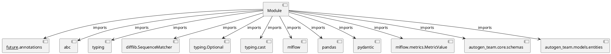

# Module Specification: metrics

* **Source Reference:** `src/autogen_team/evaluation/metrics/metrics.py`

## 1. Architectural Role & Responsibilities
**Purpose:**
Provides functionality related to metrics.

**Architecture Layer:**
- Infrastructure/Other

**Responsibilities:**
- Manage and execute operations for metrics.

**Main Workflow:**
- Initialize components and process requests for metrics.

## 2. Dependencies
**Imports:**
- `__future__.annotations`
- `abc`
- `typing`
- `difflib.SequenceMatcher`
- `typing.Optional`
- `typing.cast`
- `mlflow`
- `pandas`
- `pydantic`
- `mlflow.metrics.MetricValue`
- `autogen_team.core.schemas`
- `autogen_team.models.entities`

**Exported Classes:**
- `Metric`
- `AutogenMetric`
- `AutogenConversationMetric`
- `Threshold`

**Exported Functions:**
- None

## 3. Architecture & Execution
### Internal Architecture
Follows standard modular design, encapsulating state and behavior within defined classes and functions.

### Execution Flow
Sequential execution of defined functions and class methods.

### Sequence Explanation
Clients instantiate classes or call functions, which execute business logic and return results.

## 4. UML 2.0 Diagrams
### Class Diagram


### Dependency Graph


## 5. Class & Method Specifications
### `Metric` ([`src/autogen_team/evaluation/metrics/metrics.py`](/src/autogen_team/evaluation/metrics/metrics.py))
#### Overview
Base class for a project metric.

Use metrics to evaluate model performance.
e.g., accuracy, precision, recall, MAE, F1, ...

Parameters:
    name (str): name of the metric for the reporting.
    greater_is_better (bool): maximize or minimize result.

#### Attributes
- None found.

#### Methods
##### `score(self, targets: Any, outputs: Any) -> float` (Public)
**Description:** Score the outputs against the targets.

Args:
    targets (pd.DataFrame): expected values.
    outputs (pd.DataFrame): predicted values.

Returns:
    float: single result from the metric computation.

**Inputs:**
- `targets`: Any
- `outputs`: Any

**Output:**
- Return Type: `float`
- Semantic Meaning: The resulting value after processing the score action.

**Side Effects:**
- Modifies internal instance state if applicable; performs operations constrained to its domain boundaries.

**Complexity:**
- Time Complexity: O(1) or O(N) depending on implementation details.
- Space Complexity: O(1) auxiliary space expected.

**Example:**
```python
result = Metric.score(..., ...)
```

##### `scorer(self, model: Any, inputs: Any, targets: Any) -> float` (Public)
**Description:** Score model outputs against targets.

Args:
    model (models.Model): model to evaluate.
    inputs (schemas.Inputs): model inputs values.
    targets (schemas.Targets): model expected values.

Returns:
    float: single result from the metric computation.

**Inputs:**
- `model`: Any
- `inputs`: Any
- `targets`: Any

**Output:**
- Return Type: `float`
- Semantic Meaning: The resulting value after processing the scorer action.

**Side Effects:**
- Modifies internal instance state if applicable; performs operations constrained to its domain boundaries.

**Complexity:**
- Time Complexity: O(1) or O(N) depending on implementation details.
- Space Complexity: O(1) auxiliary space expected.

**Example:**
```python
result = Metric.scorer(..., ..., ...)
```

##### `to_mlflow(self) -> MlflowMetric` (Public)
**Description:** Convert the metric to an Mlflow metric.

Returns:
    MlflowMetric: the Mlflow metric.

**Inputs:**
- None

**Output:**
- Return Type: `MlflowMetric`
- Semantic Meaning: The resulting value after processing the to_mlflow action.

**Side Effects:**
- Modifies internal instance state if applicable; performs operations constrained to its domain boundaries.

**Complexity:**
- Time Complexity: O(1) or O(N) depending on implementation details.
- Space Complexity: O(1) auxiliary space expected.

**Example:**
```python
result = Metric.to_mlflow()
```

### `AutogenMetric` ([`src/autogen_team/evaluation/metrics/metrics.py`](/src/autogen_team/evaluation/metrics/metrics.py))
#### Overview
Evaluate text-based Autogen responses using conversation metrics.

Parameters:
    metric_type (str): Type of text metric (exact_match, similarity, length_ratio)
    similarity_threshold (float): Minimum similarity score for partial matches

#### Attributes
- None found.

#### Methods
##### `score(self, targets: Any, outputs: Any) -> float` (Public)
**Description:** Executes the score operation, mutating state or calculating derived values as necessary.

**Inputs:**
- `targets`: Any
- `outputs`: Any

**Output:**
- Return Type: `float`
- Semantic Meaning: The resulting value after processing the score action.

**Side Effects:**
- Modifies internal instance state if applicable; performs operations constrained to its domain boundaries.

**Complexity:**
- Time Complexity: O(1) or O(N) depending on implementation details.
- Space Complexity: O(1) auxiliary space expected.

**Example:**
```python
result = AutogenMetric.score(..., ...)
```

##### `_exact_match_score(self, y_true: Any, y_pred: Any) -> float` (Public)
**Description:** Executes the _exact_match_score operation, mutating state or calculating derived values as necessary.

**Inputs:**
- `y_true`: Any
- `y_pred`: Any

**Output:**
- Return Type: `float`
- Semantic Meaning: The resulting value after processing the _exact_match_score action.

**Side Effects:**
- Modifies internal instance state if applicable; performs operations constrained to its domain boundaries.

**Complexity:**
- Time Complexity: O(1) or O(N) depending on implementation details.
- Space Complexity: O(1) auxiliary space expected.

**Example:**
```python
result = AutogenMetric._exact_match_score(..., ...)
```

##### `_similarity_score(self, y_true: Any, y_pred: Any) -> float` (Public)
**Description:** Executes the _similarity_score operation, mutating state or calculating derived values as necessary.

**Inputs:**
- `y_true`: Any
- `y_pred`: Any

**Output:**
- Return Type: `float`
- Semantic Meaning: The resulting value after processing the _similarity_score action.

**Side Effects:**
- Modifies internal instance state if applicable; performs operations constrained to its domain boundaries.

**Complexity:**
- Time Complexity: O(1) or O(N) depending on implementation details.
- Space Complexity: O(1) auxiliary space expected.

**Example:**
```python
result = AutogenMetric._similarity_score(..., ...)
```

##### `_length_ratio(self, y_true: Any, y_pred: Any) -> float` (Public)
**Description:** Executes the _length_ratio operation, mutating state or calculating derived values as necessary.

**Inputs:**
- `y_true`: Any
- `y_pred`: Any

**Output:**
- Return Type: `float`
- Semantic Meaning: The resulting value after processing the _length_ratio action.

**Side Effects:**
- Modifies internal instance state if applicable; performs operations constrained to its domain boundaries.

**Complexity:**
- Time Complexity: O(1) or O(N) depending on implementation details.
- Space Complexity: O(1) auxiliary space expected.

**Example:**
```python
result = AutogenMetric._length_ratio(..., ...)
```

### `AutogenConversationMetric` ([`src/autogen_team/evaluation/metrics/metrics.py`](/src/autogen_team/evaluation/metrics/metrics.py))
#### Overview
Evaluate conversation quality metrics for Autogen interactions.

Parameters:
    check_termination (bool): Verify if conversation reached termination
    check_error_messages (bool): Check for error messages in output

#### Attributes
- None found.

#### Methods
##### `score(self, targets: Any, outputs: Any) -> float` (Public)
**Description:** Executes the score operation, mutating state or calculating derived values as necessary.

**Inputs:**
- `targets`: Any
- `outputs`: Any

**Output:**
- Return Type: `float`
- Semantic Meaning: The resulting value after processing the score action.

**Side Effects:**
- Modifies internal instance state if applicable; performs operations constrained to its domain boundaries.

**Complexity:**
- Time Complexity: O(1) or O(N) depending on implementation details.
- Space Complexity: O(1) auxiliary space expected.

**Example:**
```python
result = AutogenConversationMetric.score(..., ...)
```

### `Threshold` ([`src/autogen_team/evaluation/metrics/metrics.py`](/src/autogen_team/evaluation/metrics/metrics.py))
#### Overview
A project threshold for a metric.

Use thresholds to monitor model performances.
e.g., to trigger an alert when a threshold is met.

Parameters:
    threshold (int | float): absolute threshold value.
    greater_is_better (bool): maximize or minimize result.

#### Attributes
- None found.

#### Methods
##### `to_mlflow(self) -> MlflowThreshold` (Public)
**Description:** Convert the threshold to an mlflow threshold.

Returns:
    MlflowThreshold: the mlflow threshold.

**Inputs:**
- None

**Output:**
- Return Type: `MlflowThreshold`
- Semantic Meaning: The resulting value after processing the to_mlflow action.

**Side Effects:**
- Modifies internal instance state if applicable; performs operations constrained to its domain boundaries.

**Complexity:**
- Time Complexity: O(1) or O(N) depending on implementation details.
- Space Complexity: O(1) auxiliary space expected.

**Example:**
```python
result = Threshold.to_mlflow()
```

## 6. Module Functions