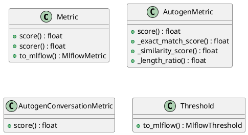
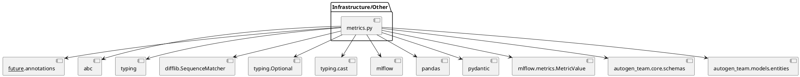
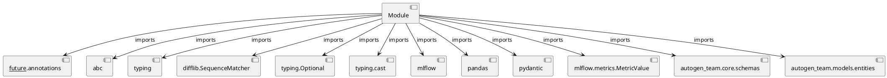

# Module Specification: metrics

* **Source Reference:** `src/autogen_team/evaluation/metrics/metrics.py`

## 1. Architectural Role & Responsibilities
**Purpose:**
Provides functionality related to metrics.

**Architecture Layer:**
- Infrastructure/Other

**Responsibilities:**
- Manages operations and logic for metrics.

**Main Workflow:**
- Executes the primary flow defined by metrics functions and classes.

## 2. Dependencies
**Imports:**
- `__future__.annotations`
- `abc`
- `typing`
- `difflib.SequenceMatcher`
- `typing.Optional`
- `typing.cast`
- `mlflow`
- `pandas`
- `pydantic`
- `mlflow.metrics.MetricValue`
- `autogen_team.core.schemas`
- `autogen_team.models.entities`

**Exported Classes:**
- `Metric`
- `AutogenMetric`
- `AutogenConversationMetric`
- `Threshold`

**Exported Functions:**
- None

**Exported Interfaces:**
- Not explicitly defined.

**Public API:**
- Not explicitly defined.

## 3. Architecture & Execution
### Internal Architecture
Not explicitly defined.

### Execution Flow
Not explicitly defined.

### Sequence Explanation
Not explicitly defined.

### Examples
Not explicitly defined.

## 4. UML 2.0 Diagrams
### Class Diagram

```plantuml
@startuml
    class Metric {
        +score() : float
        +scorer() : float
        +to_mlflow() : MlflowMetric
    }
    class AutogenMetric {
        +score() : float
        +_exact_match_score() : float
        +_similarity_score() : float
        +_length_ratio() : float
    }
    class AutogenConversationMetric {
        +score() : float
    }
    class Threshold {
        +to_mlflow() : MlflowThreshold
    }
@enduml
```

### Sequence Diagram

```plantuml
@startuml
    ' No functions for sequence
@enduml
```

### Component Diagram

```plantuml
@startuml
    package "Infrastructure/Other" {
        [metrics.py]
    }
    [metrics.py] --> [__future__.annotations]
    [metrics.py] --> [abc]
    [metrics.py] --> [typing]
    [metrics.py] --> [difflib.SequenceMatcher]
    [metrics.py] --> [typing.Optional]
    [metrics.py] --> [typing.cast]
    [metrics.py] --> [mlflow]
    [metrics.py] --> [pandas]
    [metrics.py] --> [pydantic]
    [metrics.py] --> [mlflow.metrics.MetricValue]
    [metrics.py] --> [autogen_team.core.schemas]
    [metrics.py] --> [autogen_team.models.entities]
@enduml
```

### Dependency Graph

```plantuml
@startuml
    [Module] --> [__future__.annotations] : imports
    [Module] --> [abc] : imports
    [Module] --> [typing] : imports
    [Module] --> [difflib.SequenceMatcher] : imports
    [Module] --> [typing.Optional] : imports
    [Module] --> [typing.cast] : imports
    [Module] --> [mlflow] : imports
    [Module] --> [pandas] : imports
    [Module] --> [pydantic] : imports
    [Module] --> [mlflow.metrics.MetricValue] : imports
    [Module] --> [autogen_team.core.schemas] : imports
    [Module] --> [autogen_team.models.entities] : imports
@enduml
```

## 5. Class & Method Specifications
### `Metric` ([`src/autogen_team/evaluation/metrics/metrics.py`](/src/autogen_team/evaluation/metrics/metrics.py))
#### Overview
Base class for a project metric.

Use metrics to evaluate model performance.
e.g., accuracy, precision, recall, MAE, F1, ...

Parameters:
    name (str): name of the metric for the reporting.
    greater_is_better (bool): maximize or minimize result.

#### Attributes
- None found.

#### Methods
##### `score(self, targets: pd.DataFrame, outputs: pd.DataFrame) -> float` (Public)
**Description:** Score the outputs against the targets.

Args:
    targets (pd.DataFrame): expected values.
    outputs (pd.DataFrame): predicted values.

Returns:
    float: single result from the metric computation.

**Inputs:**
- `targets`
  - type: pd.DataFrame
  - meaning: Represents the targets parameter.
  - valid values: Any valid pd.DataFrame.
  - optional?: False
  - default value: None
- `outputs`
  - type: pd.DataFrame
  - meaning: Represents the outputs parameter.
  - valid values: Any valid pd.DataFrame.
  - optional?: False
  - default value: None

**Output:**
- return type: `float`
- semantic meaning: Returns the result of score.
- possible null values: Yes, if float allows it.
- exceptions: Standard execution exceptions.

**Side Effects:**
- Database updates: Not explicitly defined.
- File operations: Not explicitly defined.
- Network calls: Not explicitly defined.
- Cache: Not explicitly defined.
- State changes: Not explicitly defined.

**Complexity:**
- Time Complexity: Not explicitly defined.
- Space Complexity: Not explicitly defined.

**Example:**
```python
result = Metric.score(..., ...)
```

##### `scorer(self, model: models.Model, inputs: schemas.Inputs, targets: pd.DataFrame) -> float` (Public)
**Description:** Score model outputs against targets.

Args:
    model (models.Model): model to evaluate.
    inputs (schemas.Inputs): model inputs values.
    targets (schemas.Targets): model expected values.

Returns:
    float: single result from the metric computation.

**Inputs:**
- `model`
  - type: models.Model
  - meaning: Represents the model parameter.
  - valid values: Any valid models.Model.
  - optional?: False
  - default value: None
- `inputs`
  - type: schemas.Inputs
  - meaning: Represents the inputs parameter.
  - valid values: Any valid schemas.Inputs.
  - optional?: False
  - default value: None
- `targets`
  - type: pd.DataFrame
  - meaning: Represents the targets parameter.
  - valid values: Any valid pd.DataFrame.
  - optional?: False
  - default value: None

**Output:**
- return type: `float`
- semantic meaning: Returns the result of scorer.
- possible null values: Yes, if float allows it.
- exceptions: Standard execution exceptions.

**Side Effects:**
- Database updates: Not explicitly defined.
- File operations: Not explicitly defined.
- Network calls: Not explicitly defined.
- Cache: Not explicitly defined.
- State changes: Not explicitly defined.

**Complexity:**
- Time Complexity: Not explicitly defined.
- Space Complexity: Not explicitly defined.

**Example:**
```python
result = Metric.scorer(..., ..., ...)
```

##### `to_mlflow(self) -> MlflowMetric` (Public)
**Description:** Convert the metric to an Mlflow metric.

Returns:
    MlflowMetric: the Mlflow metric.

**Inputs:**
- None

**Output:**
- return type: `MlflowMetric`
- semantic meaning: Returns the result of to mlflow.
- possible null values: Yes, if MlflowMetric allows it.
- exceptions: Standard execution exceptions.

**Side Effects:**
- Database updates: Not explicitly defined.
- File operations: Not explicitly defined.
- Network calls: Not explicitly defined.
- Cache: Not explicitly defined.
- State changes: Not explicitly defined.

**Complexity:**
- Time Complexity: Not explicitly defined.
- Space Complexity: Not explicitly defined.

**Example:**
```python
result = Metric.to_mlflow()
```

### `AutogenMetric` ([`src/autogen_team/evaluation/metrics/metrics.py`](/src/autogen_team/evaluation/metrics/metrics.py))
#### Overview
Evaluate text-based Autogen responses using conversation metrics.

Parameters:
    metric_type (str): Type of text metric (exact_match, similarity, length_ratio)
    similarity_threshold (float): Minimum similarity score for partial matches

#### Attributes
- None found.

#### Methods
##### `score(self, targets: pd.DataFrame, outputs: pd.DataFrame) -> float` (Public)
**Description:** Executes the score operation.

**Inputs:**
- `targets`
  - type: pd.DataFrame
  - meaning: Represents the targets parameter.
  - valid values: Any valid pd.DataFrame.
  - optional?: False
  - default value: None
- `outputs`
  - type: pd.DataFrame
  - meaning: Represents the outputs parameter.
  - valid values: Any valid pd.DataFrame.
  - optional?: False
  - default value: None

**Output:**
- return type: `float`
- semantic meaning: Returns the result of score.
- possible null values: Yes, if float allows it.
- exceptions: Standard execution exceptions.

**Side Effects:**
- Database updates: Not explicitly defined.
- File operations: Not explicitly defined.
- Network calls: Not explicitly defined.
- Cache: Not explicitly defined.
- State changes: Not explicitly defined.

**Complexity:**
- Time Complexity: Not explicitly defined.
- Space Complexity: Not explicitly defined.

**Example:**
```python
result = AutogenMetric.score(..., ...)
```

##### `_exact_match_score(self, y_true: pd.Series[str], y_pred: pd.Series[str]) -> float` (Private)
**Purpose:** Handles internal execution for  exact match score.

**Parameters:**
- `y_true`: pd.Series[str]
- `y_pred`: pd.Series[str]

**Return value:**
- `float`

##### `_similarity_score(self, y_true: pd.Series[str], y_pred: pd.Series[str]) -> float` (Private)
**Purpose:** Handles internal execution for  similarity score.

**Parameters:**
- `y_true`: pd.Series[str]
- `y_pred`: pd.Series[str]

**Return value:**
- `float`

##### `_length_ratio(self, y_true: pd.Series[str], y_pred: pd.Series[str]) -> float` (Private)
**Purpose:** Handles internal execution for  length ratio.

**Parameters:**
- `y_true`: pd.Series[str]
- `y_pred`: pd.Series[str]

**Return value:**
- `float`

### `AutogenConversationMetric` ([`src/autogen_team/evaluation/metrics/metrics.py`](/src/autogen_team/evaluation/metrics/metrics.py))
#### Overview
Evaluate conversation quality metrics for Autogen interactions.

Parameters:
    check_termination (bool): Verify if conversation reached termination
    check_error_messages (bool): Check for error messages in output

#### Attributes
- None found.

#### Methods
##### `score(self, targets: pd.DataFrame, outputs: pd.DataFrame) -> float` (Public)
**Description:** Executes the score operation.

**Inputs:**
- `targets`
  - type: pd.DataFrame
  - meaning: Represents the targets parameter.
  - valid values: Any valid pd.DataFrame.
  - optional?: False
  - default value: None
- `outputs`
  - type: pd.DataFrame
  - meaning: Represents the outputs parameter.
  - valid values: Any valid pd.DataFrame.
  - optional?: False
  - default value: None

**Output:**
- return type: `float`
- semantic meaning: Returns the result of score.
- possible null values: Yes, if float allows it.
- exceptions: Standard execution exceptions.

**Side Effects:**
- Database updates: Not explicitly defined.
- File operations: Not explicitly defined.
- Network calls: Not explicitly defined.
- Cache: Not explicitly defined.
- State changes: Not explicitly defined.

**Complexity:**
- Time Complexity: Not explicitly defined.
- Space Complexity: Not explicitly defined.

**Example:**
```python
result = AutogenConversationMetric.score(..., ...)
```

### `Threshold` ([`src/autogen_team/evaluation/metrics/metrics.py`](/src/autogen_team/evaluation/metrics/metrics.py))
#### Overview
A project threshold for a metric.

Use thresholds to monitor model performances.
e.g., to trigger an alert when a threshold is met.

Parameters:
    threshold (int | float): absolute threshold value.
    greater_is_better (bool): maximize or minimize result.

#### Attributes
- None found.

#### Methods
##### `to_mlflow(self) -> MlflowThreshold` (Public)
**Description:** Convert the threshold to an mlflow threshold.

Returns:
    MlflowThreshold: the mlflow threshold.

**Inputs:**
- None

**Output:**
- return type: `MlflowThreshold`
- semantic meaning: Returns the result of to mlflow.
- possible null values: Yes, if MlflowThreshold allows it.
- exceptions: Standard execution exceptions.

**Side Effects:**
- Database updates: Not explicitly defined.
- File operations: Not explicitly defined.
- Network calls: Not explicitly defined.
- Cache: Not explicitly defined.
- State changes: Not explicitly defined.

**Complexity:**
- Time Complexity: Not explicitly defined.
- Space Complexity: Not explicitly defined.

**Example:**
```python
result = Threshold.to_mlflow()
```

## 6. Module Functions
## 7. Call Graph

```plantuml
@startuml
[metrics] --> [len] : calls
[metrics] --> [predict] : calls
[metrics] --> [float] : calls
[metrics] --> [Field] : calls
[metrics] --> [MetricThreshold] : calls
[metrics] --> [mean] : calls
[metrics] --> [make_metric] : calls
[metrics] --> [_length_ratio] : calls
[metrics] --> [_similarity_score] : calls
[metrics] --> [apply] : calls
[metrics] --> [ratio] : calls
[metrics] --> [score] : calls
[metrics] --> [ValueError] : calls
[metrics] --> [cast] : calls
[metrics] --> [reset_index] : calls
[metrics] --> [MlflowMetric] : calls
[metrics] --> [replace] : calls
[metrics] --> [combine] : calls
[metrics] --> [SequenceMatcher] : calls
[metrics] --> [get] : calls
[metrics] --> [DataFrame] : calls
[metrics] --> [_exact_match_score] : calls
@enduml
```

## 8. Cross References
- **Parent module:** __init__.md
- **Child modules:** None
- **Dependencies:** `typing.cast`, `pandas`, `mlflow.metrics.MetricValue`, `__future__.annotations`, `typing`, `difflib.SequenceMatcher`, `autogen_team.models.entities`, `mlflow`, `autogen_team.core.schemas`, `abc`, `typing.Optional`, `pydantic`
- **Used by:** ../../application/jobs/evaluations.md, ../../application/jobs/training.md, ../../application/jobs/tuning.md, ../../../../tests/evaluation/metrics/test_metrics.md, ../../../../tests/application/jobs/test_evaluations.md, ../../../../tests/conftest.md
- **Calls:** len, predict, float, Field, MetricThreshold, mean, make_metric, _length_ratio, _similarity_score, apply, ratio, score, ValueError, cast, reset_index, MlflowMetric, replace, combine, SequenceMatcher, get, DataFrame, _exact_match_score
- **Called from:** None
- **Related classes:** [Classes](../../../../../classes/index.md)
- **Related interfaces:** Not explicitly defined.
- **Related diagrams:** [Diagrams](../../../../../diagrams/index.md)
