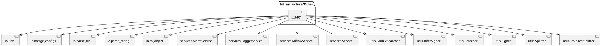

# Module Specification: __init__

* **Source Reference:** `src/autogen_team/infrastructure/__init__.py`

## 1. Architectural Role & Responsibilities
**Purpose:**
Provides functionality related to   init  .

**Architecture Layer:**
- Infrastructure/Other

**Responsibilities:**
- Manages operations and logic for   init  .

**Main Workflow:**
- Executes the primary flow defined by   init   functions and classes.

## 2. Dependencies
**Imports:**
- `io.Env`
- `io.merge_configs`
- `io.parse_file`
- `io.parse_string`
- `io.to_object`
- `services.AlertsService`
- `services.LoggerService`
- `services.MlflowService`
- `services.Service`
- `utils.GridCVSearcher`
- `utils.InferSigner`
- `utils.Searcher`
- `utils.Signer`
- `utils.Splitter`
- `utils.TrainTestSplitter`

**Exported Classes:**
- None

**Exported Functions:**
- None

**Exported Interfaces:**
- Not explicitly defined.

**Public API:**
- Not explicitly defined.

## 3. Architecture & Execution
### Internal Architecture
Not explicitly defined.

### Execution Flow
Not explicitly defined.

### Sequence Explanation
Not explicitly defined.

### Examples
Not explicitly defined.

## 4. UML 2.0 Diagrams
### Class Diagram

### Sequence Diagram

### Component Diagram

### Dependency Graph

```plantuml
@startuml
    [Module] --> [io.Env] : imports
    [Module] --> [io.merge_configs] : imports
    [Module] --> [io.parse_file] : imports
    [Module] --> [io.parse_string] : imports
    [Module] --> [io.to_object] : imports
    [Module] --> [services.AlertsService] : imports
    [Module] --> [services.LoggerService] : imports
    [Module] --> [services.MlflowService] : imports
    [Module] --> [services.Service] : imports
    [Module] --> [utils.GridCVSearcher] : imports
    [Module] --> [utils.InferSigner] : imports
    [Module] --> [utils.Searcher] : imports
    [Module] --> [utils.Signer] : imports
    [Module] --> [utils.Splitter] : imports
    [Module] --> [utils.TrainTestSplitter] : imports
@enduml
```

## 5. Class & Method Specifications
## 6. Module Functions
## 7. Call Graph
- No public API calls detected.

## 8. Cross References
- **Parent module:** ../__init__.md
- **Child modules:** messaging/__init__.md, services/__init__.md, utils/__init__.md, io/__init__.md
- **Dependencies:** `utils.Signer`, `services.MlflowService`, `services.AlertsService`, `utils.Splitter`, `io.merge_configs`, `utils.InferSigner`, `services.LoggerService`, `io.to_object`, `utils.GridCVSearcher`, `services.Service`, `io.parse_file`, `io.Env`, `utils.Searcher`, `utils.TrainTestSplitter`, `io.parse_string`
- **Used by:** None
- **Calls:** None
- **Called from:** None
- **Related classes:** [Classes](../../../../classes/index.md)
- **Related interfaces:** Not explicitly defined.
- **Related diagrams:** [Diagrams](../../../../diagrams/index.md)
