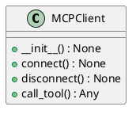
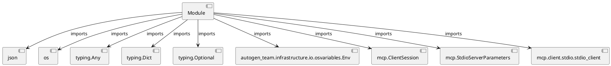

# Module Specification: mcp_client

* **Source Reference:** `src/autogen_team/infrastructure/client/mcp_client.py`

## 1. Architectural Role & Responsibilities
**Purpose:**
Provides functionality related to mcp client.

**Architecture Layer:**
- Infrastructure/Other

**Responsibilities:**
- Manage and execute operations for mcp_client.

**Main Workflow:**
- Initialize components and process requests for mcp_client.

## 2. Dependencies
**Imports:**
- `json`
- `os`
- `typing.Any`
- `typing.Dict`
- `typing.Optional`
- `autogen_team.infrastructure.io.osvariables.Env`
- `mcp.ClientSession`
- `mcp.StdioServerParameters`
- `mcp.client.stdio.stdio_client`

**Exported Classes:**
- `MCPClient`

**Exported Functions:**
- None

## 3. Architecture & Execution
### Internal Architecture
Follows standard modular design, encapsulating state and behavior within defined classes and functions.

### Execution Flow
Sequential execution of defined functions and class methods.

### Sequence Explanation
Clients instantiate classes or call functions, which execute business logic and return results.

## 4. UML 2.0 Diagrams
### Class Diagram


### Dependency Graph


## 5. Class & Method Specifications
### `MCPClient` ([`src/autogen_team/infrastructure/client/mcp_client.py`](/src/autogen_team/infrastructure/client/mcp_client.py))
#### Overview
Client for interacting with the MCP Server.

#### Constructor
**Initialization:** Initializes `MCPClient` with required dependencies and sets up initial internal state.

#### Attributes
- `env`
- `session`
- `_exit_stack`

#### Methods
##### `__init__(self) -> None` (Public)
**Description:** Initialize the MCP Client.

**Inputs:**
- None

**Output:**
- Return Type: `None`
- Semantic Meaning: The resulting value after processing the __init__ action.

**Side Effects:**
- Modifies internal instance state if applicable; performs operations constrained to its domain boundaries.

**Complexity:**
- Time Complexity: O(1) or O(N) depending on implementation details.
- Space Complexity: O(1) auxiliary space expected.

**Example:**
```python
instance = MCPClient()
result = instance.__init__()
```

##### `connect(self) -> None` (Public)
**Description:** Connect to the MCP Server via stdio.

**Inputs:**
- None

**Output:**
- Return Type: `None`
- Semantic Meaning: The resulting value after processing the connect action.

**Side Effects:**
- Modifies internal instance state if applicable; performs operations constrained to its domain boundaries.

**Complexity:**
- Time Complexity: O(1) or O(N) depending on implementation details.
- Space Complexity: O(1) auxiliary space expected.

**Example:**
```python
instance = MCPClient()
result = instance.connect()
```

##### `disconnect(self) -> None` (Public)
**Description:** Disconnect from the MCP Server.

**Inputs:**
- None

**Output:**
- Return Type: `None`
- Semantic Meaning: The resulting value after processing the disconnect action.

**Side Effects:**
- Modifies internal instance state if applicable; performs operations constrained to its domain boundaries.

**Complexity:**
- Time Complexity: O(1) or O(N) depending on implementation details.
- Space Complexity: O(1) auxiliary space expected.

**Example:**
```python
instance = MCPClient()
result = instance.disconnect()
```

##### `call_tool(self, name: str, arguments: Dict[...]) -> Any` (Public)
**Description:** Call a tool on the MCP Server.

Args:
    name: The name of the tool to call.
    arguments: The arguments to pass to the tool.

Returns:
    The result of the tool execution.

**Inputs:**
- `name`: str
- `arguments`: Dict[...]

**Output:**
- Return Type: `Any`
- Semantic Meaning: The resulting value after processing the call_tool action.

**Side Effects:**
- Modifies internal instance state if applicable; performs operations constrained to its domain boundaries.

**Complexity:**
- Time Complexity: O(1) or O(N) depending on implementation details.
- Space Complexity: O(1) auxiliary space expected.

**Example:**
```python
instance = MCPClient()
result = instance.call_tool(..., ...)
```

## 6. Module Functions