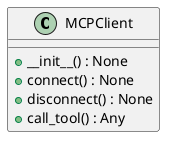
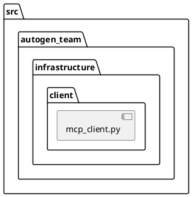
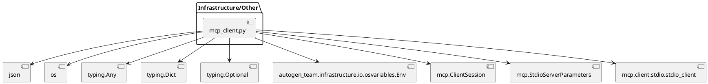
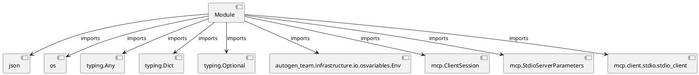
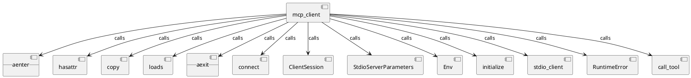

# Module Specification: mcp_client

* **Source Reference:** `src/autogen_team/infrastructure/client/mcp_client.py`

## 1. Architectural Role & Responsibilities
**Purpose:**
Provides functionality related to mcp client.

**Architecture Layer:**
- Infrastructure/Other

**Responsibilities:**
- Not explicitly defined.

**Main Workflow:**
- Not explicitly defined.

## 2. Dependencies
**Imports:**
- `json`
- `os`
- `typing.Any`
- `typing.Dict`
- `typing.Optional`
- `autogen_team.infrastructure.io.osvariables.Env`
- `mcp.ClientSession`
- `mcp.StdioServerParameters`
- `mcp.client.stdio.stdio_client`

**Exported Classes:**
- `MCPClient`

**Exported Functions:**
- None

**Exported Interfaces:**
- Not explicitly defined.

**Public API:**
- Not explicitly defined.

## 3. Architecture & Execution
### Internal Architecture
Not explicitly defined.

### Execution Flow
Not explicitly defined.

### Sequence Explanation
Not explicitly defined.

### Examples
Not explicitly defined.

## 4. UML 2.0 Diagrams
### Class Diagram

```plantuml
@startuml
    class MCPClient {
        +__init__() : None
        +connect() : None
        +disconnect() : None
        +call_tool() : Any
    }
@enduml
```

### Package Diagram

```plantuml
@startuml
    package "src" {
        package "autogen_team" {
            package "infrastructure" {
                package "client" {
                    [mcp_client.py]
                }
            }
        }
    }
@enduml
```

### Sequence Diagram

```plantuml
@startuml
    ' No functions for sequence
@enduml
```

### Component Diagram

```plantuml
@startuml
    package "Infrastructure/Other" {
        [mcp_client.py]
    }
    [mcp_client.py] --> [json]
    [mcp_client.py] --> [os]
    [mcp_client.py] --> [typing.Any]
    [mcp_client.py] --> [typing.Dict]
    [mcp_client.py] --> [typing.Optional]
    [mcp_client.py] --> [autogen_team.infrastructure.io.osvariables.Env]
    [mcp_client.py] --> [mcp.ClientSession]
    [mcp_client.py] --> [mcp.StdioServerParameters]
    [mcp_client.py] --> [mcp.client.stdio.stdio_client]
@enduml
```

### Dependency Graph

```plantuml
@startuml
    [Module] --> [json] : imports
    [Module] --> [os] : imports
    [Module] --> [typing.Any] : imports
    [Module] --> [typing.Dict] : imports
    [Module] --> [typing.Optional] : imports
    [Module] --> [autogen_team.infrastructure.io.osvariables.Env] : imports
    [Module] --> [mcp.ClientSession] : imports
    [Module] --> [mcp.StdioServerParameters] : imports
    [Module] --> [mcp.client.stdio.stdio_client] : imports
@enduml
```

## 5. Class & Method Specifications
### `MCPClient` ([`src/autogen_team/infrastructure/client/mcp_client.py`](/src/autogen_team/infrastructure/client/mcp_client.py))
#### Overview
Client for interacting with the MCP Server.

#### Constructor
**Initialization:** Initializes `MCPClient` with required dependencies and sets up initial internal state.

#### Attributes
- `env`
  - Type: Any
  - Purpose: Not explicitly defined.
  - Constraints: Not explicitly defined.
- `session`
  - Type: Any
  - Purpose: Not explicitly defined.
  - Constraints: Not explicitly defined.
- `_exit_stack`
  - Type: Any
  - Purpose: Not explicitly defined.
  - Constraints: Not explicitly defined.

#### Methods
##### `__init__(self) -> None` (Public)
**Description:** Initialize the MCP Client.

**Inputs:**
- None

**Output:**
- return type: `None`
- semantic meaning: Not explicitly defined.
- possible null values: Not explicitly defined.
- exceptions: Not explicitly defined.

**Side Effects:**
- Database updates: Not explicitly defined.
- File operations: Not explicitly defined.
- Network calls: Not explicitly defined.
- Cache: Not explicitly defined.
- State changes: Not explicitly defined.

**Complexity:**
- Time Complexity: Not explicitly defined.
- Space Complexity: Not explicitly defined.

**Example:**
```python
instance = MCPClient()
result = instance.__init__()
```

##### `connect(self) -> None` (Public)
**Description:** Connect to the MCP Server via stdio.

**Inputs:**
- None

**Output:**
- return type: `None`
- semantic meaning: Not explicitly defined.
- possible null values: Not explicitly defined.
- exceptions: Not explicitly defined.

**Side Effects:**
- Database updates: Not explicitly defined.
- File operations: Not explicitly defined.
- Network calls: Not explicitly defined.
- Cache: Not explicitly defined.
- State changes: Not explicitly defined.

**Complexity:**
- Time Complexity: Not explicitly defined.
- Space Complexity: Not explicitly defined.

**Example:**
```python
instance = MCPClient()
result = instance.connect()
```

##### `disconnect(self) -> None` (Public)
**Description:** Disconnect from the MCP Server.

**Inputs:**
- None

**Output:**
- return type: `None`
- semantic meaning: Not explicitly defined.
- possible null values: Not explicitly defined.
- exceptions: Not explicitly defined.

**Side Effects:**
- Database updates: Not explicitly defined.
- File operations: Not explicitly defined.
- Network calls: Not explicitly defined.
- Cache: Not explicitly defined.
- State changes: Not explicitly defined.

**Complexity:**
- Time Complexity: Not explicitly defined.
- Space Complexity: Not explicitly defined.

**Example:**
```python
instance = MCPClient()
result = instance.disconnect()
```

##### `call_tool(self, name: str, arguments: Dict[str, Any]) -> Any` (Public)
**Description:** Call a tool on the MCP Server.

Args:
    name: The name of the tool to call.
    arguments: The arguments to pass to the tool.

Returns:
    The result of the tool execution.

**Inputs:**
- `name`
  - type: str
  - meaning: Not explicitly defined.
  - valid values: Not explicitly defined.
  - optional?: False
  - default value: None
- `arguments`
  - type: Dict[str, Any]
  - meaning: Not explicitly defined.
  - valid values: Not explicitly defined.
  - optional?: False
  - default value: None

**Output:**
- return type: `Any`
- semantic meaning: Not explicitly defined.
- possible null values: Not explicitly defined.
- exceptions: Not explicitly defined.

**Side Effects:**
- Database updates: Not explicitly defined.
- File operations: Not explicitly defined.
- Network calls: Not explicitly defined.
- Cache: Not explicitly defined.
- State changes: Not explicitly defined.

**Complexity:**
- Time Complexity: Not explicitly defined.
- Space Complexity: Not explicitly defined.

**Example:**
```python
instance = MCPClient()
result = instance.call_tool(..., ...)
```

## 6. Module Functions
## 7. Call Graph

```plantuml
@startuml
[mcp_client] --> [__aenter__] : calls
[mcp_client] --> [hasattr] : calls
[mcp_client] --> [copy] : calls
[mcp_client] --> [loads] : calls
[mcp_client] --> [__aexit__] : calls
[mcp_client] --> [connect] : calls
[mcp_client] --> [ClientSession] : calls
[mcp_client] --> [StdioServerParameters] : calls
[mcp_client] --> [Env] : calls
[mcp_client] --> [initialize] : calls
[mcp_client] --> [stdio_client] : calls
[mcp_client] --> [RuntimeError] : calls
[mcp_client] --> [call_tool] : calls
@enduml
```

## 8. Cross References
- **Dependencies:** [Dependencies](../../../../../dependencies/index.md)
- **Used by:** ../../../../tests/infrastructure/client/test_mcp_client.md, ../../application/agents/coder_agent.md, ../../application/agents/tester_agent.md, ../../../../Scripts/test_mcp_client_simple.md, ../../application/agents/planner_agent.md, ../../application/agents/documentation_agent.md, ../../application/agents/reviewer_agent.md
- **Calls:** __aenter__, hasattr, copy, loads, __aexit__, connect, ClientSession, StdioServerParameters, Env, initialize, stdio_client, RuntimeError, call_tool
- **Called from:** None
- **Related classes:** [Classes](../../../../../classes/index.md)
- **Related diagrams:** [Diagrams](../../../../../diagrams/index.md)
