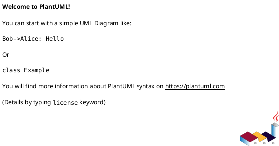
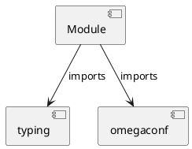

# Module Specification: configs

* **Source Reference:** `src/autogen_team/infrastructure/io/configs.py`

## 1. Architectural Role & Responsibilities
**Purpose:**
Provides functionality related to configs.

**Architecture Layer:**
- Infrastructure/Other

**Responsibilities:**
- Not explicitly defined.

**Main Workflow:**
- Not explicitly defined.

## 2. Dependencies
**Imports:**
- `typing`
- `omegaconf`

**Exported Classes:**
- None

**Exported Functions:**
- `parse_file`
- `parse_string`
- `merge_configs`
- `to_object`

## 3. Architecture & Execution
### Internal Architecture
Not explicitly defined.

### Execution Flow
Not explicitly defined.

### Sequence Explanation
Not explicitly defined.

## 4. UML 2.0 Diagrams
### Class Diagram

### Dependency Graph

## 5. Class & Method Specifications
## 6. Module Functions
### `parse_file(path: str)`
Parse a config file from a path.

Args:
    path (str): path to local config.

Returns:
    Config: representation of the config file.

**Inputs:**
- `path`: str

**Output:**
- Return Type: `Config`

### `parse_string(string: str)`
Parse the given config string.

Args:
    string (str): content of config string.

Returns:
    Config: representation of the config string.

**Inputs:**
- `string`: str

**Output:**
- Return Type: `Config`

### `merge_configs(configs: T.Sequence[Config])`
Merge a list of config into a single config.

Args:
    configs (T.Sequence[Config]): list of configs.

Returns:
    Config: representation of the merged config objects.

**Inputs:**
- `configs`: T.Sequence[Config]

**Output:**
- Return Type: `Config`

### `to_object(config: Config, resolve: bool)`
Convert a config object to a python object.

Args:
    config (Config): representation of the config.
    resolve (bool): resolve variables. Defaults to True.

Returns:
    object: conversion of the config to a python object.

**Inputs:**
- `config`: Config
- `resolve`: bool

**Output:**
- Return Type: `object`
