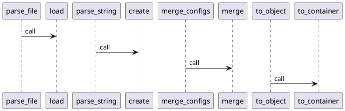
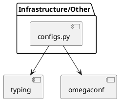
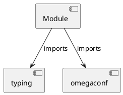
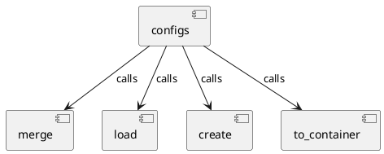

# Module Specification: configs

* **Source Reference:** `src/autogen_team/infrastructure/io/configs.py`

## 1. Architectural Role & Responsibilities
**Purpose:**
Provides functionality related to configs.

**Architecture Layer:**
- Infrastructure/Other

**Responsibilities:**
- Manages operations and logic for configs.

**Main Workflow:**
- Executes the primary flow defined by configs functions and classes.

## 2. Dependencies
**Imports:**
- `typing`
- `omegaconf`

**Exported Classes:**
- None

**Exported Functions:**
- `parse_file`
- `parse_string`
- `merge_configs`
- `to_object`

**Exported Interfaces:**
- Not explicitly defined.

**Public API:**
- Not explicitly defined.

## 3. Architecture & Execution
### Internal Architecture
Not explicitly defined.

### Execution Flow
Not explicitly defined.

### Sequence Explanation
Not explicitly defined.

### Examples
Not explicitly defined.

## 4. UML 2.0 Diagrams
### Class Diagram

```plantuml
@startuml
    ' No classes found in module
@enduml
```

### Sequence Diagram

```plantuml
@startuml
    parse_file -> load : call
    parse_string -> create : call
    merge_configs -> merge : call
    to_object -> to_container : call
@enduml
```

### Component Diagram

```plantuml
@startuml
    package "Infrastructure/Other" {
        [configs.py]
    }
    [configs.py] --> [typing]
    [configs.py] --> [omegaconf]
@enduml
```

### Dependency Graph

```plantuml
@startuml
    [Module] --> [typing] : imports
    [Module] --> [omegaconf] : imports
@enduml
```

## 5. Class & Method Specifications
## 6. Module Functions
### `parse_file(path: str)`
Parse a config file from a path.

Args:
    path (str): path to local config.

Returns:
    Config: representation of the config file.

**Inputs:**
- `path`
  - type: str
  - meaning: Represents the path parameter.
  - valid values: Any valid str.
  - optional?: False
  - default value: None

**Output:**
- return type: `Config`
- semantic meaning: Returns the result of parse file.
- possible null values: Yes, if Config allows it.
- exceptions: Standard execution exceptions.

**Side Effects:**
- Database updates: Not explicitly defined.
- File operations: Not explicitly defined.
- Network calls: Not explicitly defined.
- Cache: Not explicitly defined.
- State changes: Not explicitly defined.

### `parse_string(string: str)`
Parse the given config string.

Args:
    string (str): content of config string.

Returns:
    Config: representation of the config string.

**Inputs:**
- `string`
  - type: str
  - meaning: Represents the string parameter.
  - valid values: Any valid str.
  - optional?: False
  - default value: None

**Output:**
- return type: `Config`
- semantic meaning: Returns the result of parse string.
- possible null values: Yes, if Config allows it.
- exceptions: Standard execution exceptions.

**Side Effects:**
- Database updates: Not explicitly defined.
- File operations: Not explicitly defined.
- Network calls: Not explicitly defined.
- Cache: Not explicitly defined.
- State changes: Not explicitly defined.

### `merge_configs(configs: T.Sequence[Config])`
Merge a list of config into a single config.

Args:
    configs (T.Sequence[Config]): list of configs.

Returns:
    Config: representation of the merged config objects.

**Inputs:**
- `configs`
  - type: T.Sequence[Config]
  - meaning: Represents the configs parameter.
  - valid values: Any valid T.Sequence[Config].
  - optional?: False
  - default value: None

**Output:**
- return type: `Config`
- semantic meaning: Returns the result of merge configs.
- possible null values: Yes, if Config allows it.
- exceptions: Standard execution exceptions.

**Side Effects:**
- Database updates: Not explicitly defined.
- File operations: Not explicitly defined.
- Network calls: Not explicitly defined.
- Cache: Not explicitly defined.
- State changes: Not explicitly defined.

### `to_object(config: Config, resolve: bool)`
Convert a config object to a python object.

Args:
    config (Config): representation of the config.
    resolve (bool): resolve variables. Defaults to True.

Returns:
    object: conversion of the config to a python object.

**Inputs:**
- `config`
  - type: Config
  - meaning: Represents the config parameter.
  - valid values: Any valid Config.
  - optional?: False
  - default value: None
- `resolve`
  - type: bool
  - meaning: Represents the resolve parameter.
  - valid values: Any valid bool.
  - optional?: True
  - default value: True

**Output:**
- return type: `object`
- semantic meaning: Returns the result of to object.
- possible null values: Yes, if object allows it.
- exceptions: Standard execution exceptions.

**Side Effects:**
- Database updates: Not explicitly defined.
- File operations: Not explicitly defined.
- Network calls: Not explicitly defined.
- Cache: Not explicitly defined.
- State changes: Not explicitly defined.

## 7. Call Graph

```plantuml
@startuml
[configs] --> [merge] : calls
[configs] --> [load] : calls
[configs] --> [create] : calls
[configs] --> [to_container] : calls
@enduml
```

## 8. Cross References
- **Parent module:** __init__.md
- **Child modules:** None
- **Dependencies:** `omegaconf`, `typing`
- **Used by:** None
- **Calls:** merge, load, create, to_container
- **Called from:** ../../../../tests/infrastructure/io/test_configs.md, ../services/mcp_service.md, ../../scripts.md
- **Related classes:** [Classes](../../../../../classes/index.md)
- **Related interfaces:** Not explicitly defined.
- **Related diagrams:** [Diagrams](../../../../../diagrams/index.md)
