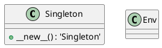
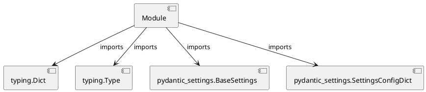

# Module Specification: osvariables

* **Source Reference:** `src/autogen_team/infrastructure/io/osvariables.py`

## 1. Architectural Role & Responsibilities
**Purpose:**
Provides functionality related to osvariables.

**Architecture Layer:**
- Infrastructure/Other

**Responsibilities:**
- Not explicitly defined.

**Main Workflow:**
- Not explicitly defined.

## 2. Dependencies
**Imports:**
- `typing.Dict`
- `typing.Type`
- `pydantic_settings.BaseSettings`
- `pydantic_settings.SettingsConfigDict`

**Exported Classes:**
- `Singleton`
- `Env`

**Exported Functions:**
- None

## 3. Architecture & Execution
### Internal Architecture
Not explicitly defined.

### Execution Flow
Not explicitly defined.

### Sequence Explanation
Not explicitly defined.

## 4. UML 2.0 Diagrams
### Class Diagram

### Dependency Graph

## 5. Class & Method Specifications
### `Singleton` ([`src/autogen_team/infrastructure/io/osvariables.py`](/src/autogen_team/infrastructure/io/osvariables.py))
#### Overview
Provides state and behavior management for Singleton.

#### Attributes
- None found.

#### Methods
##### `__new__(cls: Type['Singleton']) -> 'Singleton'` (Private)
**Purpose:** No description provided.

**Parameters:**
- `cls`: Type['Singleton']

**Return value:**
- `'Singleton'`

### `Env` ([`src/autogen_team/infrastructure/io/osvariables.py`](/src/autogen_team/infrastructure/io/osvariables.py))
#### Overview
Provides state and behavior management for Env.

#### Attributes
- None found.

#### Methods
## 6. Module Functions