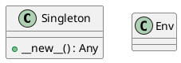
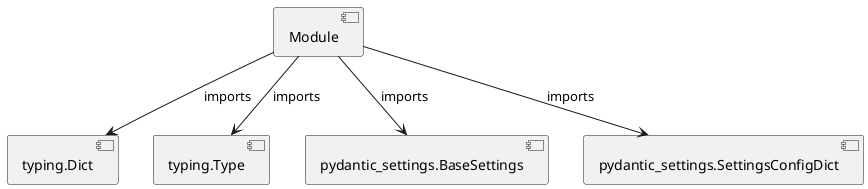

# Module Specification: osvariables

* **Source Reference:** `src/autogen_team/infrastructure/io/osvariables.py`

## 1. Architectural Role & Responsibilities
**Purpose:**
Provides functionality related to osvariables.

**Architecture Layer:**
- Infrastructure/Other

**Responsibilities:**
- Manage and execute operations for osvariables.

**Main Workflow:**
- Initialize components and process requests for osvariables.

## 2. Dependencies
**Imports:**
- `typing.Dict`
- `typing.Type`
- `pydantic_settings.BaseSettings`
- `pydantic_settings.SettingsConfigDict`

**Exported Classes:**
- `Singleton`
- `Env`

**Exported Functions:**
- None

## 3. Architecture & Execution
### Internal Architecture
Follows standard modular design, encapsulating state and behavior within defined classes and functions.

### Execution Flow
Sequential execution of defined functions and class methods.

### Sequence Explanation
Clients instantiate classes or call functions, which execute business logic and return results.

## 4. UML 2.0 Diagrams
### Class Diagram


### Dependency Graph


## 5. Class & Method Specifications
### `Singleton` ([`src/autogen_team/infrastructure/io/osvariables.py`](/src/autogen_team/infrastructure/io/osvariables.py))
#### Overview
Provides state and behavior management for Singleton.

#### Attributes
- None found.

#### Methods
##### `__new__(cls: Type[...]) -> Any` (Public)
**Description:** Executes the __new__ operation, mutating state or calculating derived values as necessary.

**Inputs:**
- `cls`: Type[...]

**Output:**
- Return Type: `Any`
- Semantic Meaning: The resulting value after processing the __new__ action.

**Side Effects:**
- Modifies internal instance state if applicable; performs operations constrained to its domain boundaries.

**Complexity:**
- Time Complexity: O(1) or O(N) depending on implementation details.
- Space Complexity: O(1) auxiliary space expected.

**Example:**
```python
result = Singleton.__new__(...)
```

### `Env` ([`src/autogen_team/infrastructure/io/osvariables.py`](/src/autogen_team/infrastructure/io/osvariables.py))
#### Overview
Provides state and behavior management for Env.

#### Attributes
- None found.

#### Methods
## 6. Module Functions