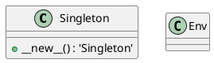
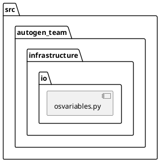
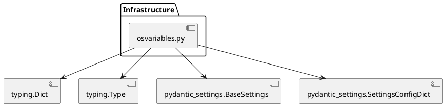
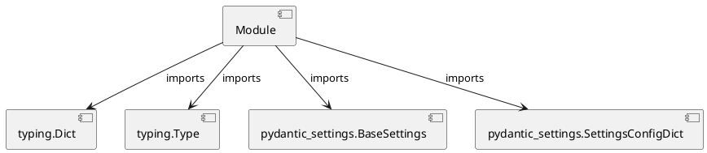
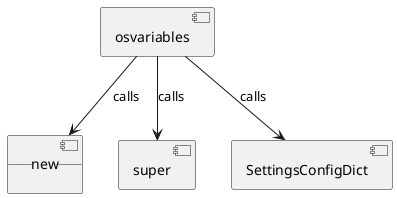

# Module Specification: osvariables

* **Source Reference:** `src/autogen_team/infrastructure/io/osvariables.py`

## 1. Architectural Role & Responsibilities
**Purpose:**
Provides functionality related to osvariables.

**Architecture Layer:**
- Infrastructure

**Responsibilities:**
- Not explicitly defined.

**Main Workflow:**
- Not explicitly defined.

## 2. Dependencies
**Imports:**
- `typing.Dict`
- `typing.Type`
- `pydantic_settings.BaseSettings`
- `pydantic_settings.SettingsConfigDict`

**Exported Classes:**
- `Singleton`
- `Env`

**Exported Functions:**
- None

**Exported Interfaces:**
- Not explicitly defined.

**Public API:**
- Not explicitly defined.

## 3. Architecture & Execution
### Internal Architecture
Not explicitly defined.

### Execution Flow
Not explicitly defined.

### Sequence Explanation
Not explicitly defined.

### Examples
Not explicitly defined.

## 4. UML 2.0 Diagrams
### Class Diagram

```plantuml
@startuml
    class Singleton {
        +__new__() : 'Singleton'
    }
    class Env {
    }
@enduml
```

### Package Diagram

```plantuml
@startuml
    package "src" {
        package "autogen_team" {
            package "infrastructure" {
                package "io" {
                    [osvariables.py]
                }
            }
        }
    }
@enduml
```

### Sequence Diagram

```plantuml
@startuml
    ' No functions for sequence
@enduml
```

### Component Diagram

```plantuml
@startuml
    package "Infrastructure" {
        [osvariables.py]
    }
    [osvariables.py] --> [typing.Dict]
    [osvariables.py] --> [typing.Type]
    [osvariables.py] --> [pydantic_settings.BaseSettings]
    [osvariables.py] --> [pydantic_settings.SettingsConfigDict]
@enduml
```

### Dependency Graph

```plantuml
@startuml
    [Module] --> [typing.Dict] : imports
    [Module] --> [typing.Type] : imports
    [Module] --> [pydantic_settings.BaseSettings] : imports
    [Module] --> [pydantic_settings.SettingsConfigDict] : imports
@enduml
```

## 5. Class & Method Specifications
### `Singleton` ([`src/autogen_team/infrastructure/io/osvariables.py`](/src/autogen_team/infrastructure/io/osvariables.py))
#### Overview
Provides state and behavior management for singleton.

#### Attributes
- None found.

#### Methods
##### `__new__(cls: Type['Singleton']) -> 'Singleton'` (Private)
**Purpose:** Executes the new   operation.

**Parameters:**
- `cls`: Type['Singleton']

**Return value:**
- `'Singleton'`

### `Env` ([`src/autogen_team/infrastructure/io/osvariables.py`](/src/autogen_team/infrastructure/io/osvariables.py))
#### Overview
Provides state and behavior management for env.

#### Attributes
- None found.

#### Methods
## 6. Module Functions
## 7. Call Graph

```plantuml
@startuml
[osvariables] --> [__new__] : calls
[osvariables] --> [super] : calls
[osvariables] --> [SettingsConfigDict] : calls
@enduml
```

## 8. Cross References
- **Dependencies:** [Dependencies](../../../../../dependencies/index.md)
- **Used by:** ../client/mcp_client.md, ../services/mcp_service.md, ../../application/mcp/tools/index_code.md, ../../../../tests/infrastructure/io/test_osvariables_fix.md, ../services/hatchet_service.md, ../services/mlflow_service.md, ../../application/mcp/tools/retrieve_context.md
- **Calls:** __new__, super, SettingsConfigDict
- **Called from:** None
- **Related classes:** [Classes](../../../../../classes/index.md)
- **Related diagrams:** [Diagrams](../../../../../diagrams/index.md)
