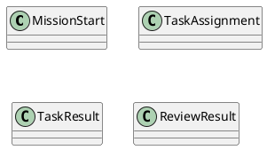
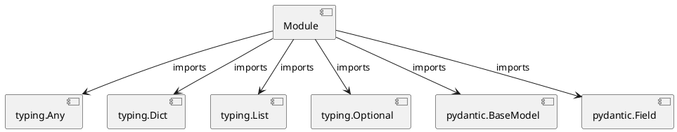

# Module Specification: a2a_protocol

* **Source Reference:** `src/autogen_team/infrastructure/messaging/a2a_protocol.py`

## 1. Architectural Role & Responsibilities
**Purpose:**
Provides functionality related to a2a protocol.

**Architecture Layer:**
- Infrastructure/Other

**Responsibilities:**
- Not explicitly defined.

**Main Workflow:**
- Not explicitly defined.

## 2. Dependencies
**Imports:**
- `typing.Any`
- `typing.Dict`
- `typing.List`
- `typing.Optional`
- `pydantic.BaseModel`
- `pydantic.Field`

**Exported Classes:**
- `MissionStart`
- `TaskAssignment`
- `TaskResult`
- `ReviewResult`

**Exported Functions:**
- None

## 3. Architecture & Execution
### Internal Architecture
Not explicitly defined.

### Execution Flow
Not explicitly defined.

### Sequence Explanation
Not explicitly defined.

## 4. UML 2.0 Diagrams
### Class Diagram

### Dependency Graph

## 5. Class & Method Specifications
### `MissionStart` ([`src/autogen_team/infrastructure/messaging/a2a_protocol.py`](/src/autogen_team/infrastructure/messaging/a2a_protocol.py))
#### Overview
Event payload to start a new autonomous mission.

#### Attributes
- None found.

#### Methods
### `TaskAssignment` ([`src/autogen_team/infrastructure/messaging/a2a_protocol.py`](/src/autogen_team/infrastructure/messaging/a2a_protocol.py))
#### Overview
Payload for assigning a task to a Coder Agent.

#### Attributes
- None found.

#### Methods
### `TaskResult` ([`src/autogen_team/infrastructure/messaging/a2a_protocol.py`](/src/autogen_team/infrastructure/messaging/a2a_protocol.py))
#### Overview
Result from a Coder Agent execution.

#### Attributes
- None found.

#### Methods
### `ReviewResult` ([`src/autogen_team/infrastructure/messaging/a2a_protocol.py`](/src/autogen_team/infrastructure/messaging/a2a_protocol.py))
#### Overview
Result from a Reviewer Agent.

#### Attributes
- None found.

#### Methods
## 6. Module Functions