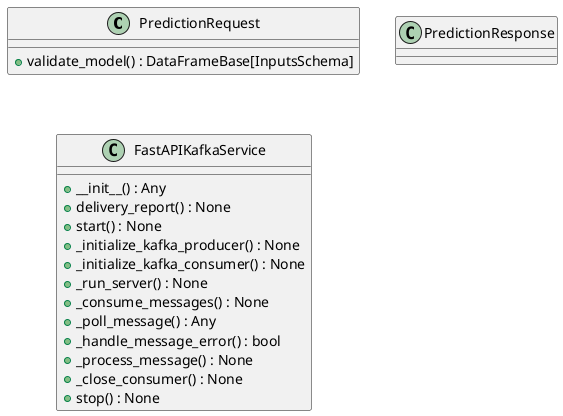

# Module Specification: kafka_app

* **Source Reference:** `src/autogen_team/infrastructure/messaging/kafka_app.py`

## 1. Architectural Role & Responsibilities
**Purpose:**
Provides functionality related to kafka app.

**Architecture Layer:**
- Infrastructure/Other

**Responsibilities:**
- Not explicitly defined.

**Main Workflow:**
- Not explicitly defined.

## 2. Dependencies
**Imports:**
- `json`
- `logging`
- `os`
- `signal`
- `sys`
- `threading`
- `time`
- `typing.Any`
- `typing.Callable`
- `typing.Dict`
- `typing.Optional`
- `pandas`
- `uvicorn`
- `confluent_kafka.Consumer`
- `confluent_kafka.KafkaError`
- `confluent_kafka.Producer`
- `fastapi.FastAPI`
- `pandera.typing.common.DataFrameBase`
- `pydantic.BaseModel`
- `autogen_team.infrastructure.io`
- `autogen_team.core.schemas.InputsSchema`
- `autogen_team.core.schemas.Outputs`
- `autogen_team.infrastructure.services`
- `autogen_team.registry.adapters.mlflow_adapter.CustomLoader`
- `types`
- `autogen_team.registry`
- `autogen_team.registry.adapters.mlflow_adapter.CustomSaver`
- `autogen_team.models`

**Exported Classes:**
- `PredictionRequest`
- `PredictionResponse`
- `FastAPIKafkaService`

**Exported Functions:**
- `health_check`
- `main`

## 3. Architecture & Execution
### Internal Architecture
Not explicitly defined.

### Execution Flow
Not explicitly defined.

### Sequence Explanation
Not explicitly defined.

## 4. UML 2.0 Diagrams
### Class Diagram


### Dependency Graph

```plantuml
@startuml
    [Module] --> [json] : imports
    [Module] --> [logging] : imports
    [Module] --> [os] : imports
    [Module] --> [signal] : imports
    [Module] --> [sys] : imports
    [Module] --> [threading] : imports
    [Module] --> [time] : imports
    [Module] --> [typing.Any] : imports
    [Module] --> [typing.Callable] : imports
    [Module] --> [typing.Dict] : imports
    [Module] --> [typing.Optional] : imports
    [Module] --> [pandas] : imports
    [Module] --> [uvicorn] : imports
    [Module] --> [confluent_kafka.Consumer] : imports
    [Module] --> [confluent_kafka.KafkaError] : imports
    [Module] --> [confluent_kafka.Producer] : imports
    [Module] --> [fastapi.FastAPI] : imports
    [Module] --> [pandera.typing.common.DataFrameBase] : imports
    [Module] --> [pydantic.BaseModel] : imports
    [Module] --> [autogen_team.infrastructure.io] : imports
    [Module] --> [autogen_team.core.schemas.InputsSchema] : imports
    [Module] --> [autogen_team.core.schemas.Outputs] : imports
    [Module] --> [autogen_team.infrastructure.services] : imports
    [Module] --> [autogen_team.registry.adapters.mlflow_adapter.CustomLoader] : imports
    [Module] --> [types] : imports
    [Module] --> [autogen_team.registry] : imports
    [Module] --> [autogen_team.registry.adapters.mlflow_adapter.CustomSaver] : imports
    [Module] --> [autogen_team.models] : imports
@enduml
```


## 5. Class & Method Specifications
### `PredictionRequest` ([`src/autogen_team/infrastructure/messaging/kafka_app.py`](/src/autogen_team/infrastructure/messaging/kafka_app.py))
#### Overview
Request model for prediction.

#### Attributes
- None found.

#### Methods
##### `validate_model(self) -> DataFrameBase[InputsSchema]` (Public)
**Description:** Validates the input data against InputsSchema.

**Inputs:**
- None

**Output:**
- Return Type: `DataFrameBase[InputsSchema]`
- Semantic Meaning: Not explicitly defined.

**Side Effects:**
- Not explicitly defined.

**Complexity:**
- Time Complexity: Not explicitly defined.
- Space Complexity: Not explicitly defined.

**Example:**
```python
result = PredictionRequest.validate_model()
```

### `PredictionResponse` ([`src/autogen_team/infrastructure/messaging/kafka_app.py`](/src/autogen_team/infrastructure/messaging/kafka_app.py))
#### Overview
Response model for prediction.

#### Attributes
- None found.

#### Methods
### `FastAPIKafkaService` ([`src/autogen_team/infrastructure/messaging/kafka_app.py`](/src/autogen_team/infrastructure/messaging/kafka_app.py))
#### Overview
Service for deploying a FastAPI application with a Kafka producer and consumer.

#### Constructor
**Initialization:** Initializes `FastAPIKafkaService` with required dependencies and sets up initial internal state.

#### Attributes
- `server_thread`
- `stop_event`
- `prediction_callback`
- `producer_config`
- `consumer_config`
- `input_topic`
- `output_topic`
- `producer`
- `consumer`

#### Methods
##### `__init__(self, prediction_callback: Callable[[PredictionRequest], PredictionResponse], producer_config: Dict[str, Any], consumer_config: Dict[str, Any], input_topic: str, output_topic: str) -> Any` (Public)
**Description:** No description provided.

**Inputs:**
- `prediction_callback`: Callable[[PredictionRequest], PredictionResponse]
- `producer_config`: Dict[str, Any]
- `consumer_config`: Dict[str, Any]
- `input_topic`: str
- `output_topic`: str

**Output:**
- Return Type: `Any`
- Semantic Meaning: Not explicitly defined.

**Side Effects:**
- Not explicitly defined.

**Complexity:**
- Time Complexity: Not explicitly defined.
- Space Complexity: Not explicitly defined.

**Example:**
```python
instance = FastAPIKafkaService()
result = instance.__init__(..., ..., ..., ..., ...)
```

##### `delivery_report(self, err: Optional[KafkaError], msg: Any) -> None` (Public)
**Description:** Called once for each message produced to indicate delivery result.

**Inputs:**
- `err`: Optional[KafkaError]
- `msg`: Any

**Output:**
- Return Type: `None`
- Semantic Meaning: Not explicitly defined.

**Side Effects:**
- Not explicitly defined.

**Complexity:**
- Time Complexity: Not explicitly defined.
- Space Complexity: Not explicitly defined.

**Example:**
```python
instance = FastAPIKafkaService()
result = instance.delivery_report(..., ...)
```

##### `start(self) -> None` (Public)
**Description:** Start the FastAPI application and Kafka consumer.

**Inputs:**
- None

**Output:**
- Return Type: `None`
- Semantic Meaning: Not explicitly defined.

**Side Effects:**
- Not explicitly defined.

**Complexity:**
- Time Complexity: Not explicitly defined.
- Space Complexity: Not explicitly defined.

**Example:**
```python
instance = FastAPIKafkaService()
result = instance.start()
```

##### `_initialize_kafka_producer(self) -> None` (Private)
**Purpose:** Initialize Kafka producer.

**Parameters:**
- None

**Return value:**
- `None`

##### `_initialize_kafka_consumer(self) -> None` (Private)
**Purpose:** Initialize Kafka consumer.

**Parameters:**
- None

**Return value:**
- `None`

##### `_run_server(self) -> None` (Private)
**Purpose:** Run the FastAPI server.

**Parameters:**
- None

**Return value:**
- `None`

##### `_consume_messages(self) -> None` (Private)
**Purpose:** Consume messages from Kafka topic and produce predictions.

**Parameters:**
- None

**Return value:**
- `None`

##### `_poll_message(self) -> Any` (Private)
**Purpose:** Poll message from Kafka consumer.

**Parameters:**
- None

**Return value:**
- `Any`

##### `_handle_message_error(self, msg: Any) -> bool` (Private)
**Purpose:** Handle errors in polled messages.

**Parameters:**
- `msg`: Any

**Return value:**
- `bool`

##### `_process_message(self, msg: Any) -> None` (Private)
**Purpose:** Process a valid Kafka message.

**Parameters:**
- `msg`: Any

**Return value:**
- `None`

##### `_close_consumer(self) -> None` (Private)
**Purpose:** Close the Kafka consumer.

**Parameters:**
- None

**Return value:**
- `None`

##### `stop(self) -> None` (Public)
**Description:** Stop the FastAPI application and Kafka consumer.

**Inputs:**
- None

**Output:**
- Return Type: `None`
- Semantic Meaning: Not explicitly defined.

**Side Effects:**
- Not explicitly defined.

**Complexity:**
- Time Complexity: Not explicitly defined.
- Space Complexity: Not explicitly defined.

**Example:**
```python
instance = FastAPIKafkaService()
result = instance.stop()
```

## 6. Module Functions
### `health_check()`
Simple health check endpoint to verify that the service is running.

**Inputs:**
- None

**Output:**
- Return Type: `Dict[str, str]`

### `main()`
No description provided.

**Inputs:**
- None

**Output:**
- Return Type: `None`
