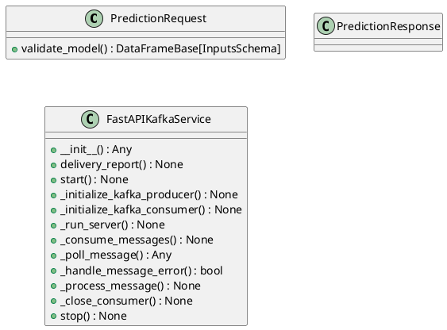
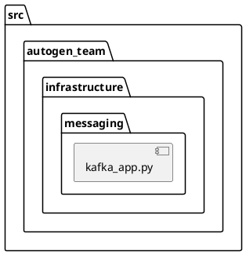
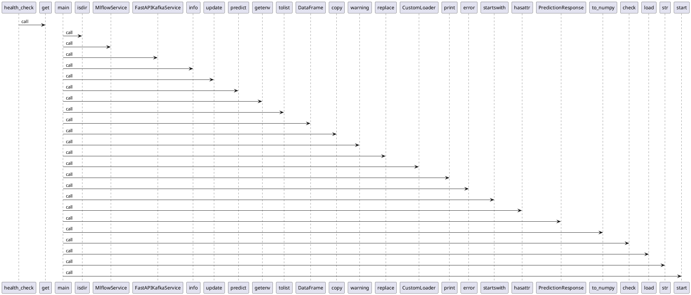

# Module Specification: kafka_app

* **Source Reference:** `src/autogen_team/infrastructure/messaging/kafka_app.py`

## 1. Architectural Role & Responsibilities
**Purpose:**
Provides functionality related to kafka app.

**Architecture Layer:**
- Infrastructure

**Responsibilities:**
- Not explicitly defined.

**Main Workflow:**
- Not explicitly defined.

## 2. Dependencies
**Imports:**
- `json`
- `logging`
- `os`
- `signal`
- `sys`
- `threading`
- `time`
- `typing.Any`
- `typing.Callable`
- `typing.Dict`
- `typing.Optional`
- `pandas`
- `uvicorn`
- `confluent_kafka.Consumer`
- `confluent_kafka.KafkaError`
- `confluent_kafka.Producer`
- `fastapi.FastAPI`
- `pandera.typing.common.DataFrameBase`
- `pydantic.BaseModel`
- `autogen_team.infrastructure.io`
- `autogen_team.core.schemas.InputsSchema`
- `autogen_team.core.schemas.Outputs`
- `autogen_team.infrastructure.services`
- `autogen_team.registry.adapters.mlflow_adapter.CustomLoader`
- `types`
- `autogen_team.registry`
- `autogen_team.registry.adapters.mlflow_adapter.CustomSaver`
- `autogen_team.models`

**Exported Classes:**
- `PredictionRequest`
- `PredictionResponse`
- `FastAPIKafkaService`

**Exported Functions:**
- `health_check`
- `main`

**Exported Interfaces:**
- Not explicitly defined.

**Public API:**
- Not explicitly defined.

## 3. Architecture & Execution
### Internal Architecture
Not explicitly defined.

### Execution Flow
Not explicitly defined.

### Sequence Explanation
Not explicitly defined.

### Examples
Not explicitly defined.

## 4. UML 2.0 Diagrams
### Class Diagram

```plantuml
@startuml
    class PredictionRequest {
        +validate_model() : DataFrameBase[InputsSchema]
    }
    class PredictionResponse {
    }
    class FastAPIKafkaService {
        +__init__() : Any
        +delivery_report() : None
        +start() : None
        +_initialize_kafka_producer() : None
        +_initialize_kafka_consumer() : None
        +_run_server() : None
        +_consume_messages() : None
        +_poll_message() : Any
        +_handle_message_error() : bool
        +_process_message() : None
        +_close_consumer() : None
        +stop() : None
    }
@enduml
```

### Package Diagram

```plantuml
@startuml
    package "src" {
        package "autogen_team" {
            package "infrastructure" {
                package "messaging" {
                    [kafka_app.py]
                }
            }
        }
    }
@enduml
```

### Sequence Diagram

```plantuml
@startuml
    health_check -> get : call
    main -> isdir : call
    main -> MlflowService : call
    main -> FastAPIKafkaService : call
    main -> info : call
    main -> update : call
    main -> predict : call
    main -> getenv : call
    main -> tolist : call
    main -> DataFrame : call
    main -> copy : call
    main -> warning : call
    main -> replace : call
    main -> CustomLoader : call
    main -> print : call
    main -> error : call
    main -> startswith : call
    main -> hasattr : call
    main -> PredictionResponse : call
    main -> to_numpy : call
    main -> check : call
    main -> load : call
    main -> str : call
    main -> start : call
@enduml
```

### Component Diagram

```plantuml
@startuml
    package "Infrastructure" {
        [kafka_app.py]
    }
    [kafka_app.py] --> [json]
    [kafka_app.py] --> [logging]
    [kafka_app.py] --> [os]
    [kafka_app.py] --> [signal]
    [kafka_app.py] --> [sys]
    [kafka_app.py] --> [threading]
    [kafka_app.py] --> [time]
    [kafka_app.py] --> [typing.Any]
    [kafka_app.py] --> [typing.Callable]
    [kafka_app.py] --> [typing.Dict]
    [kafka_app.py] --> [typing.Optional]
    [kafka_app.py] --> [pandas]
    [kafka_app.py] --> [uvicorn]
    [kafka_app.py] --> [confluent_kafka.Consumer]
    [kafka_app.py] --> [confluent_kafka.KafkaError]
    [kafka_app.py] --> [confluent_kafka.Producer]
    [kafka_app.py] --> [fastapi.FastAPI]
    [kafka_app.py] --> [pandera.typing.common.DataFrameBase]
    [kafka_app.py] --> [pydantic.BaseModel]
    [kafka_app.py] --> [autogen_team.infrastructure.io]
    [kafka_app.py] --> [autogen_team.core.schemas.InputsSchema]
    [kafka_app.py] --> [autogen_team.core.schemas.Outputs]
    [kafka_app.py] --> [autogen_team.infrastructure.services]
    [kafka_app.py] --> [autogen_team.registry.adapters.mlflow_adapter.CustomLoader]
    [kafka_app.py] --> [types]
    [kafka_app.py] --> [autogen_team.registry]
    [kafka_app.py] --> [autogen_team.registry.adapters.mlflow_adapter.CustomSaver]
    [kafka_app.py] --> [autogen_team.models]
@enduml
```

### Dependency Graph

```plantuml
@startuml
    [Module] --> [json] : imports
    [Module] --> [logging] : imports
    [Module] --> [os] : imports
    [Module] --> [signal] : imports
    [Module] --> [sys] : imports
    [Module] --> [threading] : imports
    [Module] --> [time] : imports
    [Module] --> [typing.Any] : imports
    [Module] --> [typing.Callable] : imports
    [Module] --> [typing.Dict] : imports
    [Module] --> [typing.Optional] : imports
    [Module] --> [pandas] : imports
    [Module] --> [uvicorn] : imports
    [Module] --> [confluent_kafka.Consumer] : imports
    [Module] --> [confluent_kafka.KafkaError] : imports
    [Module] --> [confluent_kafka.Producer] : imports
    [Module] --> [fastapi.FastAPI] : imports
    [Module] --> [pandera.typing.common.DataFrameBase] : imports
    [Module] --> [pydantic.BaseModel] : imports
    [Module] --> [autogen_team.infrastructure.io] : imports
    [Module] --> [autogen_team.core.schemas.InputsSchema] : imports
    [Module] --> [autogen_team.core.schemas.Outputs] : imports
    [Module] --> [autogen_team.infrastructure.services] : imports
    [Module] --> [autogen_team.registry.adapters.mlflow_adapter.CustomLoader] : imports
    [Module] --> [types] : imports
    [Module] --> [autogen_team.registry] : imports
    [Module] --> [autogen_team.registry.adapters.mlflow_adapter.CustomSaver] : imports
    [Module] --> [autogen_team.models] : imports
@enduml
```

## 5. Class & Method Specifications
### `PredictionRequest` ([`src/autogen_team/infrastructure/messaging/kafka_app.py`](/src/autogen_team/infrastructure/messaging/kafka_app.py))
#### Overview
Request model for prediction.

#### Attributes
- None found.

#### Methods
##### `validate_model(self) -> DataFrameBase[InputsSchema]` (Public)
**Description:** Validates the input data against InputsSchema.

**Inputs:**
- None

**Output:**
- return type: `DataFrameBase[InputsSchema]`
- semantic meaning: Not explicitly defined.
- possible null values: Not explicitly defined.
- exceptions: Not explicitly defined.

**Side Effects:**
- Database updates: Not explicitly defined.
- File operations: Not explicitly defined.
- Network calls: Not explicitly defined.
- Cache: Not explicitly defined.
- State changes: Not explicitly defined.

**Complexity:**
- Time Complexity: Not explicitly defined.
- Space Complexity: Not explicitly defined.

**Example:**
```python
result = PredictionRequest.validate_model()
```

### `PredictionResponse` ([`src/autogen_team/infrastructure/messaging/kafka_app.py`](/src/autogen_team/infrastructure/messaging/kafka_app.py))
#### Overview
Response model for prediction.

#### Attributes
- None found.

#### Methods
### `FastAPIKafkaService` ([`src/autogen_team/infrastructure/messaging/kafka_app.py`](/src/autogen_team/infrastructure/messaging/kafka_app.py))
#### Overview
Service for deploying a FastAPI application with a Kafka producer and consumer.

#### Constructor
**Initialization:** Initializes `FastAPIKafkaService` with required dependencies and sets up initial internal state.

#### Attributes
- `server_thread`
  - Type: Any
  - Purpose: Not explicitly defined.
  - Constraints: Not explicitly defined.
- `stop_event`
  - Type: Any
  - Purpose: Not explicitly defined.
  - Constraints: Not explicitly defined.
- `prediction_callback`
  - Type: Any
  - Purpose: Not explicitly defined.
  - Constraints: Not explicitly defined.
- `producer_config`
  - Type: Any
  - Purpose: Not explicitly defined.
  - Constraints: Not explicitly defined.
- `consumer_config`
  - Type: Any
  - Purpose: Not explicitly defined.
  - Constraints: Not explicitly defined.
- `input_topic`
  - Type: Any
  - Purpose: Not explicitly defined.
  - Constraints: Not explicitly defined.
- `output_topic`
  - Type: Any
  - Purpose: Not explicitly defined.
  - Constraints: Not explicitly defined.
- `producer`
  - Type: Any
  - Purpose: Not explicitly defined.
  - Constraints: Not explicitly defined.
- `consumer`
  - Type: Any
  - Purpose: Not explicitly defined.
  - Constraints: Not explicitly defined.

#### Methods
##### `__init__(self, prediction_callback: Callable[[PredictionRequest], PredictionResponse], producer_config: Dict[str, Any], consumer_config: Dict[str, Any], input_topic: str, output_topic: str) -> Any` (Public)
**Description:** Executes the   init   operation.

**Inputs:**
- `prediction_callback`
  - type: Callable[[PredictionRequest], PredictionResponse]
  - meaning: Not explicitly defined.
  - valid values: Not explicitly defined.
  - optional?: False
  - default value: None
- `producer_config`
  - type: Dict[str, Any]
  - meaning: Not explicitly defined.
  - valid values: Not explicitly defined.
  - optional?: False
  - default value: None
- `consumer_config`
  - type: Dict[str, Any]
  - meaning: Not explicitly defined.
  - valid values: Not explicitly defined.
  - optional?: False
  - default value: None
- `input_topic`
  - type: str
  - meaning: Not explicitly defined.
  - valid values: Not explicitly defined.
  - optional?: False
  - default value: None
- `output_topic`
  - type: str
  - meaning: Not explicitly defined.
  - valid values: Not explicitly defined.
  - optional?: False
  - default value: None

**Output:**
- return type: `Any`
- semantic meaning: Not explicitly defined.
- possible null values: Not explicitly defined.
- exceptions: Not explicitly defined.

**Side Effects:**
- Database updates: Not explicitly defined.
- File operations: Not explicitly defined.
- Network calls: Not explicitly defined.
- Cache: Not explicitly defined.
- State changes: Not explicitly defined.

**Complexity:**
- Time Complexity: Not explicitly defined.
- Space Complexity: Not explicitly defined.

**Example:**
```python
instance = FastAPIKafkaService()
result = instance.__init__(..., ..., ..., ..., ...)
```

##### `delivery_report(self, err: Optional[KafkaError], msg: Any) -> None` (Public)
**Description:** Called once for each message produced to indicate delivery result.

**Inputs:**
- `err`
  - type: Optional[KafkaError]
  - meaning: Not explicitly defined.
  - valid values: Not explicitly defined.
  - optional?: False
  - default value: None
- `msg`
  - type: Any
  - meaning: Not explicitly defined.
  - valid values: Not explicitly defined.
  - optional?: False
  - default value: None

**Output:**
- return type: `None`
- semantic meaning: Not explicitly defined.
- possible null values: Not explicitly defined.
- exceptions: Not explicitly defined.

**Side Effects:**
- Database updates: Not explicitly defined.
- File operations: Not explicitly defined.
- Network calls: Not explicitly defined.
- Cache: Not explicitly defined.
- State changes: Not explicitly defined.

**Complexity:**
- Time Complexity: Not explicitly defined.
- Space Complexity: Not explicitly defined.

**Example:**
```python
instance = FastAPIKafkaService()
result = instance.delivery_report(..., ...)
```

##### `start(self) -> None` (Public)
**Description:** Start the FastAPI application and Kafka consumer.

**Inputs:**
- None

**Output:**
- return type: `None`
- semantic meaning: Not explicitly defined.
- possible null values: Not explicitly defined.
- exceptions: Not explicitly defined.

**Side Effects:**
- Database updates: Not explicitly defined.
- File operations: Not explicitly defined.
- Network calls: Not explicitly defined.
- Cache: Not explicitly defined.
- State changes: Not explicitly defined.

**Complexity:**
- Time Complexity: Not explicitly defined.
- Space Complexity: Not explicitly defined.

**Example:**
```python
instance = FastAPIKafkaService()
result = instance.start()
```

##### `_initialize_kafka_producer(self) -> None` (Private)
**Purpose:** Initialize Kafka producer.

**Parameters:**
- None

**Return value:**
- `None`

##### `_initialize_kafka_consumer(self) -> None` (Private)
**Purpose:** Initialize Kafka consumer.

**Parameters:**
- None

**Return value:**
- `None`

##### `_run_server(self) -> None` (Private)
**Purpose:** Run the FastAPI server.

**Parameters:**
- None

**Return value:**
- `None`

##### `_consume_messages(self) -> None` (Private)
**Purpose:** Consume messages from Kafka topic and produce predictions.

**Parameters:**
- None

**Return value:**
- `None`

##### `_poll_message(self) -> Any` (Private)
**Purpose:** Poll message from Kafka consumer.

**Parameters:**
- None

**Return value:**
- `Any`

##### `_handle_message_error(self, msg: Any) -> bool` (Private)
**Purpose:** Handle errors in polled messages.

**Parameters:**
- `msg`: Any

**Return value:**
- `bool`

##### `_process_message(self, msg: Any) -> None` (Private)
**Purpose:** Process a valid Kafka message.

**Parameters:**
- `msg`: Any

**Return value:**
- `None`

##### `_close_consumer(self) -> None` (Private)
**Purpose:** Close the Kafka consumer.

**Parameters:**
- None

**Return value:**
- `None`

##### `stop(self) -> None` (Public)
**Description:** Stop the FastAPI application and Kafka consumer.

**Inputs:**
- None

**Output:**
- return type: `None`
- semantic meaning: Not explicitly defined.
- possible null values: Not explicitly defined.
- exceptions: Not explicitly defined.

**Side Effects:**
- Database updates: Not explicitly defined.
- File operations: Not explicitly defined.
- Network calls: Not explicitly defined.
- Cache: Not explicitly defined.
- State changes: Not explicitly defined.

**Complexity:**
- Time Complexity: Not explicitly defined.
- Space Complexity: Not explicitly defined.

**Example:**
```python
instance = FastAPIKafkaService()
result = instance.stop()
```

## 6. Module Functions
### `health_check() -> Dict[str, str]` (Public)
**Description:** Simple health check endpoint to verify that the service is running.

**Inputs:**
- None

**Output:**
- return type: `Dict[str, str]`
- semantic meaning: Not explicitly defined.
- possible null values: Not explicitly defined.
- exceptions: Not explicitly defined.

**Side Effects:**
- Database updates: Not explicitly defined.
- File operations: Not explicitly defined.
- Network calls: Not explicitly defined.
- Cache: Not explicitly defined.
- State changes: Not explicitly defined.

**Complexity:**
- Time Complexity: Not explicitly defined.
- Space Complexity: Not explicitly defined.

**Example:**
```python
result = health_check()
```

### `main() -> None` (Public)
**Description:** Executes the main operation.

**Inputs:**
- None

**Output:**
- return type: `None`
- semantic meaning: Not explicitly defined.
- possible null values: Not explicitly defined.
- exceptions: Not explicitly defined.

**Side Effects:**
- Database updates: Not explicitly defined.
- File operations: Not explicitly defined.
- Network calls: Not explicitly defined.
- Cache: Not explicitly defined.
- State changes: Not explicitly defined.

**Complexity:**
- Time Complexity: Not explicitly defined.
- Space Complexity: Not explicitly defined.

**Example:**
```python
result = main()
```

## 7. Call Graph

```plantuml
@startuml
[kafka_app] --> [is_set] : calls
[kafka_app] --> [getpid] : calls
[kafka_app] --> [isdir] : calls
[kafka_app] --> [_close_consumer] : calls
[kafka_app] --> [MlflowService] : calls
[kafka_app] --> [FastAPIKafkaService] : calls
[kafka_app] --> [ModuleType] : calls
[kafka_app] --> [info] : calls
[kafka_app] --> [run] : calls
[kafka_app] --> [poll] : calls
[kafka_app] --> [prediction_callback] : calls
[kafka_app] --> [get] : calls
[kafka_app] --> [basicConfig] : calls
[kafka_app] --> [update] : calls
[kafka_app] --> [loads] : calls
[kafka_app] --> [clear] : calls
[kafka_app] --> [Thread] : calls
[kafka_app] --> [int] : calls
[kafka_app] --> [_initialize_kafka_producer] : calls
[kafka_app] --> [dumps] : calls
[kafka_app] --> [commit] : calls
[kafka_app] --> [predict] : calls
[kafka_app] --> [Producer] : calls
[kafka_app] --> [getenv] : calls
[kafka_app] --> [getLogger] : calls
[kafka_app] --> [set] : calls
[kafka_app] --> [DataFrame] : calls
[kafka_app] --> [produce] : calls
[kafka_app] --> [tolist] : calls
[kafka_app] --> [copy] : calls
[kafka_app] --> [warning] : calls
[kafka_app] --> [replace] : calls
[kafka_app] --> [setLevel] : calls
[kafka_app] --> [CustomLoader] : calls
[kafka_app] --> [print] : calls
[kafka_app] --> [close] : calls
[kafka_app] --> [PredictionRequest] : calls
[kafka_app] --> [decode] : calls
[kafka_app] --> [sleep] : calls
[kafka_app] --> [encode] : calls
[kafka_app] --> [Event] : calls
[kafka_app] --> [main] : calls
[kafka_app] --> [_poll_message] : calls
[kafka_app] --> [_handle_message_error] : calls
[kafka_app] --> [error] : calls
[kafka_app] --> [startswith] : calls
[kafka_app] --> [hasattr] : calls
[kafka_app] --> [value] : calls
[kafka_app] --> [PredictionResponse] : calls
[kafka_app] --> [FastAPI] : calls
[kafka_app] --> [_process_message] : calls
[kafka_app] --> [to_numpy] : calls
[kafka_app] --> [code] : calls
[kafka_app] --> [Consumer] : calls
[kafka_app] --> [check] : calls
[kafka_app] --> [exception] : calls
[kafka_app] --> [_initialize_kafka_consumer] : calls
[kafka_app] --> [load] : calls
[kafka_app] --> [flush] : calls
[kafka_app] --> [str] : calls
[kafka_app] --> [subscribe] : calls
[kafka_app] --> [debug] : calls
[kafka_app] --> [_run_server] : calls
[kafka_app] --> [start] : calls
[kafka_app] --> [partition] : calls
[kafka_app] --> [topic] : calls
[kafka_app] --> [kill] : calls
[kafka_app] --> [validate] : calls
@enduml
```

## 8. Cross References
- **Dependencies:** [Dependencies](../../../../../dependencies/index.md)
- **Used by:** ../../../../tests/infrastructure/messaging/test_kafka_security.md, ../../../../tests/infrastructure/messaging/test_kafka_app.md, ../../../../tests/repro_kafka_log.md
- **Calls:** is_set, getpid, isdir, _close_consumer, MlflowService, FastAPIKafkaService, ModuleType, info, run, poll, prediction_callback, get, basicConfig, update, loads, clear, Thread, int, _initialize_kafka_producer, dumps, commit, predict, Producer, getenv, getLogger, set, DataFrame, produce, tolist, copy, warning, replace, setLevel, CustomLoader, print, close, PredictionRequest, decode, sleep, encode, Event, main, _poll_message, _handle_message_error, error, startswith, hasattr, value, PredictionResponse, FastAPI, _process_message, to_numpy, code, Consumer, check, exception, _initialize_kafka_consumer, load, flush, str, subscribe, debug, _run_server, start, partition, topic, kill, validate
- **Called from:** ../../../../Scripts/trigger_mission.md, ../../../../skills/validate/scripts/okf_validate.md, ../../../../Scripts/test_mcp_client_simple.md, ../../__main__.md, ../../../../tests/evaluation/metrics/test_metrics.md, ../../../../tests/repro_kafka_log.md, ../../../../Scripts/run_hatchet_worker.md, ../../../../tests/test_scripts.md, ../../../../tests/infrastructure/messaging/test_kafka_app.md, ../../../../skills/validate/scripts/convert_links.md, ../../../../tests/registry/adapters/test_security_mlflow_adapter.md, ../../../../Scripts/send_kafka_test.md, ../../../../Scripts/verify_agent_mcp.md
- **Related classes:** [Classes](../../../../../classes/index.md)
- **Related diagrams:** [Diagrams](../../../../../diagrams/index.md)
