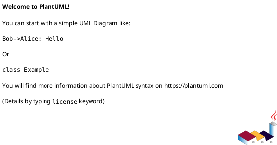
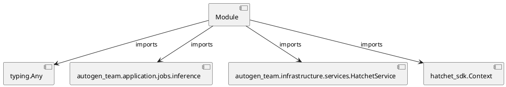

# Module Specification: hatchet_workflows

* **Source Reference:** `src/autogen_team/infrastructure/orchestration/hatchet_workflows.py`

## 1. Architectural Role & Responsibilities
**Purpose:**
Provides functionality related to hatchet workflows.

**Architecture Layer:**
- Infrastructure/Other

**Responsibilities:**
- Manage and execute operations for hatchet_workflows.

**Main Workflow:**
- Initialize components and process requests for hatchet_workflows.

## 2. Dependencies
**Imports:**
- `typing.Any`
- `autogen_team.application.jobs.inference`
- `autogen_team.infrastructure.services.HatchetService`
- `hatchet_sdk.Context`

**Exported Classes:**
- None

**Exported Functions:**
- `run_inference`

## 3. Architecture & Execution
### Internal Architecture
Follows standard modular design, encapsulating state and behavior within defined classes and functions.

### Execution Flow
Sequential execution of defined functions and class methods.

### Sequence Explanation
Clients instantiate classes or call functions, which execute business logic and return results.

## 4. UML 2.0 Diagrams
### Class Diagram

### Dependency Graph

## 5. Class & Method Specifications
## 6. Module Functions
### `run_inference(input: Any, context: Context)`
Run the inference job.

**Inputs:**
- `input`: Any
- `context`: Context

**Output:**
- Return Type: `Any`
