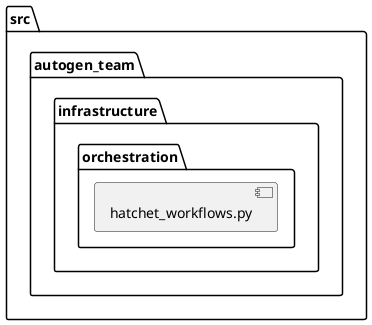
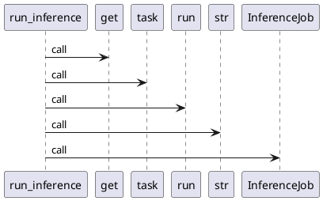
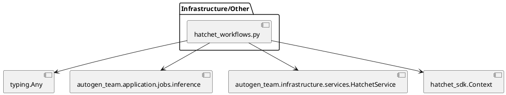
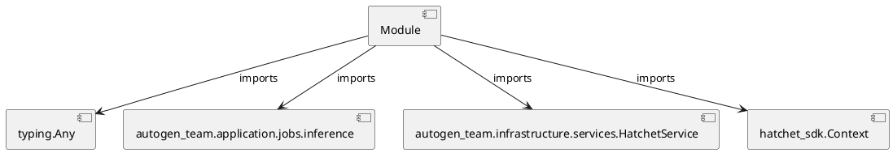
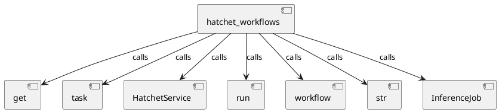

# Module Specification: hatchet_workflows

* **Source Reference:** `src/autogen_team/infrastructure/orchestration/hatchet_workflows.py`

## 1. Architectural Role & Responsibilities
**Purpose:**
Provides functionality related to hatchet workflows.

**Architecture Layer:**
- Infrastructure/Other

**Responsibilities:**
- Not explicitly defined.

**Main Workflow:**
- Not explicitly defined.

## 2. Dependencies
**Imports:**
- `typing.Any`
- `autogen_team.application.jobs.inference`
- `autogen_team.infrastructure.services.HatchetService`
- `hatchet_sdk.Context`

**Exported Classes:**
- None

**Exported Functions:**
- `run_inference`

**Exported Interfaces:**
- Not explicitly defined.

**Public API:**
- Not explicitly defined.

## 3. Architecture & Execution
### Internal Architecture
Not explicitly defined.

### Execution Flow
Not explicitly defined.

### Sequence Explanation
Not explicitly defined.

### Examples
Not explicitly defined.

## 4. UML 2.0 Diagrams
### Class Diagram

```plantuml
@startuml
    ' No classes found in module
@enduml
```

### Package Diagram

```plantuml
@startuml
    package "src" {
        package "autogen_team" {
            package "infrastructure" {
                package "orchestration" {
                    [hatchet_workflows.py]
                }
            }
        }
    }
@enduml
```

### Sequence Diagram

```plantuml
@startuml
    run_inference -> get : call
    run_inference -> task : call
    run_inference -> run : call
    run_inference -> str : call
    run_inference -> InferenceJob : call
@enduml
```

### Component Diagram

```plantuml
@startuml
    package "Infrastructure/Other" {
        [hatchet_workflows.py]
    }
    [hatchet_workflows.py] --> [typing.Any]
    [hatchet_workflows.py] --> [autogen_team.application.jobs.inference]
    [hatchet_workflows.py] --> [autogen_team.infrastructure.services.HatchetService]
    [hatchet_workflows.py] --> [hatchet_sdk.Context]
@enduml
```

### Dependency Graph

```plantuml
@startuml
    [Module] --> [typing.Any] : imports
    [Module] --> [autogen_team.application.jobs.inference] : imports
    [Module] --> [autogen_team.infrastructure.services.HatchetService] : imports
    [Module] --> [hatchet_sdk.Context] : imports
@enduml
```

## 5. Class & Method Specifications
## 6. Module Functions
### `run_inference(input: Any, context: Context) -> dict[str, Any]` (Public)
**Description:** Run the inference job.

**Inputs:**
- `input`
  - type: Any
  - meaning: Not explicitly defined.
  - valid values: Not explicitly defined.
  - optional?: False
  - default value: None
- `context`
  - type: Context
  - meaning: Not explicitly defined.
  - valid values: Not explicitly defined.
  - optional?: False
  - default value: None

**Output:**
- return type: `dict[str, Any]`
- semantic meaning: Not explicitly defined.
- possible null values: Not explicitly defined.
- exceptions: Not explicitly defined.

**Side Effects:**
- Database updates: Not explicitly defined.
- File operations: Not explicitly defined.
- Network calls: Not explicitly defined.
- Cache: Not explicitly defined.
- State changes: Not explicitly defined.

**Complexity:**
- Time Complexity: Not explicitly defined.
- Space Complexity: Not explicitly defined.

**Example:**
```python
result = run_inference(..., ...)
```

## 7. Call Graph

```plantuml
@startuml
[hatchet_workflows] --> [get] : calls
[hatchet_workflows] --> [task] : calls
[hatchet_workflows] --> [HatchetService] : calls
[hatchet_workflows] --> [run] : calls
[hatchet_workflows] --> [workflow] : calls
[hatchet_workflows] --> [str] : calls
[hatchet_workflows] --> [InferenceJob] : calls
@enduml
```

## 8. Cross References
- **Dependencies:** [Dependencies](../../../../../dependencies/index.md)
- **Used by:** None
- **Calls:** get, task, HatchetService, run, workflow, str, InferenceJob
- **Called from:** None
- **Related classes:** [Classes](../../../../../classes/index.md)
- **Related diagrams:** [Diagrams](../../../../../diagrams/index.md)
