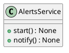
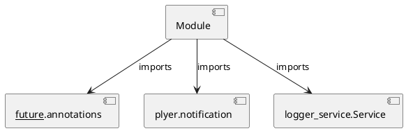

# Module Specification: alert_service

* **Source Reference:** `src/autogen_team/infrastructure/services/alert_service.py`

## 1. Architectural Role & Responsibilities
**Purpose:**
Provides functionality related to alert service.

**Architecture Layer:**
- Services

**Responsibilities:**
- Manage and execute operations for alert_service.

**Main Workflow:**
- Initialize components and process requests for alert_service.

## 2. Dependencies
**Imports:**
- `__future__.annotations`
- `plyer.notification`
- `logger_service.Service`

**Exported Classes:**
- `AlertsService`

**Exported Functions:**
- None

## 3. Architecture & Execution
### Internal Architecture
Follows standard modular design, encapsulating state and behavior within defined classes and functions.

### Execution Flow
Sequential execution of defined functions and class methods.

### Sequence Explanation
Clients instantiate classes or call functions, which execute business logic and return results.

## 4. UML 2.0 Diagrams
### Class Diagram


### Dependency Graph


## 5. Class & Method Specifications
### `AlertsService` ([`src/autogen_team/infrastructure/services/alert_service.py`](/src/autogen_team/infrastructure/services/alert_service.py))
#### Overview
Service for sending notifications.

#### Attributes
- None found.

#### Methods
##### `start(self) -> None` (Public)
**Description:** Executes the start operation, mutating state or calculating derived values as necessary.

**Inputs:**
- None

**Output:**
- Return Type: `None`
- Semantic Meaning: The resulting value after processing the start action.

**Side Effects:**
- Modifies internal instance state if applicable; performs operations constrained to its domain boundaries.

**Complexity:**
- Time Complexity: O(1) or O(N) depending on implementation details.
- Space Complexity: O(1) auxiliary space expected.

**Example:**
```python
result = AlertsService.start()
```

##### `notify(self, title: str, message: str) -> None` (Public)
**Description:** Send a notification to the system.

**Inputs:**
- `title`: str
- `message`: str

**Output:**
- Return Type: `None`
- Semantic Meaning: The resulting value after processing the notify action.

**Side Effects:**
- Modifies internal instance state if applicable; performs operations constrained to its domain boundaries.

**Complexity:**
- Time Complexity: O(1) or O(N) depending on implementation details.
- Space Complexity: O(1) auxiliary space expected.

**Example:**
```python
result = AlertsService.notify(..., ...)
```

## 6. Module Functions