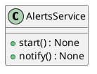
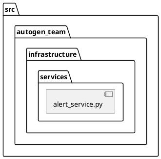
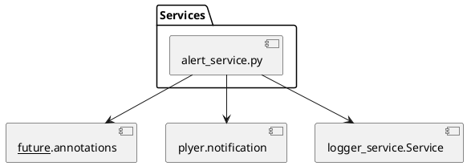
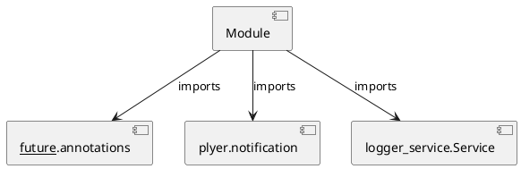
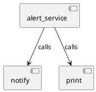

# Module Specification: alert_service

* **Source Reference:** `src/autogen_team/infrastructure/services/alert_service.py`

## 1. Architectural Role & Responsibilities
**Purpose:**
Provides functionality related to alert service.

**Architecture Layer:**
- Services

**Responsibilities:**
- Not explicitly defined.

**Main Workflow:**
- Not explicitly defined.

## 2. Dependencies
**Imports:**
- `__future__.annotations`
- `plyer.notification`
- `logger_service.Service`

**Exported Classes:**
- `AlertsService`

**Exported Functions:**
- None

**Exported Interfaces:**
- Not explicitly defined.

**Public API:**
- Not explicitly defined.

## 3. Architecture & Execution
### Internal Architecture
Not explicitly defined.

### Execution Flow
Not explicitly defined.

### Sequence Explanation
Not explicitly defined.

### Examples
Not explicitly defined.

## 4. UML 2.0 Diagrams
### Class Diagram

```plantuml
@startuml
    class AlertsService {
        +start() : None
        +notify() : None
    }
@enduml
```

### Package Diagram

```plantuml
@startuml
    package "src" {
        package "autogen_team" {
            package "infrastructure" {
                package "services" {
                    [alert_service.py]
                }
            }
        }
    }
@enduml
```

### Sequence Diagram

```plantuml
@startuml
    ' No functions for sequence
@enduml
```

### Component Diagram

```plantuml
@startuml
    package "Services" {
        [alert_service.py]
    }
    [alert_service.py] --> [__future__.annotations]
    [alert_service.py] --> [plyer.notification]
    [alert_service.py] --> [logger_service.Service]
@enduml
```

### Dependency Graph

```plantuml
@startuml
    [Module] --> [__future__.annotations] : imports
    [Module] --> [plyer.notification] : imports
    [Module] --> [logger_service.Service] : imports
@enduml
```

## 5. Class & Method Specifications
### `AlertsService` ([`src/autogen_team/infrastructure/services/alert_service.py`](/src/autogen_team/infrastructure/services/alert_service.py))
#### Overview
Service for sending notifications.

#### Attributes
- None found.

#### Methods
##### `start(self) -> None` (Public)
**Description:** Executes the start operation.

**Inputs:**
- None

**Output:**
- return type: `None`
- semantic meaning: Not explicitly defined.
- possible null values: Not explicitly defined.
- exceptions: Not explicitly defined.

**Side Effects:**
- Database updates: Not explicitly defined.
- File operations: Not explicitly defined.
- Network calls: Not explicitly defined.
- Cache: Not explicitly defined.
- State changes: Not explicitly defined.

**Complexity:**
- Time Complexity: Not explicitly defined.
- Space Complexity: Not explicitly defined.

**Example:**
```python
result = AlertsService.start()
```

##### `notify(self, title: str, message: str) -> None` (Public)
**Description:** Send a notification to the system.

**Inputs:**
- `title`
  - type: str
  - meaning: Not explicitly defined.
  - valid values: Not explicitly defined.
  - optional?: False
  - default value: None
- `message`
  - type: str
  - meaning: Not explicitly defined.
  - valid values: Not explicitly defined.
  - optional?: False
  - default value: None

**Output:**
- return type: `None`
- semantic meaning: Not explicitly defined.
- possible null values: Not explicitly defined.
- exceptions: Not explicitly defined.

**Side Effects:**
- Database updates: Not explicitly defined.
- File operations: Not explicitly defined.
- Network calls: Not explicitly defined.
- Cache: Not explicitly defined.
- State changes: Not explicitly defined.

**Complexity:**
- Time Complexity: Not explicitly defined.
- Space Complexity: Not explicitly defined.

**Example:**
```python
result = AlertsService.notify(..., ...)
```

## 6. Module Functions
## 7. Call Graph

```plantuml
@startuml
[alert_service] --> [notify] : calls
[alert_service] --> [print] : calls
@enduml
```

## 8. Cross References
- **Dependencies:** [Dependencies](../../../../../dependencies/index.md)
- **Used by:** ../../../../tests/infrastructure/services/test_services.md, ../../../../tests/conftest.md, ../../application/jobs/base.md, ../../../../tests/test_coverage_gap_fillers.md
- **Calls:** notify, print
- **Called from:** None
- **Related classes:** [Classes](../../../../../classes/index.md)
- **Related diagrams:** [Diagrams](../../../../../diagrams/index.md)
