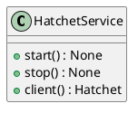
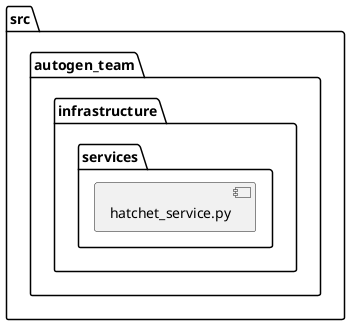
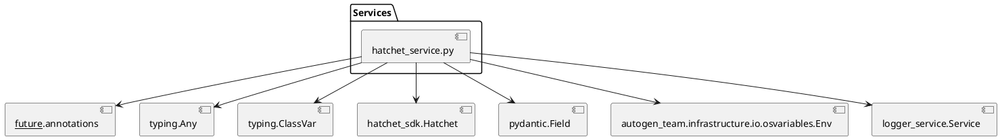
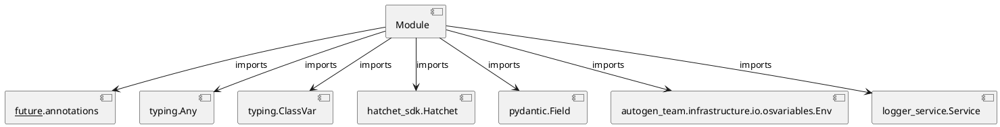
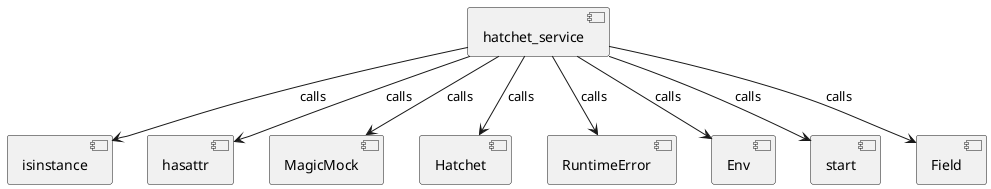

# Module Specification: hatchet_service

* **Source Reference:** `src/autogen_team/infrastructure/services/hatchet_service.py`

## 1. Architectural Role & Responsibilities
**Purpose:**
Provides functionality related to hatchet service.

**Architecture Layer:**
- Services

**Responsibilities:**
- Not explicitly defined.

**Main Workflow:**
- Not explicitly defined.

## 2. Dependencies
**Imports:**
- `__future__.annotations`
- `typing.Any`
- `typing.ClassVar`
- `hatchet_sdk.Hatchet`
- `pydantic.Field`
- `autogen_team.infrastructure.io.osvariables.Env`
- `logger_service.Service`

**Exported Classes:**
- `HatchetService`

**Exported Functions:**
- None

**Exported Interfaces:**
- Not explicitly defined.

**Public API:**
- Not explicitly defined.

## 3. Architecture & Execution
### Internal Architecture
Not explicitly defined.

### Execution Flow
Not explicitly defined.

### Sequence Explanation
Not explicitly defined.

### Examples
Not explicitly defined.

## 4. UML 2.0 Diagrams
### Class Diagram

```plantuml
@startuml
    class HatchetService {
        +start() : None
        +stop() : None
        +client() : Hatchet
    }
@enduml
```

### Package Diagram

```plantuml
@startuml
    package "src" {
        package "autogen_team" {
            package "infrastructure" {
                package "services" {
                    [hatchet_service.py]
                }
            }
        }
    }
@enduml
```

### Sequence Diagram

```plantuml
@startuml
    ' No functions for sequence
@enduml
```

### Component Diagram

```plantuml
@startuml
    package "Services" {
        [hatchet_service.py]
    }
    [hatchet_service.py] --> [__future__.annotations]
    [hatchet_service.py] --> [typing.Any]
    [hatchet_service.py] --> [typing.ClassVar]
    [hatchet_service.py] --> [hatchet_sdk.Hatchet]
    [hatchet_service.py] --> [pydantic.Field]
    [hatchet_service.py] --> [autogen_team.infrastructure.io.osvariables.Env]
    [hatchet_service.py] --> [logger_service.Service]
@enduml
```

### Dependency Graph

```plantuml
@startuml
    [Module] --> [__future__.annotations] : imports
    [Module] --> [typing.Any] : imports
    [Module] --> [typing.ClassVar] : imports
    [Module] --> [hatchet_sdk.Hatchet] : imports
    [Module] --> [pydantic.Field] : imports
    [Module] --> [autogen_team.infrastructure.io.osvariables.Env] : imports
    [Module] --> [logger_service.Service] : imports
@enduml
```

## 5. Class & Method Specifications
### `HatchetService` ([`src/autogen_team/infrastructure/services/hatchet_service.py`](/src/autogen_team/infrastructure/services/hatchet_service.py))
#### Overview
Service for Hatchet task orchestration.

#### Attributes
- None found.

#### Methods
##### `start(self) -> None` (Public)
**Description:** Initialize the Hatchet client.

**Inputs:**
- None

**Output:**
- return type: `None`
- semantic meaning: Not explicitly defined.
- possible null values: Not explicitly defined.
- exceptions: Not explicitly defined.

**Side Effects:**
- Database updates: Not explicitly defined.
- File operations: Not explicitly defined.
- Network calls: Not explicitly defined.
- Cache: Not explicitly defined.
- State changes: Not explicitly defined.

**Complexity:**
- Time Complexity: Not explicitly defined.
- Space Complexity: Not explicitly defined.

**Example:**
```python
result = HatchetService.start()
```

##### `stop(self) -> None` (Public)
**Description:** Stop the Hatchet service.

**Inputs:**
- None

**Output:**
- return type: `None`
- semantic meaning: Not explicitly defined.
- possible null values: Not explicitly defined.
- exceptions: Not explicitly defined.

**Side Effects:**
- Database updates: Not explicitly defined.
- File operations: Not explicitly defined.
- Network calls: Not explicitly defined.
- Cache: Not explicitly defined.
- State changes: Not explicitly defined.

**Complexity:**
- Time Complexity: Not explicitly defined.
- Space Complexity: Not explicitly defined.

**Example:**
```python
result = HatchetService.stop()
```

##### `client(self) -> Hatchet` (Public)
**Description:** Return the Hatchet client.

**Inputs:**
- None

**Output:**
- return type: `Hatchet`
- semantic meaning: Not explicitly defined.
- possible null values: Not explicitly defined.
- exceptions: Not explicitly defined.

**Side Effects:**
- Database updates: Not explicitly defined.
- File operations: Not explicitly defined.
- Network calls: Not explicitly defined.
- Cache: Not explicitly defined.
- State changes: Not explicitly defined.

**Complexity:**
- Time Complexity: Not explicitly defined.
- Space Complexity: Not explicitly defined.

**Example:**
```python
result = HatchetService.client()
```

## 6. Module Functions
## 7. Call Graph

```plantuml
@startuml
[hatchet_service] --> [isinstance] : calls
[hatchet_service] --> [hasattr] : calls
[hatchet_service] --> [MagicMock] : calls
[hatchet_service] --> [Hatchet] : calls
[hatchet_service] --> [RuntimeError] : calls
[hatchet_service] --> [Env] : calls
[hatchet_service] --> [start] : calls
[hatchet_service] --> [Field] : calls
@enduml
```

## 8. Cross References
- **Dependencies:** [Dependencies](../../../../../dependencies/index.md)
- **Used by:** ../../../../tests/infrastructure/services/test_hatchet_service.md, ../../../../Scripts/run_hatchet_worker.md, ../../../../Scripts/trigger_mission.md, ../../../../tests/e2e/test_autonomous_mission_e2e.md, ../orchestration/hatchet_workflows.md, ../../application/workflows/autonomous_mission.md, ../../application/jobs/hatchet_inference.md
- **Calls:** isinstance, hasattr, MagicMock, Hatchet, RuntimeError, Env, start, Field
- **Called from:** None
- **Related classes:** [Classes](../../../../../classes/index.md)
- **Related diagrams:** [Diagrams](../../../../../diagrams/index.md)
