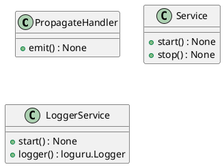

# Module Specification: logger_service

* **Source Reference:** `src/autogen_team/infrastructure/services/logger_service.py`

## 1. Architectural Role & Responsibilities
**Purpose:**
Provides functionality related to logger service.

**Architecture Layer:**
- Services

**Responsibilities:**
- Not explicitly defined.

**Main Workflow:**
- Not explicitly defined.

## 2. Dependencies
**Imports:**
- `__future__.annotations`
- `abc`
- `logging`
- `sys`
- `loguru`
- `pydantic`
- `opentelemetry.trace`
- `opentelemetry._logs.set_logger_provider`
- `opentelemetry.exporter.otlp.proto.http._log_exporter.OTLPLogExporter`
- `opentelemetry.exporter.otlp.proto.http.trace_exporter.OTLPSpanExporter`
- `opentelemetry.sdk._logs.LoggerProvider`
- `opentelemetry.sdk._logs.LoggingHandler`
- `opentelemetry.sdk._logs.export.BatchLogRecordProcessor`
- `opentelemetry.sdk.resources.Resource`
- `opentelemetry.sdk.trace.TracerProvider`
- `opentelemetry.sdk.trace.export.BatchSpanProcessor`

**Exported Classes:**
- `PropagateHandler`
- `Service`
- `LoggerService`

**Exported Functions:**
- None

## 3. Architecture & Execution
### Internal Architecture
Not explicitly defined.

### Execution Flow
Not explicitly defined.

### Sequence Explanation
Not explicitly defined.

## 4. UML 2.0 Diagrams
### Class Diagram


### Dependency Graph

```plantuml
@startuml
    [Module] --> [__future__.annotations] : imports
    [Module] --> [abc] : imports
    [Module] --> [logging] : imports
    [Module] --> [sys] : imports
    [Module] --> [loguru] : imports
    [Module] --> [pydantic] : imports
    [Module] --> [opentelemetry.trace] : imports
    [Module] --> [opentelemetry._logs.set_logger_provider] : imports
    [Module] --> [opentelemetry.exporter.otlp.proto.http._log_exporter.OTLPLogExporter] : imports
    [Module] --> [opentelemetry.exporter.otlp.proto.http.trace_exporter.OTLPSpanExporter] : imports
    [Module] --> [opentelemetry.sdk._logs.LoggerProvider] : imports
    [Module] --> [opentelemetry.sdk._logs.LoggingHandler] : imports
    [Module] --> [opentelemetry.sdk._logs.export.BatchLogRecordProcessor] : imports
    [Module] --> [opentelemetry.sdk.resources.Resource] : imports
    [Module] --> [opentelemetry.sdk.trace.TracerProvider] : imports
    [Module] --> [opentelemetry.sdk.trace.export.BatchSpanProcessor] : imports
@enduml
```


## 5. Class & Method Specifications
### `PropagateHandler` ([`src/autogen_team/infrastructure/services/logger_service.py`](/src/autogen_team/infrastructure/services/logger_service.py))
#### Overview
Provides state and behavior management for PropagateHandler.

#### Attributes
- None found.

#### Methods
##### `emit(self, record: logging.LogRecord) -> None` (Public)
**Description:** No description provided.

**Inputs:**
- `record`: logging.LogRecord

**Output:**
- Return Type: `None`
- Semantic Meaning: Not explicitly defined.

**Side Effects:**
- Not explicitly defined.

**Complexity:**
- Time Complexity: Not explicitly defined.
- Space Complexity: Not explicitly defined.

**Example:**
```python
result = PropagateHandler.emit(...)
```

### `Service` ([`src/autogen_team/infrastructure/services/logger_service.py`](/src/autogen_team/infrastructure/services/logger_service.py))
#### Overview
Base class for a global service.

#### Attributes
- None found.

#### Methods
##### `start(self) -> None` (Public)
**Description:** Start the service.

**Inputs:**
- None

**Output:**
- Return Type: `None`
- Semantic Meaning: Not explicitly defined.

**Side Effects:**
- Not explicitly defined.

**Complexity:**
- Time Complexity: Not explicitly defined.
- Space Complexity: Not explicitly defined.

**Example:**
```python
result = Service.start()
```

##### `stop(self) -> None` (Public)
**Description:** Stop the service.

**Inputs:**
- None

**Output:**
- Return Type: `None`
- Semantic Meaning: Not explicitly defined.

**Side Effects:**
- Not explicitly defined.

**Complexity:**
- Time Complexity: Not explicitly defined.
- Space Complexity: Not explicitly defined.

**Example:**
```python
result = Service.stop()
```

### `LoggerService` ([`src/autogen_team/infrastructure/services/logger_service.py`](/src/autogen_team/infrastructure/services/logger_service.py))
#### Overview
Service for logging messages.

https://loguru.readthedocs.io/en/stable/api/logger.html

#### Attributes
- None found.

#### Methods
##### `start(self) -> None` (Public)
**Description:** No description provided.

**Inputs:**
- None

**Output:**
- Return Type: `None`
- Semantic Meaning: Not explicitly defined.

**Side Effects:**
- Not explicitly defined.

**Complexity:**
- Time Complexity: Not explicitly defined.
- Space Complexity: Not explicitly defined.

**Example:**
```python
result = LoggerService.start()
```

##### `logger(self) -> loguru.Logger` (Public)
**Description:** Return the main logger.

**Inputs:**
- None

**Output:**
- Return Type: `loguru.Logger`
- Semantic Meaning: Not explicitly defined.

**Side Effects:**
- Not explicitly defined.

**Complexity:**
- Time Complexity: Not explicitly defined.
- Space Complexity: Not explicitly defined.

**Example:**
```python
result = LoggerService.logger()
```

## 6. Module Functions