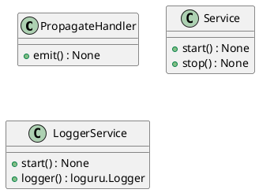

# Module Specification: logger_service

* **Source Reference:** `src/autogen_team/infrastructure/services/logger_service.py`

## 1. Architectural Role & Responsibilities
**Purpose:**
Provides functionality related to logger service.

**Architecture Layer:**
- Services

**Responsibilities:**
- Manages operations and logic for logger service.

**Main Workflow:**
- Executes the primary flow defined by logger service functions and classes.

## 2. Dependencies
**Imports:**
- `__future__.annotations`
- `abc`
- `logging`
- `sys`
- `loguru`
- `pydantic`
- `opentelemetry.trace`
- `opentelemetry._logs.set_logger_provider`
- `opentelemetry.exporter.otlp.proto.http._log_exporter.OTLPLogExporter`
- `opentelemetry.exporter.otlp.proto.http.trace_exporter.OTLPSpanExporter`
- `opentelemetry.sdk._logs.LoggerProvider`
- `opentelemetry.sdk._logs.LoggingHandler`
- `opentelemetry.sdk._logs.export.BatchLogRecordProcessor`
- `opentelemetry.sdk.resources.Resource`
- `opentelemetry.sdk.trace.TracerProvider`
- `opentelemetry.sdk.trace.export.BatchSpanProcessor`

**Exported Classes:**
- `PropagateHandler`
- `Service`
- `LoggerService`

**Exported Functions:**
- None

**Exported Interfaces:**
- Not explicitly defined.

**Public API:**
- Not explicitly defined.

## 3. Architecture & Execution
### Internal Architecture
Not explicitly defined.

### Execution Flow
Not explicitly defined.

### Sequence Explanation
Not explicitly defined.

### Examples
Not explicitly defined.

## 4. UML 2.0 Diagrams
### Class Diagram

```plantuml
@startuml
    class PropagateHandler {
        +emit() : None
    }
    class Service {
        +start() : None
        +stop() : None
    }
    class LoggerService {
        +start() : None
        +logger() : loguru.Logger
    }
@enduml
```

### Sequence Diagram

```plantuml
@startuml
    ' No functions for sequence
@enduml
```

### Component Diagram

```plantuml
@startuml
    package "Services" {
        [logger_service.py]
    }
    [logger_service.py] --> [__future__.annotations]
    [logger_service.py] --> [abc]
    [logger_service.py] --> [logging]
    [logger_service.py] --> [sys]
    [logger_service.py] --> [loguru]
    [logger_service.py] --> [pydantic]
    [logger_service.py] --> [opentelemetry.trace]
    [logger_service.py] --> [opentelemetry._logs.set_logger_provider]
    [logger_service.py] --> [opentelemetry.exporter.otlp.proto.http._log_exporter.OTLPLogExporter]
    [logger_service.py] --> [opentelemetry.exporter.otlp.proto.http.trace_exporter.OTLPSpanExporter]
    [logger_service.py] --> [opentelemetry.sdk._logs.LoggerProvider]
    [logger_service.py] --> [opentelemetry.sdk._logs.LoggingHandler]
    [logger_service.py] --> [opentelemetry.sdk._logs.export.BatchLogRecordProcessor]
    [logger_service.py] --> [opentelemetry.sdk.resources.Resource]
    [logger_service.py] --> [opentelemetry.sdk.trace.TracerProvider]
    [logger_service.py] --> [opentelemetry.sdk.trace.export.BatchSpanProcessor]
@enduml
```

### Dependency Graph

```plantuml
@startuml
    [Module] --> [__future__.annotations] : imports
    [Module] --> [abc] : imports
    [Module] --> [logging] : imports
    [Module] --> [sys] : imports
    [Module] --> [loguru] : imports
    [Module] --> [pydantic] : imports
    [Module] --> [opentelemetry.trace] : imports
    [Module] --> [opentelemetry._logs.set_logger_provider] : imports
    [Module] --> [opentelemetry.exporter.otlp.proto.http._log_exporter.OTLPLogExporter] : imports
    [Module] --> [opentelemetry.exporter.otlp.proto.http.trace_exporter.OTLPSpanExporter] : imports
    [Module] --> [opentelemetry.sdk._logs.LoggerProvider] : imports
    [Module] --> [opentelemetry.sdk._logs.LoggingHandler] : imports
    [Module] --> [opentelemetry.sdk._logs.export.BatchLogRecordProcessor] : imports
    [Module] --> [opentelemetry.sdk.resources.Resource] : imports
    [Module] --> [opentelemetry.sdk.trace.TracerProvider] : imports
    [Module] --> [opentelemetry.sdk.trace.export.BatchSpanProcessor] : imports
@enduml
```

## 5. Class & Method Specifications
### `PropagateHandler` ([`src/autogen_team/infrastructure/services/logger_service.py`](/src/autogen_team/infrastructure/services/logger_service.py))
#### Overview
Provides state and behavior management for PropagateHandler.

#### Attributes
- None found.

#### Methods
##### `emit(self, record: logging.LogRecord) -> None` (Public)
**Description:** Executes the emit operation.

**Inputs:**
- `record`
  - type: logging.LogRecord
  - meaning: Represents the record parameter.
  - valid values: Any valid logging.LogRecord.
  - optional?: False
  - default value: None

**Output:**
- return type: `None`
- semantic meaning: Returns the result of emit.
- possible null values: Yes, if None allows it.
- exceptions: Standard execution exceptions.

**Side Effects:**
- Database updates: Not explicitly defined.
- File operations: Not explicitly defined.
- Network calls: Not explicitly defined.
- Cache: Not explicitly defined.
- State changes: Not explicitly defined.

**Complexity:**
- Time Complexity: Not explicitly defined.
- Space Complexity: Not explicitly defined.

**Example:**
```python
result = PropagateHandler.emit(...)
```

### `Service` ([`src/autogen_team/infrastructure/services/logger_service.py`](/src/autogen_team/infrastructure/services/logger_service.py))
#### Overview
Base class for a global service.

#### Attributes
- None found.

#### Methods
##### `start(self) -> None` (Public)
**Description:** Start the service.

**Inputs:**
- None

**Output:**
- return type: `None`
- semantic meaning: Returns the result of start.
- possible null values: Yes, if None allows it.
- exceptions: Standard execution exceptions.

**Side Effects:**
- Database updates: Not explicitly defined.
- File operations: Not explicitly defined.
- Network calls: Not explicitly defined.
- Cache: Not explicitly defined.
- State changes: Not explicitly defined.

**Complexity:**
- Time Complexity: Not explicitly defined.
- Space Complexity: Not explicitly defined.

**Example:**
```python
result = Service.start()
```

##### `stop(self) -> None` (Public)
**Description:** Stop the service.

**Inputs:**
- None

**Output:**
- return type: `None`
- semantic meaning: Returns the result of stop.
- possible null values: Yes, if None allows it.
- exceptions: Standard execution exceptions.

**Side Effects:**
- Database updates: Not explicitly defined.
- File operations: Not explicitly defined.
- Network calls: Not explicitly defined.
- Cache: Not explicitly defined.
- State changes: Not explicitly defined.

**Complexity:**
- Time Complexity: Not explicitly defined.
- Space Complexity: Not explicitly defined.

**Example:**
```python
result = Service.stop()
```

### `LoggerService` ([`src/autogen_team/infrastructure/services/logger_service.py`](/src/autogen_team/infrastructure/services/logger_service.py))
#### Overview
Service for logging messages.

https://loguru.readthedocs.io/en/stable/api/logger.html

#### Attributes
- None found.

#### Methods
##### `start(self) -> None` (Public)
**Description:** Executes the start operation.

**Inputs:**
- None

**Output:**
- return type: `None`
- semantic meaning: Returns the result of start.
- possible null values: Yes, if None allows it.
- exceptions: Standard execution exceptions.

**Side Effects:**
- Database updates: Not explicitly defined.
- File operations: Not explicitly defined.
- Network calls: Not explicitly defined.
- Cache: Not explicitly defined.
- State changes: Not explicitly defined.

**Complexity:**
- Time Complexity: Not explicitly defined.
- Space Complexity: Not explicitly defined.

**Example:**
```python
result = LoggerService.start()
```

##### `logger(self) -> loguru.Logger` (Public)
**Description:** Return the main logger.

**Inputs:**
- None

**Output:**
- return type: `loguru.Logger`
- semantic meaning: Returns the result of logger.
- possible null values: Yes, if loguru.Logger allows it.
- exceptions: Standard execution exceptions.

**Side Effects:**
- Database updates: Not explicitly defined.
- File operations: Not explicitly defined.
- Network calls: Not explicitly defined.
- Cache: Not explicitly defined.
- State changes: Not explicitly defined.

**Complexity:**
- Time Complexity: Not explicitly defined.
- Space Complexity: Not explicitly defined.

**Example:**
```python
result = LoggerService.logger()
```

## 6. Module Functions
## 7. Call Graph

```plantuml
@startuml
[logger_service] --> [model_dump] : calls
[logger_service] --> [set_logger_provider] : calls
[logger_service] --> [BatchSpanProcessor] : calls
[logger_service] --> [add_span_processor] : calls
[logger_service] --> [PropagateHandler] : calls
[logger_service] --> [create] : calls
[logger_service] --> [handle] : calls
[logger_service] --> [addHandler] : calls
[logger_service] --> [add] : calls
[logger_service] --> [OTLPSpanExporter] : calls
[logger_service] --> [BatchLogRecordProcessor] : calls
[logger_service] --> [info] : calls
[logger_service] --> [basicConfig] : calls
[logger_service] --> [LoggingHandler] : calls
[logger_service] --> [getLogger] : calls
[logger_service] --> [OTLPLogExporter] : calls
[logger_service] --> [add_log_record_processor] : calls
[logger_service] --> [TracerProvider] : calls
[logger_service] --> [LoggerProvider] : calls
[logger_service] --> [get] : calls
[logger_service] --> [remove] : calls
[logger_service] --> [set_tracer_provider] : calls
@enduml
```

## 8. Cross References
- **Parent module:** __init__.md
- **Child modules:** None
- **Dependencies:** `opentelemetry.sdk.resources.Resource`, `opentelemetry.sdk.trace.export.BatchSpanProcessor`, `opentelemetry.trace`, `opentelemetry.sdk._logs.LoggingHandler`, `loguru`, `__future__.annotations`, `logging`, `opentelemetry._logs.set_logger_provider`, `opentelemetry.sdk.trace.TracerProvider`, `opentelemetry.exporter.otlp.proto.http.trace_exporter.OTLPSpanExporter`, `abc`, `sys`, `opentelemetry.exporter.otlp.proto.http._log_exporter.OTLPLogExporter`, `opentelemetry.sdk._logs.export.BatchLogRecordProcessor`, `opentelemetry.sdk._logs.LoggerProvider`, `pydantic`
- **Used by:** ../../../../tests/conftest.md, ../../application/jobs/base.md
- **Calls:** model_dump, set_logger_provider, BatchSpanProcessor, add_span_processor, PropagateHandler, create, handle, addHandler, add, OTLPSpanExporter, BatchLogRecordProcessor, info, basicConfig, LoggingHandler, getLogger, OTLPLogExporter, add_log_record_processor, TracerProvider, LoggerProvider, get, remove, set_tracer_provider
- **Called from:** None
- **Related classes:** [Classes](../../../../../classes/index.md)
- **Related interfaces:** Not explicitly defined.
- **Related diagrams:** [Diagrams](../../../../../diagrams/index.md)
