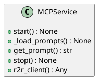
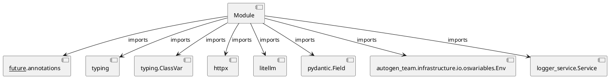

# Module Specification: mcp_service

* **Source Reference:** `src/autogen_team/infrastructure/services/mcp_service.py`

## 1. Architectural Role & Responsibilities
**Purpose:**
Provides functionality related to mcp service.

**Architecture Layer:**
- Services

**Responsibilities:**
- Manage and execute operations for mcp_service.

**Main Workflow:**
- Initialize components and process requests for mcp_service.

## 2. Dependencies
**Imports:**
- `__future__.annotations`
- `typing`
- `typing.ClassVar`
- `httpx`
- `litellm`
- `pydantic.Field`
- `autogen_team.infrastructure.io.osvariables.Env`
- `logger_service.Service`

**Exported Classes:**
- `MCPService`

**Exported Functions:**
- None

## 3. Architecture & Execution
### Internal Architecture
Follows standard modular design, encapsulating state and behavior within defined classes and functions.

### Execution Flow
Sequential execution of defined functions and class methods.

### Sequence Explanation
Clients instantiate classes or call functions, which execute business logic and return results.

## 4. UML 2.0 Diagrams
### Class Diagram


### Dependency Graph


## 5. Class & Method Specifications
### `MCPService` ([`src/autogen_team/infrastructure/services/mcp_service.py`](/src/autogen_team/infrastructure/services/mcp_service.py))
#### Overview
Service for MCP server lifecycle and backend clients.

Manages LiteLLM and R2R HTTP client initialization, providing
a single point of access for all MCP tool backends.

Parameters:
    litellm_api_base (str): LiteLLM API base URL.
    litellm_api_key (str): LiteLLM API key.
    litellm_model (str): Default LiteLLM model identifier.
    r2r_base_url (str): R2R RAG API base URL.

#### Attributes
- None found.

#### Methods
##### `start(self) -> None` (Public)
**Description:** Initialize LiteLLM configuration and R2R HTTP client.

**Inputs:**
- None

**Output:**
- Return Type: `None`
- Semantic Meaning: The resulting value after processing the start action.

**Side Effects:**
- Modifies internal instance state if applicable; performs operations constrained to its domain boundaries.

**Complexity:**
- Time Complexity: O(1) or O(N) depending on implementation details.
- Space Complexity: O(1) auxiliary space expected.

**Example:**
```python
result = MCPService.start()
```

##### `_load_prompts(self) -> None` (Public)
**Description:** Load prompts from YAML file.

**Inputs:**
- None

**Output:**
- Return Type: `None`
- Semantic Meaning: The resulting value after processing the _load_prompts action.

**Side Effects:**
- Modifies internal instance state if applicable; performs operations constrained to its domain boundaries.

**Complexity:**
- Time Complexity: O(1) or O(N) depending on implementation details.
- Space Complexity: O(1) auxiliary space expected.

**Example:**
```python
result = MCPService._load_prompts()
```

##### `get_prompt(self, tool_name: str, key: str) -> str` (Public)
**Description:** Get a specific prompt for a tool and key.

**Inputs:**
- `tool_name`: str
- `key`: str

**Output:**
- Return Type: `str`
- Semantic Meaning: The resulting value after processing the get_prompt action.

**Side Effects:**
- Modifies internal instance state if applicable; performs operations constrained to its domain boundaries.

**Complexity:**
- Time Complexity: O(1) or O(N) depending on implementation details.
- Space Complexity: O(1) auxiliary space expected.

**Example:**
```python
result = MCPService.get_prompt(..., ...)
```

##### `stop(self) -> None` (Public)
**Description:** Stop the MCP service and close HTTP clients.

**Inputs:**
- None

**Output:**
- Return Type: `None`
- Semantic Meaning: The resulting value after processing the stop action.

**Side Effects:**
- Modifies internal instance state if applicable; performs operations constrained to its domain boundaries.

**Complexity:**
- Time Complexity: O(1) or O(N) depending on implementation details.
- Space Complexity: O(1) auxiliary space expected.

**Example:**
```python
result = MCPService.stop()
```

##### `r2r_client(self) -> Any` (Public)
**Description:** Return the R2R async HTTP client.

**Inputs:**
- None

**Output:**
- Return Type: `Any`
- Semantic Meaning: The resulting value after processing the r2r_client action.

**Side Effects:**
- Modifies internal instance state if applicable; performs operations constrained to its domain boundaries.

**Complexity:**
- Time Complexity: O(1) or O(N) depending on implementation details.
- Space Complexity: O(1) auxiliary space expected.

**Example:**
```python
result = MCPService.r2r_client()
```

## 6. Module Functions