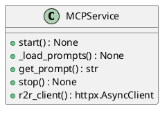
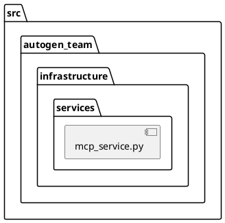
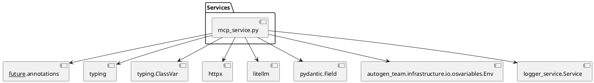
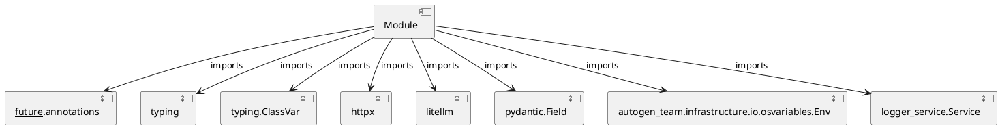
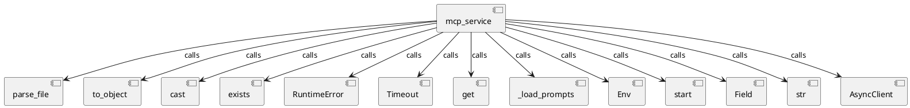

# Module Specification: mcp_service

* **Source Reference:** `src/autogen_team/infrastructure/services/mcp_service.py`

## 1. Architectural Role & Responsibilities
**Purpose:**
Provides functionality related to mcp service.

**Architecture Layer:**
- Services

**Responsibilities:**
- Not explicitly defined.

**Main Workflow:**
- Not explicitly defined.

## 2. Dependencies
**Imports:**
- `__future__.annotations`
- `typing`
- `typing.ClassVar`
- `httpx`
- `litellm`
- `pydantic.Field`
- `autogen_team.infrastructure.io.osvariables.Env`
- `logger_service.Service`

**Exported Classes:**
- `MCPService`

**Exported Functions:**
- None

**Exported Interfaces:**
- Not explicitly defined.

**Public API:**
- Not explicitly defined.

## 3. Architecture & Execution
### Internal Architecture
Not explicitly defined.

### Execution Flow
Not explicitly defined.

### Sequence Explanation
Not explicitly defined.

### Examples
Not explicitly defined.

## 4. UML 2.0 Diagrams
### Class Diagram

```plantuml
@startuml
    class MCPService {
        +start() : None
        +_load_prompts() : None
        +get_prompt() : str
        +stop() : None
        +r2r_client() : httpx.AsyncClient
    }
@enduml
```

### Package Diagram

```plantuml
@startuml
    package "src" {
        package "autogen_team" {
            package "infrastructure" {
                package "services" {
                    [mcp_service.py]
                }
            }
        }
    }
@enduml
```

### Sequence Diagram

```plantuml
@startuml
    ' No functions for sequence
@enduml
```

### Component Diagram

```plantuml
@startuml
    package "Services" {
        [mcp_service.py]
    }
    [mcp_service.py] --> [__future__.annotations]
    [mcp_service.py] --> [typing]
    [mcp_service.py] --> [typing.ClassVar]
    [mcp_service.py] --> [httpx]
    [mcp_service.py] --> [litellm]
    [mcp_service.py] --> [pydantic.Field]
    [mcp_service.py] --> [autogen_team.infrastructure.io.osvariables.Env]
    [mcp_service.py] --> [logger_service.Service]
@enduml
```

### Dependency Graph

```plantuml
@startuml
    [Module] --> [__future__.annotations] : imports
    [Module] --> [typing] : imports
    [Module] --> [typing.ClassVar] : imports
    [Module] --> [httpx] : imports
    [Module] --> [litellm] : imports
    [Module] --> [pydantic.Field] : imports
    [Module] --> [autogen_team.infrastructure.io.osvariables.Env] : imports
    [Module] --> [logger_service.Service] : imports
@enduml
```

## 5. Class & Method Specifications
### `MCPService` ([`src/autogen_team/infrastructure/services/mcp_service.py`](/src/autogen_team/infrastructure/services/mcp_service.py))
#### Overview
Service for MCP server lifecycle and backend clients.

Manages LiteLLM and R2R HTTP client initialization, providing
a single point of access for all MCP tool backends.

Parameters:
    litellm_api_base (str): LiteLLM API base URL.
    litellm_api_key (str): LiteLLM API key.
    litellm_model (str): Default LiteLLM model identifier.
    r2r_base_url (str): R2R RAG API base URL.

#### Attributes
- None found.

#### Methods
##### `start(self) -> None` (Public)
**Description:** Initialize LiteLLM configuration and R2R HTTP client.

**Inputs:**
- None

**Output:**
- return type: `None`
- semantic meaning: Not explicitly defined.
- possible null values: Not explicitly defined.
- exceptions: Not explicitly defined.

**Side Effects:**
- Database updates: Not explicitly defined.
- File operations: Not explicitly defined.
- Network calls: Not explicitly defined.
- Cache: Not explicitly defined.
- State changes: Not explicitly defined.

**Complexity:**
- Time Complexity: Not explicitly defined.
- Space Complexity: Not explicitly defined.

**Example:**
```python
result = MCPService.start()
```

##### `_load_prompts(self) -> None` (Private)
**Purpose:** Load prompts from YAML file.

**Parameters:**
- None

**Return value:**
- `None`

##### `get_prompt(self, tool_name: str, key: str) -> str` (Public)
**Description:** Get a specific prompt for a tool and key.

**Inputs:**
- `tool_name`
  - type: str
  - meaning: Not explicitly defined.
  - valid values: Not explicitly defined.
  - optional?: False
  - default value: None
- `key`
  - type: str
  - meaning: Not explicitly defined.
  - valid values: Not explicitly defined.
  - optional?: True
  - default value: 'system'

**Output:**
- return type: `str`
- semantic meaning: Not explicitly defined.
- possible null values: Not explicitly defined.
- exceptions: Not explicitly defined.

**Side Effects:**
- Database updates: Not explicitly defined.
- File operations: Not explicitly defined.
- Network calls: Not explicitly defined.
- Cache: Not explicitly defined.
- State changes: Not explicitly defined.

**Complexity:**
- Time Complexity: Not explicitly defined.
- Space Complexity: Not explicitly defined.

**Example:**
```python
result = MCPService.get_prompt(..., ...)
```

##### `stop(self) -> None` (Public)
**Description:** Stop the MCP service and close HTTP clients.

**Inputs:**
- None

**Output:**
- return type: `None`
- semantic meaning: Not explicitly defined.
- possible null values: Not explicitly defined.
- exceptions: Not explicitly defined.

**Side Effects:**
- Database updates: Not explicitly defined.
- File operations: Not explicitly defined.
- Network calls: Not explicitly defined.
- Cache: Not explicitly defined.
- State changes: Not explicitly defined.

**Complexity:**
- Time Complexity: Not explicitly defined.
- Space Complexity: Not explicitly defined.

**Example:**
```python
result = MCPService.stop()
```

##### `r2r_client(self) -> httpx.AsyncClient` (Public)
**Description:** Return the R2R async HTTP client.

**Inputs:**
- None

**Output:**
- return type: `httpx.AsyncClient`
- semantic meaning: Not explicitly defined.
- possible null values: Not explicitly defined.
- exceptions: Not explicitly defined.

**Side Effects:**
- Database updates: Not explicitly defined.
- File operations: Not explicitly defined.
- Network calls: Not explicitly defined.
- Cache: Not explicitly defined.
- State changes: Not explicitly defined.

**Complexity:**
- Time Complexity: Not explicitly defined.
- Space Complexity: Not explicitly defined.

**Example:**
```python
result = MCPService.r2r_client()
```

## 6. Module Functions
## 7. Call Graph

```plantuml
@startuml
[mcp_service] --> [parse_file] : calls
[mcp_service] --> [to_object] : calls
[mcp_service] --> [cast] : calls
[mcp_service] --> [exists] : calls
[mcp_service] --> [RuntimeError] : calls
[mcp_service] --> [Timeout] : calls
[mcp_service] --> [get] : calls
[mcp_service] --> [_load_prompts] : calls
[mcp_service] --> [Env] : calls
[mcp_service] --> [start] : calls
[mcp_service] --> [Field] : calls
[mcp_service] --> [str] : calls
[mcp_service] --> [AsyncClient] : calls
@enduml
```

## 8. Cross References
- **Dependencies:** [Dependencies](../../../../../dependencies/index.md)
- **Used by:** ../../application/mcp/tools/execute_code.md, ../../application/mcp/tools/plan_mission.md, ../../application/mcp/tools/security_review.md, ../../../../tests/infrastructure/services/test_mcp_service.md, ../../application/mcp/tools/generate_mission_docs.md
- **Calls:** parse_file, to_object, cast, exists, RuntimeError, Timeout, get, _load_prompts, Env, start, Field, str, AsyncClient
- **Called from:** None
- **Related classes:** [Classes](../../../../../classes/index.md)
- **Related diagrams:** [Diagrams](../../../../../diagrams/index.md)
