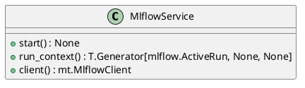
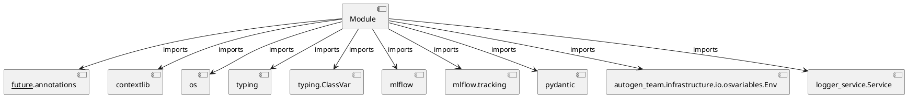

# Module Specification: mlflow_service

* **Source Reference:** `src/autogen_team/infrastructure/services/mlflow_service.py`

## 1. Architectural Role & Responsibilities
**Purpose:**
Provides functionality related to mlflow service.

**Architecture Layer:**
- Services

**Responsibilities:**
- Not explicitly defined.

**Main Workflow:**
- Not explicitly defined.

## 2. Dependencies
**Imports:**
- `__future__.annotations`
- `contextlib`
- `os`
- `typing`
- `typing.ClassVar`
- `mlflow`
- `mlflow.tracking`
- `pydantic`
- `autogen_team.infrastructure.io.osvariables.Env`
- `logger_service.Service`

**Exported Classes:**
- `MlflowService`

**Exported Functions:**
- None

## 3. Architecture & Execution
### Internal Architecture
Not explicitly defined.

### Execution Flow
Not explicitly defined.

### Sequence Explanation
Not explicitly defined.

## 4. UML 2.0 Diagrams
### Class Diagram


### Dependency Graph


## 5. Class & Method Specifications
### `MlflowService` ([`src/autogen_team/infrastructure/services/mlflow_service.py`](/src/autogen_team/infrastructure/services/mlflow_service.py))
#### Overview
Service for Mlflow tracking and registry.

#### Attributes
- None found.

#### Methods
##### `start(self) -> None` (Public)
**Description:** No description provided.

**Inputs:**
- None

**Output:**
- Return Type: `None`
- Semantic Meaning: Not explicitly defined.

**Side Effects:**
- Not explicitly defined.

**Complexity:**
- Time Complexity: Not explicitly defined.
- Space Complexity: Not explicitly defined.

**Example:**
```python
result = MlflowService.start()
```

##### `run_context(self, run_config: RunConfig) -> T.Generator[mlflow.ActiveRun, None, None]` (Public)
**Description:** Yield an active Mlflow run and exit it afterwards.

**Inputs:**
- `run_config`: RunConfig

**Output:**
- Return Type: `T.Generator[mlflow.ActiveRun, None, None]`
- Semantic Meaning: Not explicitly defined.

**Side Effects:**
- Not explicitly defined.

**Complexity:**
- Time Complexity: Not explicitly defined.
- Space Complexity: Not explicitly defined.

**Example:**
```python
result = MlflowService.run_context(...)
```

##### `client(self) -> mt.MlflowClient` (Public)
**Description:** Return a new Mlflow client.

**Inputs:**
- None

**Output:**
- Return Type: `mt.MlflowClient`
- Semantic Meaning: Not explicitly defined.

**Side Effects:**
- Not explicitly defined.

**Complexity:**
- Time Complexity: Not explicitly defined.
- Space Complexity: Not explicitly defined.

**Example:**
```python
result = MlflowService.client()
```

## 6. Module Functions