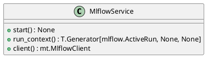
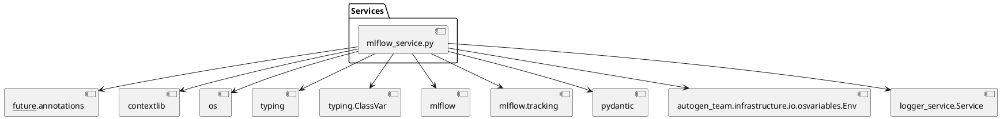
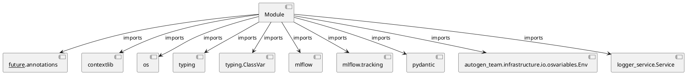
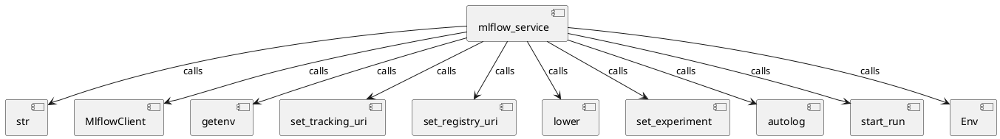

# Module Specification: mlflow_service

* **Source Reference:** `src/autogen_team/infrastructure/services/mlflow_service.py`

## 1. Architectural Role & Responsibilities
**Purpose:**
Provides functionality related to mlflow service.

**Architecture Layer:**
- Services

**Responsibilities:**
- Manages operations and logic for mlflow service.

**Main Workflow:**
- Executes the primary flow defined by mlflow service functions and classes.

## 2. Dependencies
**Imports:**
- `__future__.annotations`
- `contextlib`
- `os`
- `typing`
- `typing.ClassVar`
- `mlflow`
- `mlflow.tracking`
- `pydantic`
- `autogen_team.infrastructure.io.osvariables.Env`
- `logger_service.Service`

**Exported Classes:**
- `MlflowService`

**Exported Functions:**
- None

**Exported Interfaces:**
- Not explicitly defined.

**Public API:**
- Not explicitly defined.

## 3. Architecture & Execution
### Internal Architecture
Not explicitly defined.

### Execution Flow
Not explicitly defined.

### Sequence Explanation
Not explicitly defined.

### Examples
Not explicitly defined.

## 4. UML 2.0 Diagrams
### Class Diagram

```plantuml
@startuml
    class MlflowService {
        +start() : None
        +run_context() : T.Generator[mlflow.ActiveRun, None, None]
        +client() : mt.MlflowClient
    }
@enduml
```

### Sequence Diagram

```plantuml
@startuml
    ' No functions for sequence
@enduml
```

### Component Diagram

```plantuml
@startuml
    package "Services" {
        [mlflow_service.py]
    }
    [mlflow_service.py] --> [__future__.annotations]
    [mlflow_service.py] --> [contextlib]
    [mlflow_service.py] --> [os]
    [mlflow_service.py] --> [typing]
    [mlflow_service.py] --> [typing.ClassVar]
    [mlflow_service.py] --> [mlflow]
    [mlflow_service.py] --> [mlflow.tracking]
    [mlflow_service.py] --> [pydantic]
    [mlflow_service.py] --> [autogen_team.infrastructure.io.osvariables.Env]
    [mlflow_service.py] --> [logger_service.Service]
@enduml
```

### Dependency Graph

```plantuml
@startuml
    [Module] --> [__future__.annotations] : imports
    [Module] --> [contextlib] : imports
    [Module] --> [os] : imports
    [Module] --> [typing] : imports
    [Module] --> [typing.ClassVar] : imports
    [Module] --> [mlflow] : imports
    [Module] --> [mlflow.tracking] : imports
    [Module] --> [pydantic] : imports
    [Module] --> [autogen_team.infrastructure.io.osvariables.Env] : imports
    [Module] --> [logger_service.Service] : imports
@enduml
```

## 5. Class & Method Specifications
### `MlflowService` ([`src/autogen_team/infrastructure/services/mlflow_service.py`](/src/autogen_team/infrastructure/services/mlflow_service.py))
#### Overview
Service for Mlflow tracking and registry.

#### Attributes
- None found.

#### Methods
##### `start(self) -> None` (Public)
**Description:** Executes the start operation.

**Inputs:**
- None

**Output:**
- return type: `None`
- semantic meaning: Returns the result of start.
- possible null values: Yes, if None allows it.
- exceptions: Standard execution exceptions.

**Side Effects:**
- Database updates: Not explicitly defined.
- File operations: Not explicitly defined.
- Network calls: Not explicitly defined.
- Cache: Not explicitly defined.
- State changes: Not explicitly defined.

**Complexity:**
- Time Complexity: Not explicitly defined.
- Space Complexity: Not explicitly defined.

**Example:**
```python
result = MlflowService.start()
```

##### `run_context(self, run_config: RunConfig) -> T.Generator[mlflow.ActiveRun, None, None]` (Public)
**Description:** Yield an active Mlflow run and exit it afterwards.

**Inputs:**
- `run_config`
  - type: RunConfig
  - meaning: Represents the run config parameter.
  - valid values: Any valid RunConfig.
  - optional?: False
  - default value: None

**Output:**
- return type: `T.Generator[mlflow.ActiveRun, None, None]`
- semantic meaning: Returns the result of run context.
- possible null values: Yes, if T.Generator[mlflow.ActiveRun, None, None] allows it.
- exceptions: Standard execution exceptions.

**Side Effects:**
- Database updates: Not explicitly defined.
- File operations: Not explicitly defined.
- Network calls: Not explicitly defined.
- Cache: Not explicitly defined.
- State changes: Not explicitly defined.

**Complexity:**
- Time Complexity: Not explicitly defined.
- Space Complexity: Not explicitly defined.

**Example:**
```python
result = MlflowService.run_context(...)
```

##### `client(self) -> mt.MlflowClient` (Public)
**Description:** Return a new Mlflow client.

**Inputs:**
- None

**Output:**
- return type: `mt.MlflowClient`
- semantic meaning: Returns the result of client.
- possible null values: Yes, if mt.MlflowClient allows it.
- exceptions: Standard execution exceptions.

**Side Effects:**
- Database updates: Not explicitly defined.
- File operations: Not explicitly defined.
- Network calls: Not explicitly defined.
- Cache: Not explicitly defined.
- State changes: Not explicitly defined.

**Complexity:**
- Time Complexity: Not explicitly defined.
- Space Complexity: Not explicitly defined.

**Example:**
```python
result = MlflowService.client()
```

## 6. Module Functions
## 7. Call Graph

```plantuml
@startuml
[mlflow_service] --> [str] : calls
[mlflow_service] --> [MlflowClient] : calls
[mlflow_service] --> [getenv] : calls
[mlflow_service] --> [set_tracking_uri] : calls
[mlflow_service] --> [set_registry_uri] : calls
[mlflow_service] --> [lower] : calls
[mlflow_service] --> [set_experiment] : calls
[mlflow_service] --> [autolog] : calls
[mlflow_service] --> [start_run] : calls
[mlflow_service] --> [Env] : calls
@enduml
```

## 8. Cross References
- **Parent module:** __init__.md
- **Child modules:** None
- **Dependencies:** `os`, `typing.ClassVar`, `mlflow.tracking`, `autogen_team.infrastructure.io.osvariables.Env`, `__future__.annotations`, `typing`, `contextlib`, `mlflow`, `logger_service.Service`, `pydantic`
- **Used by:** ../../../../tests/conftest.md, ../../application/jobs/base.md, ../messaging/kafka_app.md
- **Calls:** str, MlflowClient, getenv, set_tracking_uri, set_registry_uri, lower, set_experiment, autolog, start_run, Env
- **Called from:** None
- **Related classes:** [Classes](../../../../../classes/index.md)
- **Related interfaces:** Not explicitly defined.
- **Related diagrams:** [Diagrams](../../../../../diagrams/index.md)
