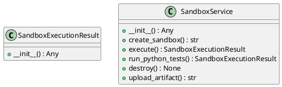
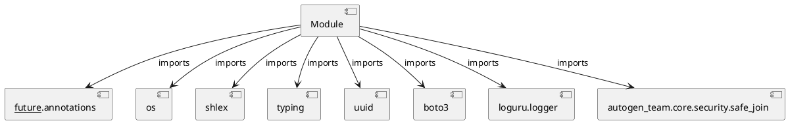

# Module Specification: sandbox_service

* **Source Reference:** `src/autogen_team/infrastructure/services/sandbox_service.py`

## 1. Architectural Role & Responsibilities
**Purpose:**
Provides functionality related to sandbox service.

**Architecture Layer:**
- Services

**Responsibilities:**
- Not explicitly defined.

**Main Workflow:**
- Not explicitly defined.

## 2. Dependencies
**Imports:**
- `__future__.annotations`
- `os`
- `shlex`
- `typing`
- `uuid`
- `boto3`
- `loguru.logger`
- `autogen_team.core.security.safe_join`

**Exported Classes:**
- `SandboxExecutionResult`
- `SandboxService`

**Exported Functions:**
- None

## 3. Architecture & Execution
### Internal Architecture
Not explicitly defined.

### Execution Flow
Not explicitly defined.

### Sequence Explanation
Not explicitly defined.

## 4. UML 2.0 Diagrams
### Class Diagram


### Dependency Graph


## 5. Class & Method Specifications
### `SandboxExecutionResult` ([`src/autogen_team/infrastructure/services/sandbox_service.py`](/src/autogen_team/infrastructure/services/sandbox_service.py))
#### Overview
Result of a command execution inside the sandbox.

#### Constructor
**Initialization:** Initializes `SandboxExecutionResult` with required dependencies and sets up initial internal state.

#### Attributes
- `exit_code`
- `stdout`
- `stderr`
- `artifacts`

#### Methods
##### `__init__(self, exit_code: int, stdout: str, stderr: str, artifacts: T.List[str] | None) -> Any` (Public)
**Description:** No description provided.

**Inputs:**
- `exit_code`: int
- `stdout`: str
- `stderr`: str
- `artifacts`: T.List[str] | None

**Output:**
- Return Type: `Any`
- Semantic Meaning: Not explicitly defined.

**Side Effects:**
- Not explicitly defined.

**Complexity:**
- Time Complexity: Not explicitly defined.
- Space Complexity: Not explicitly defined.

**Example:**
```python
instance = SandboxExecutionResult()
result = instance.__init__(..., ..., ..., ...)
```

### `SandboxService` ([`src/autogen_team/infrastructure/services/sandbox_service.py`](/src/autogen_team/infrastructure/services/sandbox_service.py))
#### Overview
Manages ephemeral MicroVM sandboxes for secure code execution.

#### Constructor
**Initialization:** Initializes `SandboxService` with required dependencies and sets up initial internal state.

#### Attributes
- `use_e2b_fallback`
- `active_sandboxes`
- `_execution_timeout`

#### Methods
##### `__init__(self, use_e2b_fallback: bool) -> Any` (Public)
**Description:** No description provided.

**Inputs:**
- `use_e2b_fallback`: bool

**Output:**
- Return Type: `Any`
- Semantic Meaning: Not explicitly defined.

**Side Effects:**
- Not explicitly defined.

**Complexity:**
- Time Complexity: Not explicitly defined.
- Space Complexity: Not explicitly defined.

**Example:**
```python
instance = SandboxService()
result = instance.__init__(...)
```

##### `create_sandbox(self, metadata: T.Dict[str, T.Any] | None) -> str` (Public)
**Description:** Create a new sandbox instance.

Args:
    metadata: Optional metadata for the sandbox.

Returns:
    sandbox_id: Unique identifier for the sandbox.

**Inputs:**
- `metadata`: T.Dict[str, T.Any] | None

**Output:**
- Return Type: `str`
- Semantic Meaning: Not explicitly defined.

**Side Effects:**
- Not explicitly defined.

**Complexity:**
- Time Complexity: Not explicitly defined.
- Space Complexity: Not explicitly defined.

**Example:**
```python
instance = SandboxService()
result = instance.create_sandbox(...)
```

##### `execute(self, sandbox_id: str, command: str) -> SandboxExecutionResult` (Public)
**Description:** Execute a command inside the specified sandbox.

Args:
    sandbox_id: The ID of the sandbox.
    command: The command to execute.

Returns:
    SandboxExecutionResult object.

**Inputs:**
- `sandbox_id`: str
- `command`: str

**Output:**
- Return Type: `SandboxExecutionResult`
- Semantic Meaning: Not explicitly defined.

**Side Effects:**
- Not explicitly defined.

**Complexity:**
- Time Complexity: Not explicitly defined.
- Space Complexity: Not explicitly defined.

**Example:**
```python
instance = SandboxService()
result = instance.execute(..., ...)
```

##### `run_python_tests(self, sandbox_id: str, workspace_dir: str) -> SandboxExecutionResult` (Public)
**Description:** Specific helper to run pytest inside the sandbox.

Args:
    sandbox_id: The ID of the sandbox.
    workspace_dir: The directory inside the sandbox where code is located.

Returns:
    SandboxExecutionResult object.

**Inputs:**
- `sandbox_id`: str
- `workspace_dir`: str

**Output:**
- Return Type: `SandboxExecutionResult`
- Semantic Meaning: Not explicitly defined.

**Side Effects:**
- Not explicitly defined.

**Complexity:**
- Time Complexity: Not explicitly defined.
- Space Complexity: Not explicitly defined.

**Example:**
```python
instance = SandboxService()
result = instance.run_python_tests(..., ...)
```

##### `destroy(self, sandbox_id: str) -> None` (Public)
**Description:** Tear down a sandbox instance.

Args:
    sandbox_id: The ID of the sandbox to destroy.

**Inputs:**
- `sandbox_id`: str

**Output:**
- Return Type: `None`
- Semantic Meaning: Not explicitly defined.

**Side Effects:**
- Not explicitly defined.

**Complexity:**
- Time Complexity: Not explicitly defined.
- Space Complexity: Not explicitly defined.

**Example:**
```python
instance = SandboxService()
result = instance.destroy(...)
```

##### `upload_artifact(self, sandbox_id: str, file_path: str, bucket_name: str) -> str` (Public)
**Description:** Upload a file from the local environment (captured from sandbox) to MinIO.

Args:
    sandbox_id: The ID of the sandbox.
    file_path: Local path to the file.
    bucket_name: Target bucket name.

Returns:
    The S3 URL of the uploaded artifact.

**Inputs:**
- `sandbox_id`: str
- `file_path`: str
- `bucket_name`: str

**Output:**
- Return Type: `str`
- Semantic Meaning: Not explicitly defined.

**Side Effects:**
- Not explicitly defined.

**Complexity:**
- Time Complexity: Not explicitly defined.
- Space Complexity: Not explicitly defined.

**Example:**
```python
instance = SandboxService()
result = instance.upload_artifact(..., ..., ...)
```

## 6. Module Functions