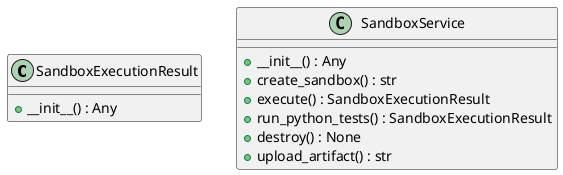
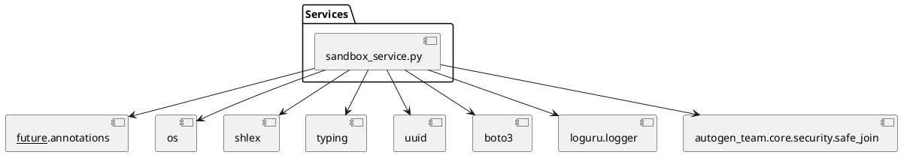
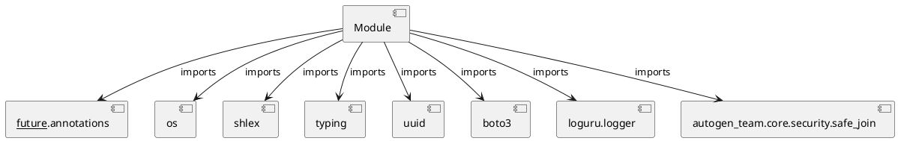

# Module Specification: sandbox_service

* **Source Reference:** `src/autogen_team/infrastructure/services/sandbox_service.py`

## 1. Architectural Role & Responsibilities
**Purpose:**
Provides functionality related to sandbox service.

**Architecture Layer:**
- Services

**Responsibilities:**
- Manages operations and logic for sandbox service.

**Main Workflow:**
- Executes the primary flow defined by sandbox service functions and classes.

## 2. Dependencies
**Imports:**
- `__future__.annotations`
- `os`
- `shlex`
- `typing`
- `uuid`
- `boto3`
- `loguru.logger`
- `autogen_team.core.security.safe_join`

**Exported Classes:**
- `SandboxExecutionResult`
- `SandboxService`

**Exported Functions:**
- None

**Exported Interfaces:**
- Not explicitly defined.

**Public API:**
- Not explicitly defined.

## 3. Architecture & Execution
### Internal Architecture
Not explicitly defined.

### Execution Flow
Not explicitly defined.

### Sequence Explanation
Not explicitly defined.

### Examples
Not explicitly defined.

## 4. UML 2.0 Diagrams
### Class Diagram

```plantuml
@startuml
    class SandboxExecutionResult {
        +__init__() : Any
    }
    class SandboxService {
        +__init__() : Any
        +create_sandbox() : str
        +execute() : SandboxExecutionResult
        +run_python_tests() : SandboxExecutionResult
        +destroy() : None
        +upload_artifact() : str
    }
@enduml
```

### Sequence Diagram

```plantuml
@startuml
    ' No functions for sequence
@enduml
```

### Component Diagram

```plantuml
@startuml
    package "Services" {
        [sandbox_service.py]
    }
    [sandbox_service.py] --> [__future__.annotations]
    [sandbox_service.py] --> [os]
    [sandbox_service.py] --> [shlex]
    [sandbox_service.py] --> [typing]
    [sandbox_service.py] --> [uuid]
    [sandbox_service.py] --> [boto3]
    [sandbox_service.py] --> [loguru.logger]
    [sandbox_service.py] --> [autogen_team.core.security.safe_join]
@enduml
```

### Dependency Graph

```plantuml
@startuml
    [Module] --> [__future__.annotations] : imports
    [Module] --> [os] : imports
    [Module] --> [shlex] : imports
    [Module] --> [typing] : imports
    [Module] --> [uuid] : imports
    [Module] --> [boto3] : imports
    [Module] --> [loguru.logger] : imports
    [Module] --> [autogen_team.core.security.safe_join] : imports
@enduml
```

## 5. Class & Method Specifications
### `SandboxExecutionResult` ([`src/autogen_team/infrastructure/services/sandbox_service.py`](/src/autogen_team/infrastructure/services/sandbox_service.py))
#### Overview
Result of a command execution inside the sandbox.

#### Constructor
**Initialization:** Initializes `SandboxExecutionResult` with required dependencies and sets up initial internal state.

#### Attributes
- `exit_code`
  - Type: Any
  - Purpose: Represents the exit code property.
  - Constraints: Not explicitly defined.
- `stdout`
  - Type: Any
  - Purpose: Represents the stdout property.
  - Constraints: Not explicitly defined.
- `stderr`
  - Type: Any
  - Purpose: Represents the stderr property.
  - Constraints: Not explicitly defined.
- `artifacts`
  - Type: Any
  - Purpose: Represents the artifacts property.
  - Constraints: Not explicitly defined.

#### Methods
##### `__init__(self, exit_code: int, stdout: str, stderr: str, artifacts: T.List[str] | None) -> Any` (Public)
**Description:** Executes the   init   operation.

**Inputs:**
- `exit_code`
  - type: int
  - meaning: Represents the exit code parameter.
  - valid values: Any valid int.
  - optional?: False
  - default value: None
- `stdout`
  - type: str
  - meaning: Represents the stdout parameter.
  - valid values: Any valid str.
  - optional?: False
  - default value: None
- `stderr`
  - type: str
  - meaning: Represents the stderr parameter.
  - valid values: Any valid str.
  - optional?: False
  - default value: None
- `artifacts`
  - type: T.List[str] | None
  - meaning: Represents the artifacts parameter.
  - valid values: Any valid T.List[str] | None.
  - optional?: True
  - default value: None

**Output:**
- return type: `Any`
- semantic meaning: Returns the result of   init  .
- possible null values: Yes, if Any allows it.
- exceptions: Standard execution exceptions.

**Side Effects:**
- Database updates: Not explicitly defined.
- File operations: Not explicitly defined.
- Network calls: Not explicitly defined.
- Cache: Not explicitly defined.
- State changes: Not explicitly defined.

**Complexity:**
- Time Complexity: Not explicitly defined.
- Space Complexity: Not explicitly defined.

**Example:**
```python
instance = SandboxExecutionResult()
result = instance.__init__(..., ..., ..., ...)
```

### `SandboxService` ([`src/autogen_team/infrastructure/services/sandbox_service.py`](/src/autogen_team/infrastructure/services/sandbox_service.py))
#### Overview
Manages ephemeral MicroVM sandboxes for secure code execution.

#### Constructor
**Initialization:** Initializes `SandboxService` with required dependencies and sets up initial internal state.

#### Attributes
- `use_e2b_fallback`
  - Type: Any
  - Purpose: Represents the use e2b fallback property.
  - Constraints: Not explicitly defined.
- `active_sandboxes`
  - Type: Any
  - Purpose: Represents the active sandboxes property.
  - Constraints: Not explicitly defined.
- `_execution_timeout`
  - Type: Any
  - Purpose: Represents the  execution timeout property.
  - Constraints: Not explicitly defined.

#### Methods
##### `__init__(self, use_e2b_fallback: bool) -> Any` (Public)
**Description:** Executes the   init   operation.

**Inputs:**
- `use_e2b_fallback`
  - type: bool
  - meaning: Represents the use e2b fallback parameter.
  - valid values: Any valid bool.
  - optional?: True
  - default value: True

**Output:**
- return type: `Any`
- semantic meaning: Returns the result of   init  .
- possible null values: Yes, if Any allows it.
- exceptions: Standard execution exceptions.

**Side Effects:**
- Database updates: Not explicitly defined.
- File operations: Not explicitly defined.
- Network calls: Not explicitly defined.
- Cache: Not explicitly defined.
- State changes: Not explicitly defined.

**Complexity:**
- Time Complexity: Not explicitly defined.
- Space Complexity: Not explicitly defined.

**Example:**
```python
instance = SandboxService()
result = instance.__init__(...)
```

##### `create_sandbox(self, metadata: T.Dict[str, T.Any] | None) -> str` (Public)
**Description:** Create a new sandbox instance.

Args:
    metadata: Optional metadata for the sandbox.

Returns:
    sandbox_id: Unique identifier for the sandbox.

**Inputs:**
- `metadata`
  - type: T.Dict[str, T.Any] | None
  - meaning: Represents the metadata parameter.
  - valid values: Any valid T.Dict[str, T.Any] | None.
  - optional?: True
  - default value: None

**Output:**
- return type: `str`
- semantic meaning: Returns the result of create sandbox.
- possible null values: Yes, if str allows it.
- exceptions: Standard execution exceptions.

**Side Effects:**
- Database updates: Not explicitly defined.
- File operations: Not explicitly defined.
- Network calls: Not explicitly defined.
- Cache: Not explicitly defined.
- State changes: Not explicitly defined.

**Complexity:**
- Time Complexity: Not explicitly defined.
- Space Complexity: Not explicitly defined.

**Example:**
```python
instance = SandboxService()
result = instance.create_sandbox(...)
```

##### `execute(self, sandbox_id: str, command: str) -> SandboxExecutionResult` (Public)
**Description:** Execute a command inside the specified sandbox.

Args:
    sandbox_id: The ID of the sandbox.
    command: The command to execute.

Returns:
    SandboxExecutionResult object.

**Inputs:**
- `sandbox_id`
  - type: str
  - meaning: Represents the sandbox id parameter.
  - valid values: Any valid str.
  - optional?: False
  - default value: None
- `command`
  - type: str
  - meaning: Represents the command parameter.
  - valid values: Any valid str.
  - optional?: False
  - default value: None

**Output:**
- return type: `SandboxExecutionResult`
- semantic meaning: Returns the result of execute.
- possible null values: Yes, if SandboxExecutionResult allows it.
- exceptions: Standard execution exceptions.

**Side Effects:**
- Database updates: Not explicitly defined.
- File operations: Not explicitly defined.
- Network calls: Not explicitly defined.
- Cache: Not explicitly defined.
- State changes: Not explicitly defined.

**Complexity:**
- Time Complexity: Not explicitly defined.
- Space Complexity: Not explicitly defined.

**Example:**
```python
instance = SandboxService()
result = instance.execute(..., ...)
```

##### `run_python_tests(self, sandbox_id: str, workspace_dir: str) -> SandboxExecutionResult` (Public)
**Description:** Specific helper to run pytest inside the sandbox.

Args:
    sandbox_id: The ID of the sandbox.
    workspace_dir: The directory inside the sandbox where code is located.

Returns:
    SandboxExecutionResult object.

**Inputs:**
- `sandbox_id`
  - type: str
  - meaning: Represents the sandbox id parameter.
  - valid values: Any valid str.
  - optional?: False
  - default value: None
- `workspace_dir`
  - type: str
  - meaning: Represents the workspace dir parameter.
  - valid values: Any valid str.
  - optional?: False
  - default value: None

**Output:**
- return type: `SandboxExecutionResult`
- semantic meaning: Returns the result of run python tests.
- possible null values: Yes, if SandboxExecutionResult allows it.
- exceptions: Standard execution exceptions.

**Side Effects:**
- Database updates: Not explicitly defined.
- File operations: Not explicitly defined.
- Network calls: Not explicitly defined.
- Cache: Not explicitly defined.
- State changes: Not explicitly defined.

**Complexity:**
- Time Complexity: Not explicitly defined.
- Space Complexity: Not explicitly defined.

**Example:**
```python
instance = SandboxService()
result = instance.run_python_tests(..., ...)
```

##### `destroy(self, sandbox_id: str) -> None` (Public)
**Description:** Tear down a sandbox instance.

Args:
    sandbox_id: The ID of the sandbox to destroy.

**Inputs:**
- `sandbox_id`
  - type: str
  - meaning: Represents the sandbox id parameter.
  - valid values: Any valid str.
  - optional?: False
  - default value: None

**Output:**
- return type: `None`
- semantic meaning: Returns the result of destroy.
- possible null values: Yes, if None allows it.
- exceptions: Standard execution exceptions.

**Side Effects:**
- Database updates: Not explicitly defined.
- File operations: Not explicitly defined.
- Network calls: Not explicitly defined.
- Cache: Not explicitly defined.
- State changes: Not explicitly defined.

**Complexity:**
- Time Complexity: Not explicitly defined.
- Space Complexity: Not explicitly defined.

**Example:**
```python
instance = SandboxService()
result = instance.destroy(...)
```

##### `upload_artifact(self, sandbox_id: str, file_path: str, bucket_name: str) -> str` (Public)
**Description:** Upload a file from the local environment (captured from sandbox) to MinIO.

Args:
    sandbox_id: The ID of the sandbox.
    file_path: Local path to the file.
    bucket_name: Target bucket name.

Returns:
    The S3 URL of the uploaded artifact.

**Inputs:**
- `sandbox_id`
  - type: str
  - meaning: Represents the sandbox id parameter.
  - valid values: Any valid str.
  - optional?: False
  - default value: None
- `file_path`
  - type: str
  - meaning: Represents the file path parameter.
  - valid values: Any valid str.
  - optional?: False
  - default value: None
- `bucket_name`
  - type: str
  - meaning: Represents the bucket name parameter.
  - valid values: Any valid str.
  - optional?: True
  - default value: 'agent-workspace'

**Output:**
- return type: `str`
- semantic meaning: Returns the result of upload artifact.
- possible null values: Yes, if str allows it.
- exceptions: Standard execution exceptions.

**Side Effects:**
- Database updates: Not explicitly defined.
- File operations: Not explicitly defined.
- Network calls: Not explicitly defined.
- Cache: Not explicitly defined.
- State changes: Not explicitly defined.

**Complexity:**
- Time Complexity: Not explicitly defined.
- Space Complexity: Not explicitly defined.

**Example:**
```python
instance = SandboxService()
result = instance.upload_artifact(..., ..., ...)
```

## 6. Module Functions
## 7. Call Graph

```plantuml
@startuml
[sandbox_service] --> [upload_file] : calls
[sandbox_service] --> [getenv] : calls
[sandbox_service] --> [getcwd] : calls
[sandbox_service] --> [NotImplementedError] : calls
[sandbox_service] --> [SandboxExecutionResult] : calls
[sandbox_service] --> [quote] : calls
[sandbox_service] --> [error] : calls
[sandbox_service] --> [int] : calls
[sandbox_service] --> [startswith] : calls
[sandbox_service] --> [create] : calls
[sandbox_service] --> [execute] : calls
[sandbox_service] --> [exec_cell] : calls
[sandbox_service] --> [pop] : calls
[sandbox_service] --> [uuid4] : calls
[sandbox_service] --> [warning] : calls
[sandbox_service] --> [basename] : calls
[sandbox_service] --> [isabs] : calls
[sandbox_service] --> [info] : calls
[sandbox_service] --> [ValueError] : calls
[sandbox_service] --> [RuntimeError] : calls
[sandbox_service] --> [safe_join] : calls
[sandbox_service] --> [str] : calls
[sandbox_service] --> [close] : calls
[sandbox_service] --> [get] : calls
[sandbox_service] --> [client] : calls
@enduml
```

## 8. Cross References
- **Parent module:** __init__.md
- **Child modules:** None
- **Dependencies:** `os`, `shlex`, `boto3`, `__future__.annotations`, `typing`, `loguru.logger`, `uuid`, `autogen_team.core.security.safe_join`
- **Used by:** ../../application/mcp/tools/run_tests.md, ../../../../tests/infrastructure/services/test_sandbox_service.md
- **Calls:** upload_file, getenv, getcwd, NotImplementedError, SandboxExecutionResult, quote, error, int, startswith, create, execute, exec_cell, pop, uuid4, warning, basename, isabs, info, ValueError, RuntimeError, safe_join, str, close, get, client
- **Called from:** None
- **Related classes:** [Classes](../../../../../classes/index.md)
- **Related interfaces:** Not explicitly defined.
- **Related diagrams:** [Diagrams](../../../../../diagrams/index.md)
