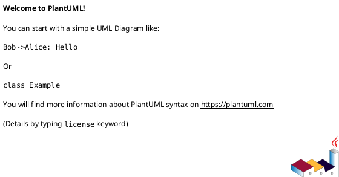

# Module Specification: __init__

* **Source Reference:** `src/autogen_team/infrastructure/utils/__init__.py`

## 1. Architectural Role & Responsibilities
**Purpose:**
Provides functionality related to   init  .

**Architecture Layer:**
- Infrastructure/Other

**Responsibilities:**
- Not explicitly defined.

**Main Workflow:**
- Not explicitly defined.

## 2. Dependencies
**Imports:**
- `searchers.CrossValidation`
- `searchers.Grid`
- `searchers.GridCVSearcher`
- `searchers.Results`
- `searchers.Searcher`
- `searchers.SearcherKind`
- `signers.InferSigner`
- `signers.Signature`
- `signers.Signer`
- `signers.SignerKind`
- `splitters.Index`
- `splitters.Splitter`
- `splitters.SplitterKind`
- `splitters.TimeSeriesSplitter`
- `splitters.TrainTestIndex`
- `splitters.TrainTestSplits`
- `splitters.TrainTestSplitter`

**Exported Classes:**
- None

**Exported Functions:**
- None

## 3. Architecture & Execution
### Internal Architecture
Not explicitly defined.

### Execution Flow
Not explicitly defined.

### Sequence Explanation
Not explicitly defined.

## 4. UML 2.0 Diagrams
### Class Diagram

### Dependency Graph

```plantuml
@startuml
    [Module] --> [searchers.CrossValidation] : imports
    [Module] --> [searchers.Grid] : imports
    [Module] --> [searchers.GridCVSearcher] : imports
    [Module] --> [searchers.Results] : imports
    [Module] --> [searchers.Searcher] : imports
    [Module] --> [searchers.SearcherKind] : imports
    [Module] --> [signers.InferSigner] : imports
    [Module] --> [signers.Signature] : imports
    [Module] --> [signers.Signer] : imports
    [Module] --> [signers.SignerKind] : imports
    [Module] --> [splitters.Index] : imports
    [Module] --> [splitters.Splitter] : imports
    [Module] --> [splitters.SplitterKind] : imports
    [Module] --> [splitters.TimeSeriesSplitter] : imports
    [Module] --> [splitters.TrainTestIndex] : imports
    [Module] --> [splitters.TrainTestSplits] : imports
    [Module] --> [splitters.TrainTestSplitter] : imports
@enduml
```

## 5. Class & Method Specifications
## 6. Module Functions