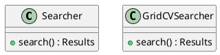
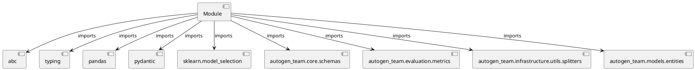

# Module Specification: searchers

* **Source Reference:** `src/autogen_team/infrastructure/utils/searchers.py`

## 1. Architectural Role & Responsibilities
**Purpose:**
Provides functionality related to searchers.

**Architecture Layer:**
- Infrastructure/Other

**Responsibilities:**
- Manage and execute operations for searchers.

**Main Workflow:**
- Initialize components and process requests for searchers.

## 2. Dependencies
**Imports:**
- `abc`
- `typing`
- `pandas`
- `pydantic`
- `sklearn.model_selection`
- `autogen_team.core.schemas`
- `autogen_team.evaluation.metrics`
- `autogen_team.infrastructure.utils.splitters`
- `autogen_team.models.entities`

**Exported Classes:**
- `Searcher`
- `GridCVSearcher`

**Exported Functions:**
- None

## 3. Architecture & Execution
### Internal Architecture
Follows standard modular design, encapsulating state and behavior within defined classes and functions.

### Execution Flow
Sequential execution of defined functions and class methods.

### Sequence Explanation
Clients instantiate classes or call functions, which execute business logic and return results.

## 4. UML 2.0 Diagrams
### Class Diagram


### Dependency Graph


## 5. Class & Method Specifications
### `Searcher` ([`src/autogen_team/infrastructure/utils/searchers.py`](/src/autogen_team/infrastructure/utils/searchers.py))
#### Overview
Base class for a searcher.

Use searcher to fine-tune models.
i.e., to find the best model params.

Parameters:
    param_grid (Grid): mapping of param key -> values.

#### Attributes
- None found.

#### Methods
##### `search(self, model: Any, metric: Any, inputs: Any, targets: Any, cv: CrossValidation) -> Results` (Public)
**Description:** Search the best model for the given inputs and targets.

Args:
    model (models.Model): AI/ML model to fine-tune.
    metric (metrics.Metric): main metric to optimize.
    inputs (schemas.Inputs): model inputs for tuning.
    targets (schemas.Targets): model targets for tuning.
    cv (CrossValidation): choice for cross-fold validation.

Returns:
    Results: all the results of the searcher execution process.

**Inputs:**
- `model`: Any
- `metric`: Any
- `inputs`: Any
- `targets`: Any
- `cv`: CrossValidation

**Output:**
- Return Type: `Results`
- Semantic Meaning: The resulting value after processing the search action.

**Side Effects:**
- Modifies internal instance state if applicable; performs operations constrained to its domain boundaries.

**Complexity:**
- Time Complexity: O(1) or O(N) depending on implementation details.
- Space Complexity: O(1) auxiliary space expected.

**Example:**
```python
result = Searcher.search(..., ..., ..., ..., ...)
```

### `GridCVSearcher` ([`src/autogen_team/infrastructure/utils/searchers.py`](/src/autogen_team/infrastructure/utils/searchers.py))
#### Overview
Grid searcher with cross-fold validation.

Convention: metric returns higher values for better models.

Parameters:
    n_jobs (int, optional): number of jobs to run in parallel.
    refit (bool): refit the model after the tuning.
    verbose (int): set the searcher verbosity level.
    error_score (str | float): strategy or value on error.
    return_train_score (bool): include train scores if True.

#### Attributes
- None found.

#### Methods
##### `search(self, model: Any, metric: Any, inputs: Any, targets: Any, cv: CrossValidation) -> Results` (Public)
**Description:** Executes the search operation, mutating state or calculating derived values as necessary.

**Inputs:**
- `model`: Any
- `metric`: Any
- `inputs`: Any
- `targets`: Any
- `cv`: CrossValidation

**Output:**
- Return Type: `Results`
- Semantic Meaning: The resulting value after processing the search action.

**Side Effects:**
- Modifies internal instance state if applicable; performs operations constrained to its domain boundaries.

**Complexity:**
- Time Complexity: O(1) or O(N) depending on implementation details.
- Space Complexity: O(1) auxiliary space expected.

**Example:**
```python
result = GridCVSearcher.search(..., ..., ..., ..., ...)
```

## 6. Module Functions