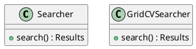
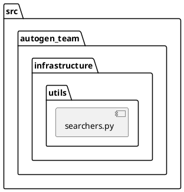
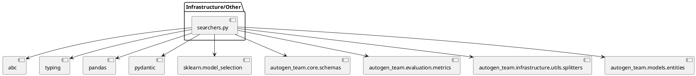
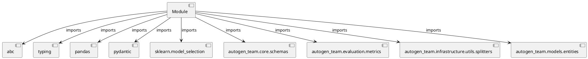
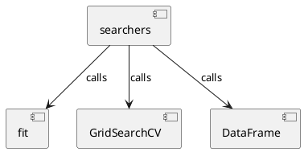

# Module Specification: searchers

* **Source Reference:** `src/autogen_team/infrastructure/utils/searchers.py`

## 1. Architectural Role & Responsibilities
**Purpose:**
Provides functionality related to searchers.

**Architecture Layer:**
- Infrastructure/Other

**Responsibilities:**
- Not explicitly defined.

**Main Workflow:**
- Not explicitly defined.

## 2. Dependencies
**Imports:**
- `abc`
- `typing`
- `pandas`
- `pydantic`
- `sklearn.model_selection`
- `autogen_team.core.schemas`
- `autogen_team.evaluation.metrics`
- `autogen_team.infrastructure.utils.splitters`
- `autogen_team.models.entities`

**Exported Classes:**
- `Searcher`
- `GridCVSearcher`

**Exported Functions:**
- None

**Exported Interfaces:**
- Not explicitly defined.

**Public API:**
- Not explicitly defined.

## 3. Architecture & Execution
### Internal Architecture
Not explicitly defined.

### Execution Flow
Not explicitly defined.

### Sequence Explanation
Not explicitly defined.

### Examples
Not explicitly defined.

## 4. UML 2.0 Diagrams
### Class Diagram

```plantuml
@startuml
    class Searcher {
        +search() : Results
    }
    class GridCVSearcher {
        +search() : Results
    }
@enduml
```

### Package Diagram

```plantuml
@startuml
    package "src" {
        package "autogen_team" {
            package "infrastructure" {
                package "utils" {
                    [searchers.py]
                }
            }
        }
    }
@enduml
```

### Sequence Diagram

```plantuml
@startuml
    ' No functions for sequence
@enduml
```

### Component Diagram

```plantuml
@startuml
    package "Infrastructure/Other" {
        [searchers.py]
    }
    [searchers.py] --> [abc]
    [searchers.py] --> [typing]
    [searchers.py] --> [pandas]
    [searchers.py] --> [pydantic]
    [searchers.py] --> [sklearn.model_selection]
    [searchers.py] --> [autogen_team.core.schemas]
    [searchers.py] --> [autogen_team.evaluation.metrics]
    [searchers.py] --> [autogen_team.infrastructure.utils.splitters]
    [searchers.py] --> [autogen_team.models.entities]
@enduml
```

### Dependency Graph

```plantuml
@startuml
    [Module] --> [abc] : imports
    [Module] --> [typing] : imports
    [Module] --> [pandas] : imports
    [Module] --> [pydantic] : imports
    [Module] --> [sklearn.model_selection] : imports
    [Module] --> [autogen_team.core.schemas] : imports
    [Module] --> [autogen_team.evaluation.metrics] : imports
    [Module] --> [autogen_team.infrastructure.utils.splitters] : imports
    [Module] --> [autogen_team.models.entities] : imports
@enduml
```

## 5. Class & Method Specifications
### `Searcher` ([`src/autogen_team/infrastructure/utils/searchers.py`](/src/autogen_team/infrastructure/utils/searchers.py))
#### Overview
Base class for a searcher.

Use searcher to fine-tune models.
i.e., to find the best model params.

Parameters:
    param_grid (Grid): mapping of param key -> values.

#### Attributes
- None found.

#### Methods
##### `search(self, model: models.Model, metric: metrics.Metric, inputs: schemas.Inputs, targets: schemas.Targets, cv: CrossValidation) -> Results` (Public)
**Description:** Search the best model for the given inputs and targets.

Args:
    model (models.Model): AI/ML model to fine-tune.
    metric (metrics.Metric): main metric to optimize.
    inputs (schemas.Inputs): model inputs for tuning.
    targets (schemas.Targets): model targets for tuning.
    cv (CrossValidation): choice for cross-fold validation.

Returns:
    Results: all the results of the searcher execution process.

**Inputs:**
- `model`
  - type: models.Model
  - meaning: Not explicitly defined.
  - valid values: Not explicitly defined.
  - optional?: False
  - default value: None
- `metric`
  - type: metrics.Metric
  - meaning: Not explicitly defined.
  - valid values: Not explicitly defined.
  - optional?: False
  - default value: None
- `inputs`
  - type: schemas.Inputs
  - meaning: Not explicitly defined.
  - valid values: Not explicitly defined.
  - optional?: False
  - default value: None
- `targets`
  - type: schemas.Targets
  - meaning: Not explicitly defined.
  - valid values: Not explicitly defined.
  - optional?: False
  - default value: None
- `cv`
  - type: CrossValidation
  - meaning: Not explicitly defined.
  - valid values: Not explicitly defined.
  - optional?: False
  - default value: None

**Output:**
- return type: `Results`
- semantic meaning: Not explicitly defined.
- possible null values: Not explicitly defined.
- exceptions: Not explicitly defined.

**Side Effects:**
- Database updates: Not explicitly defined.
- File operations: Not explicitly defined.
- Network calls: Not explicitly defined.
- Cache: Not explicitly defined.
- State changes: Not explicitly defined.

**Complexity:**
- Time Complexity: Not explicitly defined.
- Space Complexity: Not explicitly defined.

**Example:**
```python
result = Searcher.search(..., ..., ..., ..., ...)
```

### `GridCVSearcher` ([`src/autogen_team/infrastructure/utils/searchers.py`](/src/autogen_team/infrastructure/utils/searchers.py))
#### Overview
Grid searcher with cross-fold validation.

Convention: metric returns higher values for better models.

Parameters:
    n_jobs (int, optional): number of jobs to run in parallel.
    refit (bool): refit the model after the tuning.
    verbose (int): set the searcher verbosity level.
    error_score (str | float): strategy or value on error.
    return_train_score (bool): include train scores if True.

#### Attributes
- None found.

#### Methods
##### `search(self, model: models.Model, metric: metrics.Metric, inputs: schemas.Inputs, targets: schemas.Targets, cv: CrossValidation) -> Results` (Public)
**Description:** No description provided.

**Inputs:**
- `model`
  - type: models.Model
  - meaning: Not explicitly defined.
  - valid values: Not explicitly defined.
  - optional?: False
  - default value: None
- `metric`
  - type: metrics.Metric
  - meaning: Not explicitly defined.
  - valid values: Not explicitly defined.
  - optional?: False
  - default value: None
- `inputs`
  - type: schemas.Inputs
  - meaning: Not explicitly defined.
  - valid values: Not explicitly defined.
  - optional?: False
  - default value: None
- `targets`
  - type: schemas.Targets
  - meaning: Not explicitly defined.
  - valid values: Not explicitly defined.
  - optional?: False
  - default value: None
- `cv`
  - type: CrossValidation
  - meaning: Not explicitly defined.
  - valid values: Not explicitly defined.
  - optional?: False
  - default value: None

**Output:**
- return type: `Results`
- semantic meaning: Not explicitly defined.
- possible null values: Not explicitly defined.
- exceptions: Not explicitly defined.

**Side Effects:**
- Database updates: Not explicitly defined.
- File operations: Not explicitly defined.
- Network calls: Not explicitly defined.
- Cache: Not explicitly defined.
- State changes: Not explicitly defined.

**Complexity:**
- Time Complexity: Not explicitly defined.
- Space Complexity: Not explicitly defined.

**Example:**
```python
result = GridCVSearcher.search(..., ..., ..., ..., ...)
```

## 6. Module Functions
## 7. Call Graph

```plantuml
@startuml
[searchers] --> [fit] : calls
[searchers] --> [GridSearchCV] : calls
[searchers] --> [DataFrame] : calls
@enduml
```

## 8. Cross References
- **Dependencies:** [Dependencies](../../../../../dependencies/index.md)
- **Used by:** ../../application/jobs/tuning.md, ../../../../tests/conftest.md, ../../../../tests/infrastructure/utils/test_searchers.md
- **Calls:** fit, GridSearchCV, DataFrame
- **Called from:** None
- **Related classes:** [Classes](../../../../../classes/index.md)
- **Related diagrams:** [Diagrams](../../../../../diagrams/index.md)
